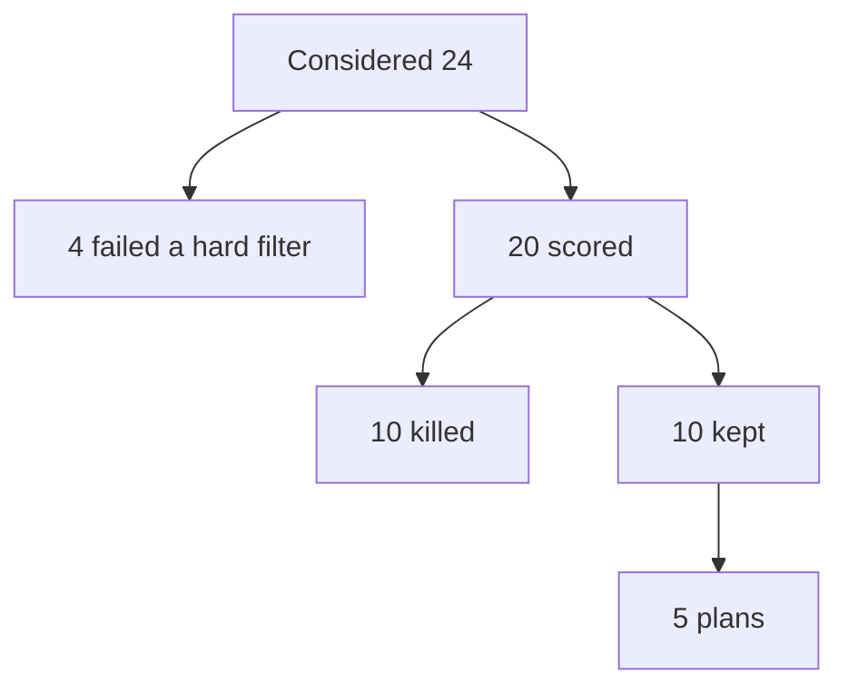
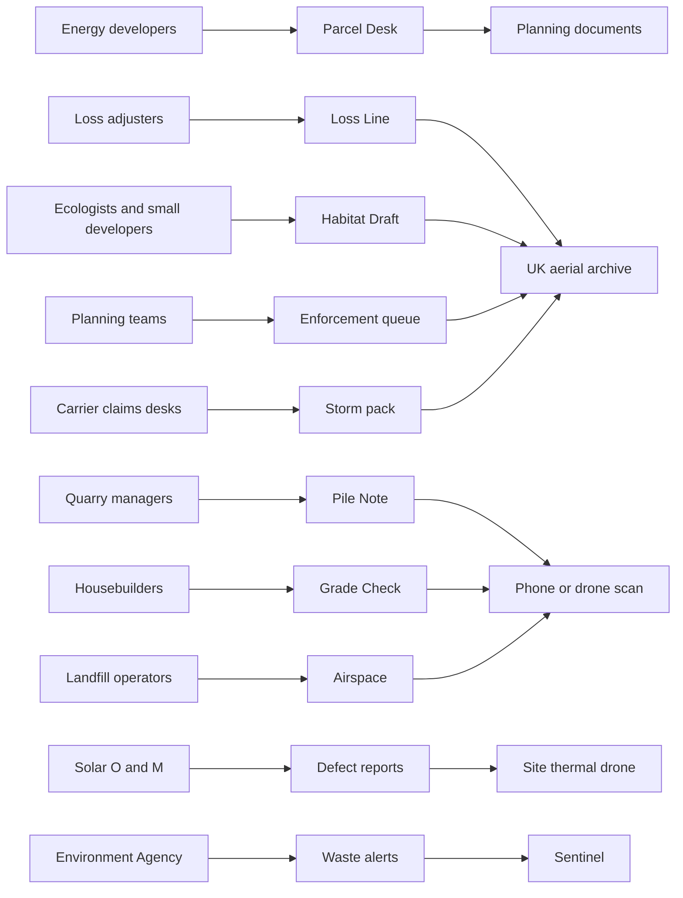
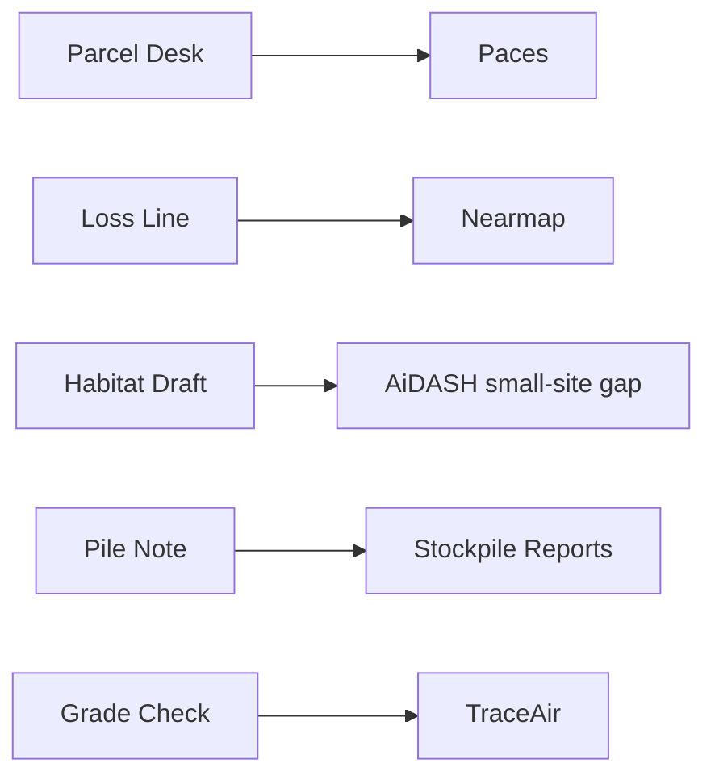

# Earth observation and AI: businesses one founder could start

**Date:** 6 October 2026
**For:** Tristan Fischer. UK-based. Strong with current models. A body of space and Earth-observation work already done. The ventures below do not require a spacecraft, a field crew, or a team before the first invoice.

**Design:** The ForgeOS Startup Business Plan workflow. Twenty ideas are cards. Ten add a Lean Canvas, the buyer, the US (or ahead) company, the UK or EU wedge, and the data. Five are written as Lean Business Plans: eight sections, a Business Model Canvas, Helmer's 7 Powers, TAM/SAM/SOM, unit economics, risks, and a 90-day experiment.

## How this was produced

The OpenRouter catalogue was queried on 6 October 2026 (464 models). Roles pinned in [graph.json](graph.json):

- Cheap web search: `google/gemini-3.5-flash-lite` (native web search)
- Deeper evidence: `google/gemini-3.8-flash`
- Cheap structured pass: `z-ai/glm-5.3-flash`
- Judge: `x-ai/grok-4.7`
- Second-lineage fact check: `xiaomi/mimo-v2.6-flash` (Exa search)

`scripts/opportunity-screen.mjs` is the loop. It reads and writes the graph after each stage. It did not complete those calls. `OPENROUTER_API_KEY` is not in this environment, and `.env.local` does not contain it. Running the script confirmed the pin, then stopped on the missing key.

The ideas, the cut, and the five plans were therefore written from pages retrieved on 6 October 2026, against the same weights and the same hard filters. Figures the pages do not support are tagged `[ASSUMPTION]` or `[UNVERIFIED]`. Company facts below are tagged with the page they came from. Re-run `node scripts/opportunity-screen.mjs --fresh` when the key is present. That replaces this seed with the model loop.

Weights: existing spend 1.4, AI leverage 1.2, Earth-observation leverage 1.0, sales cycle 1.3, time to revenue 1.3, US proof 1.2, founder moat 1.0. A failed hard filter never enters the 20. The filters are: someone already pays or is forced to pay; one founder can start; a real company is named with a URL; the UK or EU is actually behind, rather than waiting for the US leader's London office.

## How the field was cut

Four ideas were real and were still excluded before the 20, because a filter failed:

- **Wind blade inspection.** SkySpecs raised $20 million in March 2025, led by Goldman Sachs Alternatives, and reported 125 customers and more than 270,000 turbines inspected. In 2025 it was already inspecting ScottishPower's East Anglia ONE. The US company is on the UK asset. ([SkySpecs](https://skyspecs.com/press/skyspecs-raises-20m-to-fuel-global-growth-and-innovation/), [offshore note](https://skyspecs.com/blog/offshore-wind-inspections-2025/))
- **Jobsite progress from 360 cameras.** OpenSpace, San Francisco, acquired London-based Disperse on 28 October 2025. The UK product already sits inside the US company. ([OpenSpace](https://www.openspace.ai/press-releases/openspace-acquires-disperse/))
- **Dark-vessel and sanctions monitoring.** SynMax reported $20.3 million of US federal maritime contracts in October 2025. That buyer requires a security relationship a solo UK founder does not have. ([EIN Presswire](https://www.einpresswire.com/article/858770121/synmax-secures-20-3m-in-federal-contracts-to-expand-maritime-intelligence-capabilities))
- **Point-source methane for gas networks.** Satelytics and Maxar (now Vantor) productised this in June 2025, and Duke Energy's Piedmont Gas is a named user. The imagery is commercial 30 cm tasking, which fails the solo cost test. ([GlobeNewswire](https://www.globenewswire.com/news-release/2025/06/25/3105012/0/en/Media-Advisory-Energy-Sector-Gains-New-Edge-in-Vegetation-and-Methane-Emissions-Monitoring-with-Maxar-and-Satelytics-Partnership.html))

## The 20

Scores are existing spend, AI leverage, Earth observation, sales cycle, time to revenue, US proof, founder moat, then the weighted score.

### 1. Parcel Desk — land screening for UK energy projects

A desktop answer, in a day, on whether a UK solar, battery, or data-centre parcel is worth an option fee.

- **Who pays:** Development managers at UK solar, battery, and data-centre developers.
- **Job today:** Weeks of planning history, grid headroom, flood, and habitat, assembled by hand before an option.
- **AI:** The work is reading policy and connection text and pinning it to a parcel.
- **Earth observation:** Sentinel and aerials answer land cover. They are a layer, not the product.
- **Ahead company:** Paces (Brooklyn). Series A of $11 million on 24 July 2024, led by Navitas Capital. The company reported 7,439 searches in 2024 and growth from 11 to 30 people. ([announcement](https://www.paces.com/news/paces-raises-11-million-to-accelerate-clean-energy-development), [2024 note](https://www.paces.com/post/a-look-back-and-the-road-ahead-for-2025))
- **UK/EU wedge:** The published product is US permitting and US interconnection.
- **Main risk:** Paces, or a UK GIS firm, adds a UK layer.
- **Scores:** 5 · 5 · 3 · 4 · 4 · 5 · 3 · weighted 4.21

### 2. Loss Line — roof and exterior measurement for loss adjusters

Measure a damaged roof from imagery before anyone climbs it.

- **Who pays:** Loss adjusters and the insurer claims teams who instruct them.
- **Job today:** A site visit, a measuring tape, and a repair-versus-replace argument.
- **AI:** Vision models already extract roof geometry and condition in the US.
- **Earth observation:** High-resolution aerials, not Sentinel. The UK already captures them for government.
- **Ahead company:** Nearmap agreed in May 2025 to acquire itel, a US claims-pricing firm. ([Nearmap](https://www.nearmap.com/nz/blog/nearmap-to-acquire-itel)) Its public news trail records a 31 July 2025 PR Newswire release, "Nearmap Unveils Roof Measurement and Exterior Measurement Tools for Insurers." The wire URL was not re-fetched in this pass, so the headline is taken from that news trail and any savings figure in secondary copy is `[UNVERIFIED]`. ([company record](https://www.linkedin.com/company/nearmap-com))
- **UK/EU wedge:** UK claims still instruct a person. Nearmap's capture footprint is not the UK.
- **Main risk:** A global imagery owner turns on a UK layer, or UK aerial firms (Bluesky and others) add the measurement themselves.
- **Scores:** 5 · 5 · 4 · 3 · 4 · 5 · 2 · weighted 4.06

### 3. Habitat Draft — biodiversity net gain baselines for small English sites

A first-pass habitat map and statutory-metric workbook for a small planning application, for the ecologist to check rather than to start from a blank hillside.

- **Who pays:** Developers, and the ecological consultancies they hire. England requires 10% biodiversity net gain for most planning applications, from 12 February 2024 for major development and 2 April 2024 for small sites. ([GOV.UK](https://www.gov.uk/guidance/understanding-biodiversity-net-gain))
- **Job today:** A site survey and a metric. Quoted professional fees start around £399 plus VAT for a simple site and run from about £900 to £5,000 and above as sites get harder. ([ACP](https://acp-consultants.com/biodiversity-net-gain/biodiversity-net-gain-bng-surveys/), [Acorn Ecology](https://acornecology.co.uk/biodiversity-net-gain-bng-assessments)) Defra's own annex puts the wider BNG cost at about £400 to £1,600 per dwelling. ([evidence annex](https://assets.publishing.service.gov.uk/media/69c3f68193cc6e8b87a6f688/Biodiversity_net_gain_area-based_exemption_evidence_annex.pdf))
- **AI:** Habitat classes from imagery and a filled metric, with a human ecologist signing.
- **Earth observation:** Aerials and Sentinel for the first map. The signature still needs a field check on anything that is not obvious.
- **Ahead company:** AiDASH's Series C release (30 April 2024, $58.5 million, total raised $91.5 million) says its customers use the platform for biodiversity net gain mandates. Schneider Electric agreed in July 2026 to buy it at a $350 million enterprise value. ([Business Wire](https://www.businesswire.com/news/home/20240430874835/en/AiDash-Closes-its-Oversubscribed-Series-C-Funding-Round-at-%2458.5-Million), [ESG Today](https://www.esgtoday.com/schneider-electric-acquires-grid-resilience-solutions-provider-aidash-for-350-million/))
- **UK/EU wedge:** The legal duty is English, and the metric is a UK spreadsheet. A California platform does not walk a small site in Kent.
- **Main risk:** The ecologist is legally and professionally the signer, so the product can be a draft only. If consultants will not adopt a draft, there is no buyer.
- **Scores:** 5 · 4 · 4 · 4 · 4 · 4 · 3 · weighted 4.05

### 4. Pile Note — stockpile volumes for quarries and aggregates

A monthly tonnage the finance team will accept, instead of a surveyor twice a year.

- **Who pays:** Quarry and aggregates operators.
- **Job today:** A contractor survey, then an inventory write-down. Propeller's Boral write-up says sites were paying thousands of pounds per survey and reconciling stock twice a year. ([Boral story](https://www.propelleraero.com/success-story/how-boral-sites-in-victoria-measure-and-manage-their-stockpiles-ending-inventory-write-downs-in-under-six-months/))
- **AI:** Pile detection and a volume from a phone or drone scan.
- **Earth observation:** Weak. Centimetre volumes want a drone or a phone, not Sentinel. This one earns its place on AI, not on space.
- **Ahead company:** Stockpile Reports publishes prices: $100 a month for up to 10 piles, up to $500 a month for 50, drones on the larger tier. ([pricing](https://www.stockpilereports.com/pricing.html)) Propeller sells the quarry workflow and does not publish a price.
- **UK/EU wedge:** The published products are US and Australian. UK quarries still buy local surveys.
- **Main risk:** The operator buys a drone and Propeller, and does not need a UK wrapper.
- **Scores:** 4 · 4 · 2 · 4 · 5 · 4 · 2 · weighted 3.68

### 5. Grade Check — earthworks quantities before a housebuilder pays the bill

Compare the scan to the design, and pay the contractor for the dirt that actually moved.

- **Who pays:** Land development managers at housebuilders.
- **Job today:** A survey and a disputed invoice.
- **AI:** Cut and fill from a scan against a design surface.
- **Earth observation:** Again a drone scan more than a satellite. Same honesty as the quarry idea.
- **Ahead company:** TraceAir raised a $25 million Series B on 29 May 2024, led by PeakSpan Capital. The company says 18 of the top 20 US builders use it. That builder count is the company's own claim. ([PR Newswire](https://www.prnewswire.com/news-releases/traceair-secures-25-million-series-b-funding-to-drive-innovation-in-land-development-and-homebuilding-302157483.html), [site](https://www.traceair.net/)) A Toll Brothers manager is quoted saying the tool is how they check contractor bills. ([TraceAir](https://www.traceair.net/whats-new/how-traceair-ensures-accurate-billing-for-land-developers))
- **UK/EU wedge:** The round and the customer story are American. UK housebuilders still pay surveyors.
- **Main risk:** You need a pilot on site, so the solo promise slips into a subcontractor on every job.
- **Scores:** 5 · 4 · 2 · 3 · 4 · 5 · 2 · weighted 3.68

### 6. Parcel scores for regional insurers

Peril and property scores so an underwriter can price without a survey.

- **Who pays:** Regional and mutual property insurers.
- **Ahead company:** ZestyAI said it delivered over 31 million property assessments in 2024, more than double 2023, and took a $15 million facility from CIBC Innovation Banking in June 2025. ([Insurtech Analyst](https://insurtechanalyst.com/2025/06/26/zestyai-bags-15m-from-cibc-to-scale-ai-risk-platform/)) Moody's acquired Cape Analytics in January 2025. ([Cape Analytics company record](https://www.linkedin.com/company/capeanalytics))
- **Main risk:** The buyer will take Moody's or Zesty, not a new model.
- **Scores:** 5 · 5 · 4 · 2 · 2 · 5 · 2 · weighted 3.60
- **Cut later:** Killed. The US proof is also the competitor.

### 7. Leaf-level scouting for UK agricultural merchants

Send the agronomist to the bad acres only.

- **Ahead company:** Taranis. Syngenta announced a multi-year retailer programme around Taranis' leaf-level imagery. ([Taranis](https://www.taranis.com/newsroom/syngenta-crop-protection-and-taranis-partner-to-drive-ai-powered-agronomy-solutions-and-business-opportunities-for-retailers/)) A Dealroom item in May 2026 reported a $40 million Series D and a push into Europe. That round is `[UNVERIFIED]` beyond Dealroom. ([Dealroom](https://app.dealroom.co/news/feed/taranis-raises-40m-series-d-reaching-100m-total-funding-for-leaf-level-ai-crop-monitoring))
- **Main risk:** The company already says it serves Europe.
- **Scores:** 4 · 5 · 2 · 3 · 3 · 5 · 2 · weighted 3.50
- **Cut later:** Killed on that Europe point.

### 8. Solar defect reports without the robot

A thermal and visual exception list for a UK solar O&M manager, from a drone the site already flies.

- **Ahead company:** Raptor Maps closed a $35 million Series C on 10 December 2024, led by Maverix. Latitude Media reported 71 GW under management and hundreds of customers. ([PR Newswire](https://www.prnewswire.com/news-releases/raptor-maps-closes-35-million-series-c-financing-to-drive-next-generation-solar-asset-management-solutions-302322933.html), [Latitude](https://www.latitudemedia.com/news/how-raptor-maps-crossed-the-valley-of-death/))
- **Scores:** 4 · 4 · 3 · 3 · 3 · 5 · 2 · weighted 3.48

### 9. Vegetation risk for DNOs who are not already inside AiDASH

Tell a tree crew which spans to cut, instead of driving the line.

- **Ahead company:** AiDASH, as above. Duke Energy, National Grid, and Edison International were in the Series C. National Grid's own innovation note still describes helicopter inspection of overhead fittings as the baseline, expensive and noisy, covering about 85% of targeted assets. ([NIA](https://smarter.energynetworks.org/projects/nia2_nget0043/?alttemplate=peaprojectpdf)) Ofgem in 2025 refused extra vegetation funding of £18.7 million requested across four DNOs, on the grounds it is already business as usual. ([Ofgem annex](https://www.ofgem.gov.uk/sites/default/files/2025-02/RIIO-2-Re-opener-Applications-2024-Final-Determinations-ED-Annex-REVISED.pdf))
- **Main risk:** Schneider now owns the product the DNOs would buy.
- **Scores:** 5 · 4 · 5 · 2 · 2 · 5 · 1 · weighted 3.45
- **Cut later:** Killed.

### 10. Claims-desk storm pack

A same-week imagery pack so a claims team can decide which losses get a person.

- **Ahead company:** Nearmap's ImpactResponse and the itel deal, same sources as Loss Line.
- **Scores:** 4 · 4 · 4 · 2 · 3 · 4 · 2 · weighted 3.30
- **Why it is separate from number 2:** The buyer is the carrier's claims desk, not the adjuster's measuring workflow. The debate still treats them as one company wearing two hats.

### 11. Planning-enforcement queue for local authorities

A weekly list of likely unauthorised structures, so the visit is the second step.

- **Who pays:** Planning enforcement teams. Hull City Council uses Bluesky 5 cm aerials, via the APGB contract, for desktop reviews of unplanned structures that "previously [were] too resource intensive" to do by visit. ([Hull case study, Bluesky PDF](https://bluesky-world.com/wp-content/uploads/2026/03/APGB-Case-Studies-2026_Hull.pdf))
- **Ahead company:** Nearmap sells the same pattern to government in its home markets. The UK incumbent on the pixels is Bluesky, not a US analytics firm.
- **Scores:** 4 · 4 · 5 · 2 · 3 · 3 · 3 · weighted 3.39

### 12. Illegal waste sites for the Environment Agency and councils

Change detection on permitted and unpermitted sites, before the drone squad is tasked.

- **Who pays:** The Environment Agency raised its waste-crime enforcement budget to £15.6 million and fielded 33 drone pilots. It describes waste crime as costing England about £1 billion a year. ([GOV.UK, 20 February 2026](https://www.gov.uk/government/news/enhanced-package-of-cutting-edgetechnology-to-combat-waste-crime), [EA](https://engageenvironmentagency.uk.engagementhq.com/illegal-waste-how-we-tackle-it))
- **Scores:** 4 · 4 · 5 · 2 · 3 · 3 · 2 · weighted 3.27

### 13. Landfill airspace

How much void is left, without a survey crew.

- **Ahead company:** Propeller's volume product includes landfill cell tracking. ([Propeller](https://www.propelleraero.com/platform/volume-calculations/))
- **Scores:** 4 · 4 · 2 · 3 · 4 · 3 · 2 · weighted 3.23
- **Main risk:** This is Pile Note with a different gate.

### 14. Corridor vegetation for rail and roads

The DNO product, sold to Network Rail or National Highways.

- **Ahead company:** AiDASH names transportation alongside utilities in the Series C release.
- **Scores:** 4 · 4 · 5 · 2 · 2 · 5 · 1 · weighted 3.29
- **Cut later:** Killed with the Schneider point.

### 15. Pipeline encroachment, not methane

Someone has built or dug on the right of way.

- **Ahead company:** Satelytics, same June 2025 Maxar partnership, vegetation and encroachment rather than the leak product.
- **Scores:** 4 · 4 · 5 · 2 · 2 · 4 · 1 · weighted 3.14
- **Cut later:** Killed. Commercial tasking and an enterprise safety sale.

### 16. Oil-storage signals for traders

What changed in the tank farm this week.

- **Ahead company:** Ursa Space announced a strategic investment from Sumitomo Corporation of Americas on 20 August 2025 to expand in Asia. ([PR Newswire](https://www.prnewswire.com/news-releases/sumitomo-corporation-invests-in-ursa-space-to-accelerate-global-growth-and-expand-into-japan-302533957.html)) SynMax's Hyperion, on a $13 million round in January 2024, was reported at about $3 million ARR in 2023 from oil and gas reserve detection. ([Payload](https://payloadspace.com/exclusive-synmax-raises-13m/))
- **Scores:** 4 · 4 · 5 · 2 · 2 · 4 · 1 · weighted 3.14
- **Cut later:** Killed. The buyers are traders with existing terminals, and the sale is not a solo one.

### 17. Woodland and peatland code monitoring

Year-5 stocking evidence so a project is not paying a full survey just to stay in the code.

- **Who pays:** Project owners. Validation is typically £1,800 to £2,500 plus VAT and verification £1,800 to £3,500 plus VAT, as of April 2025. ([Woodland Carbon Code](https://www.woodlandcarboncode.org.uk/3-validation)) The code is already piloting drones and satellite methods through CivTech. ([annual report](https://www.woodlandcarboncode.org.uk/annual-report-2024-2025))
- **Scores:** 3 · 3 · 4 · 3 · 3 · 3 · 2 · weighted 3.00
- **Cut later:** Killed. The buyer is already running the procurement.

### 18. Linear-infrastructure habitat baselines

BNG for a road or rail scheme rather than a housing plot.

- **Scores:** 4 · 3 · 4 · 2 · 2 · 4 · 2 · weighted 3.00
- **Cut later:** Killed. Slower buyer than the small-site version, and AiDASH already names the mandate.

### 19. District fly-tip alerts

The waste idea, sold to a district rather than the Agency.

- **Evidence:** Buckinghamshire states it uses drones for planning breaches and waste offences. ([council](https://www.buckinghamshire.gov.uk/planning-building-and-environment/applications-permission-and-advice/use-of-drones-to-investigate-planning-breaches/))
- **Scores:** 3 · 4 · 4 · 2 · 3 · 2 · 2 · weighted 2.85
- **Cut later:** Killed as a duplicate of the Agency product.

### 20. Slurry-store and farm compliance maps

Find the stores and the spreading risk from imagery, for a water company or the Agency.

- **Evidence:** A JNCC note describes Danish advisor SEGES using Picterra to estimate slurry-tank ammonia sources, and says staff time fell from months to hours. ([JNCC PDF](https://data.jncc.gov.uk/data/c650f50d-092a-4d15-8c66-5e95b70c22ef/regulation-and-compliance.pdf))
- **Scores:** 3 · 3 · 4 · 2 · 3 · 3 · 2 · weighted 2.85
- **Cut later:** Killed. The science of a tank level from a satellite is weaker than a habitat map, and the buyer is a single agency.

### Who pays, and which data

## The 10

These ten survived the kill pass. The other ten lost on a concrete point: Schneider owning the vegetation product, Moody's owning Cape, Taranis already selling in Europe, commercial tasking and trader sales for pipelines and tanks, the Woodland Carbon Code already procuring the monitoring, and duplicates of a stronger sibling.

The kill case under each of the ten is the one that was pressed and did not win.

### 1. Parcel Desk

Weighted 4.21. Developers already pay, in the US, to stop spending months on a parcel. The founder's stack is the product.

#### Lean Canvas

- **Problem:** Option fees land on parcels a desk study should have killed.
- **Customer segments:** In-house development managers at UK solar, battery, and data-centre developers.
- **Unique value proposition:** Worth a site visit, or not, from documents you can already read.
- **Solution:** A search area in, a two-page memo out, each constraint linked to a source.
- **Unfair advantage:** `[ASSUMPTION]` A private set of UK planning and connection outcomes. It does not exist on day one.
- **Revenue:** A fee per search, then a monthly watch-list.
- **Cost:** Founder time and map access. Imagery only on the shortlist.
- **Key metrics:** Paid screens, and screens that correctly kill a parcel.
- **Channels:** Public teardown memos, sent to development managers. One channel.

#### Buyer and current spend

Paces states that site selection and due diligence take months and that developers pay to compress them. A UK pound figure for the manual desk study was not retrieved.

#### US analog

**Paces.** $11 million Series A, 24 July 2024, Navitas Capital. 7,439 searches in 2024. LLMs used to attach text to parcels and substations. ([BuiltWorlds](https://builtworlds.com/news/cleantech-platform-startup-paces-raises-11m-to-scale-energy-project-development/)) Pricing is not published. They are ahead because US developers already buy this as software.

#### UK/EU wedge

Planning policy, agricultural land class, and DNO connection documents are local. Paces' published expansion talk in the 2024 note is Canada and more US data, not a UK planning model.

#### Data a founder can start on

Planning-portal PDFs, flood and designation open data, Sentinel-2. A commercial scene only after the shortlist.

#### Kill case that did not land

Paces could open a UK layer with the Series A money. What still holds: their product and their customers, in the sources, are American. The first UK memo does not require them to fail.

### 2. Loss Line

Weighted 4.06.

#### Lean Canvas

- **Problem:** An adjuster climbs a roof to produce a measurement a photograph already contains.
- **Customer segments:** Independent loss adjusters and small UK claims teams.
- **Unique value proposition:** A measured roof and a materials note the same day, from aerials, with the visit reserved for the argument.
- **Solution:** Imagery in, a measurement sheet out, a person checks it.
- **Unfair advantage:** `[ASSUMPTION]` A UK claims-file format the US tools do not emit.
- **Revenue:** Per claim, paid by the adjuster or the carrier.
- **Cost:** Aerial licence and founder time.
- **Key metrics:** Claims measured, and revisits avoided.
- **Channels:** Adjusting firms. One list. No carrier enterprise sale in the first 90 days.

#### Buyer and current spend

Nearmap's July 2025 release is explicit that field inspections are the cost being cut. A UK loss-adjuster day rate was not retrieved in this pass.

#### US analog

**Nearmap**, including Betterview and the itel acquisition announced 20 May 2025. Thoma Bravo is the lead investor in the combined company. Terms of the itel deal were not disclosed. The measurement tools are the product proof. Cape, now inside Moody's, is the underwriting cousin and is not this buyer.

#### UK/EU wedge

UK roof claims are still a visit. Nearmap does not, in these sources, operate a UK capture programme.

#### Data a founder can start on

APGB and commercial UK aerial archives (Bluesky is the name in the council case studies). Not Sentinel.

#### Kill case that did not land

Bluesky or Verisk adds a measure button and the adjuster never needs a new firm. What still holds: the council case studies show the pixels being used as pictures, not as a measurement a claims file will accept. That gap is the product.

### 3. Habitat Draft

Weighted 4.05.

#### Lean Canvas

- **Problem:** Every small application now needs a habitat baseline, and ecologists are the bottleneck.
- **Customer segments:** Ecological consultancies, and developers who buy the survey.
- **Unique value proposition:** A draft metric and a map the ecologist corrects, instead of a blank site.
- **Solution:** Imagery classification, a statutory workbook, a field checklist of what the model will not call.
- **Unfair advantage:** `[ASSUMPTION]` Correction data from the ecologists who use it. Day one has none.
- **Revenue:** A draft fee, lower than a full survey, paid by the consultancy.
- **Cost:** Founder time. No junior surveyors.
- **Key metrics:** Drafts a consultancy will sign, and hours they say they saved.
- **Channels:** Ten ecological consultancies. Not a planning-portal scrape sold to the public.

#### Buyer and current spend

Mandatory in England. Survey quotes from £399 plus VAT (simple) to £900–£5,000. Wider delivery cost £400–£1,600 per dwelling in Defra's annex. Statutory credit sales in the first year were only £206,180, which shows developers are not dumping the duty on government credits. They are doing the on-site and off-site work. ([credits report](https://www.gov.uk/government/publications/biodiversity-net-gain-statutory-credits-annual-report-2024-to-2025/biodiversity-net-gain-statutory-credits-annual-report-2024-to-2025))

#### US analog

**AiDASH**, for the biodiversity product, with the caveat that Schneider's acquisition makes this a poor venture to copy at utility scale. The small-site English metric is the piece they are not staffed to walk.

#### UK/EU wedge

The duty, the metric, and the local planning authority are English. That is the wedge.

#### Data a founder can start on

APGB aerials, Sentinel-2, and the statutory metric spreadsheet. The ecologist remains the signer.

#### Kill case that did not land

A draft that cannot be signed is worthless, and consultants will refuse it. What still holds: the fee quotes are real, the duty is real, and a consultancy that can clear more small sites per ecologist has a reason to pay for the draft.

### 4. Pile Note

Weighted 3.68.

#### Lean Canvas

- **Problem:** Stock is wrong twice a year, and the correction is a write-down.
- **Customer segments:** UK quarry and aggregates finance and site managers.
- **Unique value proposition:** A monthly tonnage finance will book.
- **Solution:** Phone or drone scan, pile volumes, a PDF the supervisor can take outside.
- **Unfair advantage:** None on day one. Stockpile Reports already sells this for $100 a month.
- **Revenue:** A site subscription above the US self-serve price, because the founder delivers the number rather than the app.
- **Cost:** Founder time. The customer flies or films.
- **Key metrics:** Sites sending a monthly scan, and write-downs that shrink.
- **Channels:** Quarry managers, via the Mineral Products Association orbit. One list.

#### Buyer and current spend

Boral, on Propeller's account, was paying thousands per survey and reconciled six sites to about a $25,000 variance once they measured themselves. Treat the dollar figure as the customer's story on the vendor's page, not an audit.

#### US analog

**Stockpile Reports** for the published price. **Propeller** for the quarry workflow and the Boral result. Propeller does not publish a price.

#### UK/EU wedge

Neither product, in these pages, is a UK default. Local survey firms still own the twice-yearly job.

#### Data a founder can start on

The customer's phone video or an existing drone. No satellite contract.

#### Kill case that did not land

At $100 a month the US app is the competitor, and a UK service cannot beat it on software. What still holds: many quarry finance teams will pay a person to own the number and will not roll out an app. That is a service, and it is allowed to be small.

### 5. Grade Check

Weighted 3.68.

#### Lean Canvas

- **Problem:** Earthworks invoices are paid against a survey that arrives late.
- **Customer segments:** Land managers at UK housebuilders.
- **Unique value proposition:** The cut and fill, against the design, before the bill is approved.
- **Solution:** A scan in, a quantity sheet out, within two days.
- **Unfair advantage:** None until several sites share a design-file habit.
- **Revenue:** Per survey, priced under a traditional site survey.
- **Cost:** A subcontracted pilot plus founder processing. This is the cost to watch.
- **Key metrics:** Invoices changed, and days from flight to sheet.
- **Channels:** Land directors at ten housebuilders. One letter.

#### Buyer and current spend

TraceAir's Toll Brothers quote is the US version of the same invoice check. A UK survey price was not retrieved.

#### US analog

**TraceAir.** $25 million Series B, May 2024. "18 of the top 20 US builders" is the company's claim, not an independent census.

#### UK/EU wedge

The customers in the sources are American. UK builders are still on survey firms.

#### Data a founder can start on

A drone scan the builder or a local pilot collects. Processing is the product.

#### Kill case that did not land

The pilot requirement breaks the solo rule. What still holds: the founder never has to be on the airfield if a named pilot is paid per job, and the first invoice can still be one person plus one flight.

### 6. Solar defect reports

Weighted 3.48.

#### Lean Canvas

- **Problem:** A utility-scale site loses output to faults nobody has walked.
- **Customer segments:** UK O&M managers and asset managers.
- **Unique value proposition:** An exception list from the drone flight the site already bought.
- **Solution:** Thermal and visual frames in, a fault table out.
- **Unfair advantage:** None against Raptor Maps' model, which has 71 GW of practice.
- **Revenue:** Per inspection report.
- **Cost:** Founder time. No robot.
- **Key metrics:** Faults the O&M team fixes, and repeat sites.
- **Channels:** Independent O&M firms, not the global owners Raptor already has.

#### US analog

**Raptor Maps.** $35 million Series C, December 2024. ENGIE has described using the platform across 90 sites and 6.5 GW. ([ENGIE](https://innovation.engie.com/en/news/interview/viva-technology/ai-with-impact-how-raptor-maps-is-redefining-solar-asset-management/30545))

#### Kill case that did not land

Raptor's robots and ENGIE-scale software make a solo report look thin. What still holds: a UK O&M firm with a drone and no Raptor contract will pay for the table. It is a narrow door, which is why this stays in the ten and not the five.

### 7. Planning-enforcement queue

Weighted 3.39.

#### Lean Canvas

- **Problem:** Enforcement visits are spent confirming what a photograph already shows, and the rest of the district is never looked at.
- **Customer segments:** Planning enforcement teams in English local authorities.
- **Unique value proposition:** A weekly queue of likely breaches, ranked, with the two dates of imagery attached.
- **Solution:** Change detection on aerials the council already receives, joined to planning records.
- **Unfair advantage:** `[ASSUMPTION]` Labels from the first councils, which are public-sector slow to share.
- **Revenue:** An annual licence under the cost of one officer-month.
- **Cost:** Founder time. Imagery is already paid for by APGB.
- **Key metrics:** Visits avoided, and notices that started from the queue.
- **Channels:** Enforcement team leaders. Procurement will hurt. Start with a pilot letter, not a tender.

#### US analog

**Nearmap** for government change intelligence. The UK pixel incumbent is **Bluesky**, via APGB, and the Hull study is the proof councils already use the pictures and still do not have the queue.

#### Kill case that did not land

Hull's own study says they may train a model in QGIS, and APGB imagery is free at the point of use, so a vendor is unnecessary. What still holds: one council musing about a model is not a product the other 300 will build. Procurement is the reason this is not in the five.

### 8. Storm pack for claims desks

Weighted 3.30.

#### Lean Canvas

- **Problem:** After a storm, every claim looks urgent and the adjusters are booked out.
- **Customer segments:** UK household insurer claims operations.
- **Unique value proposition:** Which roofs changed, from the aerial before and after, so the adjuster is sent once.
- **Solution:** A post-event pack per postcode.
- **Unfair advantage:** None.
- **Revenue:** A retainer plus a per-event fee.
- **Cost:** Aerial licence and a fast processing step.
- **Key metrics:** Adjuster visits cancelled, and complaints.
- **Channels:** Heads of claims at ten insurers.

#### Kill case that did not land

This is Loss Line sold to a slower buyer. It stays in the ten as a second door into the same imagery, and the debate sends the company after adjusters first.

### 9. Illegal waste alerts

Weighted 3.27.

#### Lean Canvas

- **Problem:** The Agency's drones fly 272 hours and still cannot watch every field.
- **Customer segments:** Environment Agency waste teams, then county waste services.
- **Unique value proposition:** A short list of sites whose outline changed, for the drone to check.
- **Solution:** Sentinel change detection, a commercial scene on the hits.
- **Unfair advantage:** None. The Agency already has geomatics staff.
- **Revenue:** A pilot fee, then a regional licence.
- **Cost:** Founder time and a small imagery budget.
- **Key metrics:** Hits the drone confirms, and false alarms.
- **Channels:** One introduction into the waste-crime unit. There is no second channel that matters.

#### Kill case that did not land

The Agency is building the capability itself, with a bigger budget and its own pilots. What still holds: a 33-pilot unit and a £15.6 million budget still cannot scan every acquisition of Sentinel. A list is cheaper than another aircraft. It is a single-buyer sale, which keeps it out of the five.

### 10. Landfill airspace

Weighted 3.23.

#### Lean Canvas

- **Problem:** Void space is the asset, and it is measured too rarely.
- **Customer segments:** UK landfill operators.
- **Unique value proposition:** Remaining airspace on a monthly scan.
- **Solution:** The Pile Note pipeline on a cell instead of a stockpile.
- **Unfair advantage:** None.
- **Revenue:** Per site per month.
- **Cost:** Same as Pile Note.
- **Key metrics:** Sites on a monthly cycle.
- **Channels:** The same mineral and waste operators as Pile Note.

#### Kill case that did not land

Propeller already lists cell tracking. What still holds only if a UK operator will not buy the Australian platform. The debate folds this into Pile Note rather than staffing a second company.

## The 5

The debate kept five. Solar reports lose to Raptor's depth. Planning loses to council procurement. The storm pack is the same company as Loss Line. Waste alerts are a single public buyer. Landfill airspace is Pile Note again.

The five are written in the eight-section form. Working names are labels for a plan, not registered companies.

### 1. Parcel Desk

#### 1. Executive Summary

Parcel Desk is a one-founder desk that tells a UK solar, battery, or data-centre developer whether a parcel deserves an option. Paces, in Brooklyn, has shown that this work is bought as software: an $11 million Series A on 24 July 2024, led by Navitas Capital, and 7,439 searches on the platform in 2024 [SOURCED]. The UK version is the same question against planning portals, agricultural land class, and DNO connection documents. The first product is a written screen, not a national database. Price is `[ASSUMPTION]` £750 per screen. The plan does not ask for a raise.

#### 2. Company Description

Working name. Not incorporated by this document. The company does not buy land, hold a grid offer, or employ a surveyor. It sells a memo. The founder already uses the models that read the documents.

#### 3. Market Analysis

Bottom-up only. `[ASSUMPTION]` Forty UK developers, twenty screens a year, £750, is £600,000 in a later year. That is the obtainable figure worth writing down. A top-down number for the UK solar pipeline is refused: most of that pipeline will never pay for a screen. SAM is the set of developers who currently pay a land agent or a planner for a desk study before an option. The US company is the evidence the workflow is purchased, not the evidence of the UK price.

#### 4. Organization and Management

One founder until ten paid screens exist. A grid engineer and an ecologist are paid per memo when a signature is required. They are not employees.

#### 5. Products and Services

Screen: a map and two pages, each constraint linked to the document that states it. Watch: a monthly re-read of parcels already under option, because policy and connection offers move. No drone product.

#### 6. Marketing and Sales Strategy

One channel. Three public teardowns of parcels anyone can check, sent to development managers. No advertising and no stand. The first sale is a paid screen on a live site, not a subscription.

#### 7. Financial Projections

`[ASSUMPTION]` £750 per screen. `[ASSUMPTION]` £400 a month to watch twenty parcels. Direct cost is map access and time. Gross margin stays above 70% only while commercial imagery and subcontracted experts stay off the ordinary search. If every search needs both, the price is wrong and the product should stop. CAC in year one is the founder's time. LTV is not computed: churn has not been observed. The operating number is paid screens per month.

#### 8. Funding Requirements

None. Paces' round nationalised US data. A UK desk can invoice without that. A raise is a conversation after ten paying developers, not before.

#### Business Model Canvas

- **Customer segments:** UK solar, battery, and data-centre development managers.
- **Value propositions:** Kill a bad parcel before the option fee.
- **Channels:** Teardown memos, then a direct ask.
- **Customer relationships:** Per screen, then a watch-list.
- **Revenue streams:** Search fee and a small subscription.
- **Key resources:** The planning-document habit and the models.
- **Key activities:** Read, join to a parcel, write.
- **Key partnerships:** Grid engineer and ecologist on call.
- **Cost structure:** Time and open data. Imagery on the shortlist only.

#### 7 Powers

- **Scale Economies (None):** One founder has no cost curve.
- **Network Effects (None):** Another user's search does not yet improve this one.
- **Counter-Positioning (Weak):** A land agent who bills days is awkward about selling a fixed-price screen.
- **Switching Costs (Weak):** None until the option book sits in the watch-list.
- **Brand (None):** Three public memos are the start, not a brand.
- **Cornered Resource (None):** The documents are public. Outcome labels would be the asset, and they do not exist yet.
- **Process Power (Weak):** The process is the founder.

Primary moat to start: none. Counter-positioning against day-rate assembly is the only honest candidate, and it is weak.

#### Market sizing

- **TAM:** Refused as a national energy figure.
- **SAM:** `[ASSUMPTION]` Developers who pay for a pre-option desk study.
- **SOM:** `[ASSUMPTION]` £600,000 if 40 developers buy 20 screens at £750.
- **Bottom-up:** 40 × 20 × £750. Every term is an assumption. The US purchase is the sourced part.
- **Growth:** Not cited.
- **Logic:** One worked example, not a market slide.

#### Unit economics

- **CAC:** `[ASSUMPTION]` Founder time on the first ten sales.
- **LTV:** `[ASSUMPTION]` Low thousands of pounds if a developer stays a year. Unobserved.
- **LTV:CAC:** Not stated. The inputs are not known.
- **Payback:** `[ASSUMPTION]` One paid screen covers the outreach that found it, if the price holds.
- **Margin:** `[ASSUMPTION]` Above 70% without tasked imagery.
- **Sensitivity:** A commercial image plus an ecologist on every job destroys the margin. Do not take those jobs as the default.

#### Risks

- Paces or a UK GIS firm ships a decent UK layer.
- Connection offers stay too messy, and a memo is confidently wrong.
- Developers treat £750 as something their land agent already includes.

#### 90-day experiment

Publish three public parcel memos in the first three weeks. Send them to twenty development managers. By day 90, five paid screens, or stop. The kill is zero paid screens.

#### Fact-check

Checked against the pages above, not a second model. The OpenRouter fact-check role did not run.

- **Verified** — $11 million Series A, Navitas Capital, 24 July 2024. ([Paces](https://www.paces.com/news/paces-raises-11-million-to-accelerate-clean-energy-development))
- **Verified, company blog** — 7,439 searches and headcount 11 to 30. Not an audited filing. ([Paces](https://www.paces.com/post/a-look-back-and-the-road-ahead-for-2025))
- **Unverified** — £750 and the £600,000 illustration. Marked assumption. No UK price was found.

### 2. Loss Line

#### 1. Executive Summary

Loss Line measures roofs and exteriors for UK loss adjusters from aerial imagery, and sends a person only when the measurement will not settle the file. Nearmap's May 2025 agreement to buy itel, and its 2025 roof-measurement release, are the US proof that claims teams pay to stop climbing [SOURCED]. The UK job is the same visit. The data is the aerial archive councils already use as pictures. The first customer is an adjusting firm, not a carrier transformation programme.

#### 2. Company Description

Working name. A desk that returns a measurement sheet. It does not employ adjusters and does not own an aircraft.

#### 3. Market Analysis

Bottom-up. `[ASSUMPTION]` If twenty adjusting firms each put 30 claims a month through a sheet at £40, that is £288,000 a year. SAM is firms that currently instruct a measured visit for ordinary storm and escape-of-water roof claims. A UK household-insurance premium pool is not used as TAM.

#### 4. Organization and Management

One founder. A chartered adjuster reviews the sheet format in week one, paid for that review, and is not on the payroll.

#### 5. Products and Services

A measurement sheet: area, visible condition, and the date of the imagery. A note of what the image cannot see, which is the part that still needs a visit. No automated settlement.

#### 6. Marketing and Sales Strategy

One channel. Ten adjusting firms. Offer to run last month's claims against imagery they already could have requested, and show the visits that added nothing. The ask is a paid batch, not a pilot that is free forever.

#### 7. Financial Projections

`[ASSUMPTION]` £40 per claim sheet, or a monthly minimum of £800 once a firm is sending files. Aerial licensing is the cost that can break this; it has to be priced into the £40 or the firm supplies the image. Margin is high only in the second case. `[ASSUMPTION]` Gross margin 60% if the founder rents imagery, above 80% if the adjuster already has the frame.

#### 8. Funding Requirements

None to test the sheet. A raise would be for a UK imagery licence at volume, and only after the firms are paying.

#### Business Model Canvas

- **Customer segments:** Independent loss adjusters and small claims teams.
- **Value propositions:** The measurement without the climb, and an honest list of what still needs a person.
- **Channels:** Direct, ten firms.
- **Customer relationships:** Per claim, then a minimum.
- **Revenue streams:** Sheet fee.
- **Key resources:** Aerial access and a checked template.
- **Key activities:** Measure, flag uncertainty, return the sheet.
- **Key partnerships:** One reviewing adjuster. An aerial supplier if the firms will not bring their own frame.
- **Cost structure:** Time and imagery.

#### 7 Powers

- **Scale Economies (None).**
- **Network Effects (None).**
- **Counter-Positioning (Weak):** An adjusting firm that bills the visit is awkward about a product that cancels the visit. Selling to the firm, not past it, matters.
- **Switching Costs (Weak):** A template inside their file is a start.
- **Brand (None).**
- **Cornered Resource (None):** The pixels are licensed, not owned.
- **Process Power (Weak):** The uncertainty note is the process. It is copyable.

Primary moat: none. The commercial question is whether adjusters will pay to shrink their own site work.

#### Market sizing

- **TAM:** Not the UK insurance market.
- **SAM:** `[ASSUMPTION]` Adjusting firms who measure ordinary roof claims by visit.
- **SOM:** `[ASSUMPTION]` £288,000 at twenty firms, 30 claims, £40.
- **Bottom-up:** 20 × 30 × 12 × £40.
- **Growth:** Not cited.
- **Logic:** A worked book of claims, not a market percentage.

#### Unit economics

- **CAC:** `[ASSUMPTION]` The time to get one firm to send a batch.
- **LTV:** `[ASSUMPTION]` A firm at £800 a month for two years is about £19,000, before churn is known.
- **LTV:CAC:** Not stated.
- **Payback:** `[ASSUMPTION]` Inside a quarter if the first batch is paid.
- **Margin:** See the imagery split above.
- **Sensitivity:** If every sheet needs a fresh commercial task, £40 does not work. The product only works on archives.

#### Risks

- Nearmap or a UK aerial firm ships the measurement to UK insurers directly.
- Adjusters refuse a sheet that reduces their visit fees.
- Imagery dates are too old for a claims file, and the product becomes a triage hint rather than a measurement.

#### 90-day experiment

Agree the sheet with one adjuster in week one. Run thirty historical claims by day 45. By day 90, one firm paying for a live batch, or stop.

#### Fact-check

- **Verified** — Nearmap announced the itel acquisition on 20 May 2025. Terms not disclosed. ([Nearmap](https://www.nearmap.com/nz/blog/nearmap-to-acquire-itel))
- **Verified as a company news item, URL of the wire not re-fetched** — Roof and exterior measurement tools, July 2025, described on Nearmap's public news trail. Treat any specific dollar saving in secondary copy as `[UNVERIFIED]`.
- **Verified** — Moody's acquisition of Cape Analytics, January 2025, on Cape's company record. This supports "do not compete with Moody's for underwriting," not the adjuster product. ([record](https://www.linkedin.com/company/capeanalytics))
- **Unverified** — £40 and £288,000. Assumptions.

### 3. Habitat Draft

#### 1. Executive Summary

Habitat Draft produces a first habitat map and a statutory biodiversity-metric workbook for small English sites, for an ecologist to correct and sign. The duty is in force: 10% net gain, major sites from 12 February 2024, small sites from 2 April 2024 [SOURCED]. Consultancies quote from about £399 plus VAT to several thousand pounds [SOURCED]. AiDASH sells biodiversity compliance to infrastructure owners and, as of July 2026, is being bought by Schneider for $350 million [SOURCED]. That is the wrong shape of company for a housing plot in a district. The first customer is an ecological consultancy, and the product is a draft, not a signature.

#### 2. Company Description

Working name. The company does not employ ecologists and does not sign the metric. It sells the draft that makes the ecologist faster.

#### 3. Market Analysis

Defra's annex is the sourced cost context: about £400 to £1,600 per dwelling, and a worked exemption example of about £17.4 million a year of developer cost at one threshold. That is developer habitat cost, not software spend. Bottom-up SOM `[ASSUMPTION]`: 30 consultancies, 15 drafts a month, £120, about £648,000 a year. SAM is consultancies doing small-site metrics. TAM is not "UK construction."

#### 4. Organization and Management

One founder. A single ecologist is paid to reject the first twenty drafts and say what the model must never call. That person is a critic, not a co-founder, unless they later ask to be.

#### 5. Products and Services

A map, a workbook in the statutory format, and a field list of polygons the model will not stand behind. The consultancy visits those polygons, not the whole site, when the site is simple enough. Where it is not, the draft is refused and the fee is not charged.

#### 6. Marketing and Sales Strategy

One channel. Ten consultancies who publish small-site BNG fees. Offer to draft their last five completed, already-signed sites, and show the disagreement. The sale is the next unsigned site.

#### 7. Financial Projections

`[ASSUMPTION]` £120 per draft, against survey fees that start at a few hundred pounds and rise into the thousands. The draft has to be obviously cheaper than the visit time it removes, or the consultancy will not switch. Margin is founder time. There is no imagery plant. `[ASSUMPTION]` Gross margin above 80% while aerials come through the consultancy's existing licence or APGB-class sources they already hold.

#### 8. Funding Requirements

None. A raise would be spent on a sales person for a buyer who is reached by ten phone calls. Do not raise.

#### Business Model Canvas

- **Customer segments:** Ecological consultancies on small English sites.
- **Value propositions:** A draft metric that has already refused the polygons it cannot see.
- **Channels:** Direct, ten firms.
- **Customer relationships:** Per draft.
- **Revenue streams:** Draft fee.
- **Key resources:** The statutory workbook and a harsh reviewer.
- **Key activities:** Classify, fill, list what is unsafe.
- **Key partnerships:** One reviewing ecologist.
- **Cost structure:** Time.

#### 7 Powers

- **Scale Economies (None).**
- **Network Effects (Weak, later):** Corrections from many ecologists would improve the draft. They do not exist yet. Do not claim them.
- **Counter-Positioning (Moderate):** A consultancy that sells days on site can still sell Habitat Draft, because the signature stays theirs. A software firm that tries to sign the metric cannot.
- **Switching Costs (Weak):** The workbook habit.
- **Brand (None).**
- **Cornered Resource (None):** The metric is public.
- **Process Power (Weak):** Knowing what not to call is the process.

Primary moat: counter-positioning. The signature stays with the ecologist. That is a choice, and it is the only defence that is real at the start.

#### Market sizing

- **TAM:** Not used.
- **SAM:** `[ASSUMPTION]` Consultancies producing small-site metrics.
- **SOM:** `[ASSUMPTION]` £648,000 at 30 firms, 15 drafts, £120.
- **Bottom-up:** 30 × 15 × 12 × £120.
- **Growth:** The duty is already in force, so this is not a "market opens in 2027" story.
- **Logic:** Fee quotes are sourced. The conversion of those fees into draft purchases is not.

#### Unit economics

- **CAC:** `[ASSUMPTION]` One consultancy relationship.
- **LTV:** `[ASSUMPTION]` 15 drafts a month at £120 is £21,600 a year per firm, before they stop.
- **LTV:CAC:** Not stated.
- **Payback:** `[ASSUMPTION]` The first paid batch.
- **Margin:** `[ASSUMPTION]` Above 80% on time only.
- **Sensitivity:** If the reviewer has to look at every polygon, the draft saved nothing and the price is a fiction.

#### Risks

- Consultancies see a draft as a professional risk and refuse it.
- A planning authority will not accept a metric that started in a model, even after a person signed.
- Schneider-owned AiDASH, or a UK ecology software firm, ships a small-site tool.

#### 90-day experiment

Pay an ecologist to mark up twenty historical sites. If the model is not useful on simple sites by day 45, stop. If it is, charge three consultancies for live drafts by day 90. Zero paid drafts is the kill.

#### Fact-check

- **Verified** — 10% duty, commencement dates. ([GOV.UK](https://www.gov.uk/guidance/understanding-biodiversity-net-gain))
- **Verified as vendor quotes** — from £399 plus VAT; £900 to £5,000 and above. These are sellers' prices, not a market average. ([ACP](https://acp-consultants.com/biodiversity-net-gain/biodiversity-net-gain-bng-surveys/), [Acorn](https://acornecology.co.uk/biodiversity-net-gain-bng-assessments))
- **Verified** — Defra annex, about £400 to £1,600 per dwelling. ([PDF](https://assets.publishing.service.gov.uk/media/69c3f68193cc6e8b87a6f688/Biodiversity_net_gain_area-based_exemption_evidence_annex.pdf))
- **Verified** — AiDASH Series C $58.5 million, 30 April 2024. ([Business Wire](https://www.businesswire.com/news/home/20240430874835/en/AiDash-Closes-its-Oversubscribed-Series-C-Funding-Round-at-%2458.5-Million))
- **Verified** — Schneider agreement, $350 million enterprise value, ESG Today, 31 July 2026. ([ESG Today](https://www.esgtoday.com/schneider-electric-acquires-grid-resilience-solutions-provider-aidash-for-350-million/))
- **Unverified** — £120 and £648,000.

### 4. Pile Note

#### 1. Executive Summary

Pile Note delivers a monthly stockpile tonnage to UK quarry finance teams. Stockpile Reports sells the US self-serve version from $100 a month [SOURCED]. Propeller's Boral account describes thousands of pounds per contractor survey, twice a year, replaced by the site's own flights [SOURCED, vendor story]. The UK offer is not another app. It is the number, produced from a scan the quarry sends, in a PDF finance will book. Satellite imagery is the wrong tool for a centimetre pile. This plan is honest about that.

#### 2. Company Description

Working name. A processing desk. The quarry films. The founder measures.

#### 3. Market Analysis

Bottom-up. `[ASSUMPTION]` 25 sites at £400 a month is £120,000 a year. That is a living, not a venture round, and it is the right size. SAM is quarries that still book a contractor survey for inventory. The Mineral Products Association's membership is a directory, not a revenue number, and is not turned into a TAM here.

#### 4. Organization and Management

One founder. No pilot on staff. If a site cannot film, the job is declined or a local pilot is introduced and paid by the site.

#### 5. Products and Services

A monthly PDF: pile, volume, tonnage at the site's factor, and the picture. A note when the scan is too poor to book. No annual survey replacement on day one. The contractor can keep the audit. The product takes the months in between.

#### 6. Marketing and Sales Strategy

One channel. Quarry managers and finance controllers, introduced through the trade association's public events and a single letter. Offer one site, one month, against their last contractor survey. If the numbers are close, invoice the next month.

#### 7. Financial Projections

`[ASSUMPTION]` £400 per site per month, against "thousands per survey" on the Boral story. The US app at $100 a month is the price ceiling for software and the reason this must be a done-for-you number. Margin is time. `[ASSUMPTION]` One founder can hold 25 sites if the scan arrives clean. If every scan needs a phone call, the book is smaller.

#### 8. Funding Requirements

None. Stockpile Reports' published price shows the software is already cheap. Capital would be spent competing with them. Do not.

#### Business Model Canvas

- **Customer segments:** UK quarry finance and site managers.
- **Value propositions:** A monthly tonnage that can be booked.
- **Channels:** One trade list.
- **Customer relationships:** Monthly PDF.
- **Revenue streams:** Site subscription.
- **Key resources:** A volume workflow and a refusal rule for bad scans.
- **Key activities:** Measure and explain the difference from last month.
- **Key partnerships:** None required.
- **Cost structure:** Time.

#### 7 Powers

- **Scale Economies (None).**
- **Network Effects (None).**
- **Counter-Positioning (Weak):** A survey firm that sells a £2,000 visit does not want to sell a £400 month. A US app does.
- **Switching Costs (Weak):** Last year's piles in one folder.
- **Brand (None).**
- **Cornered Resource (None).**
- **Process Power (Weak):** The refusal rule.

Primary moat: none. The business is a practice. It can still be a good practice.

#### Market sizing

- **TAM:** Not used.
- **SAM:** `[ASSUMPTION]` Quarries on a twice-yearly contractor survey.
- **SOM:** `[ASSUMPTION]` £120,000 at 25 sites and £400.
- **Bottom-up:** 25 × 400 × 12.
- **Growth:** Not cited.
- **Logic:** The US price and the Boral story bound the offer. They do not prove 25 UK sites.

#### Unit economics

- **CAC:** `[ASSUMPTION]` One site visit's worth of founder time, ironically.
- **LTV:** `[ASSUMPTION]` £400 × 24 months = £9,600 if they stay two years.
- **LTV:CAC:** Not stated.
- **Payback:** `[ASSUMPTION]` Month two, if month one was the paid comparison.
- **Margin:** `[ASSUMPTION]` High on time, until the book is large enough that quality slips.
- **Sensitivity:** A £100 app that the site's own graduate will run removes the reason to pay £400. The experiment has to show they will not.

#### Risks

- Sites adopt Stockpile Reports or Propeller and do not want a person.
- Phone scans are not accurate enough for finance, and the product quietly needs a drone pilot.
- A single bad tonnage ends the relationship. There is no brand to absorb it.

#### 90-day experiment

Three quarries. Compare one scan to their last contractor figure. Two of the three paying for a second month by day 90, or stop.

#### Fact-check

- **Verified** — Stockpile Reports published tiers from $20 and $100 a month up to $500 a month for 50 piles. ([pricing](https://www.stockpilereports.com/pricing.html))
- **Vendor story** — Boral, thousands per survey, about $25,000 variance across six sites. Not independently audited. ([Propeller](https://www.propelleraero.com/success-story/how-boral-sites-in-victoria-measure-and-manage-their-stockpiles-ending-inventory-write-downs-in-under-six-months/))
- **Unverified** — £400 and £120,000.

### 5. Grade Check

#### 1. Executive Summary

Grade Check tells a UK housebuilder, from a scan, how much earth moved against the design, before the contractor is paid. TraceAir raised $25 million in May 2024 and is used, on its own account, by 18 of the top 20 US builders [SOURCED as company claim]. A Toll Brothers manager describes it as the way contractor bills get checked [SOURCED]. The UK version is that check, with a local pilot paid per flight and the founder doing the quantity. It is the five-idea set's weakest solo shape, and it is here because the buyer and the US proof are both strong.

#### 2. Company Description

Working name. The founder does not fly. A named pilot does, on a per-job order the builder can see.

#### 3. Market Analysis

Bottom-up. `[ASSUMPTION]` Eight housebuilders, six live sites, one flight a month, £600 a flight, about £345,600 a year. SAM is land teams who currently wait on a surveyor to approve earthworks invoices. The US "top 20 builders" claim is not converted into a UK TAM.

#### 4. Organization and Management

One founder. A panel of two CAA-legal pilots, paid per site, contracted before the first paid flight. If the pilots cannot be named in week two, this plan stops, because the solo rule was a fiction.

#### 5. Products and Services

A quantity sheet: cut, fill, and the difference from the design and from the previous flight. Delivered in two working days. Disputed areas marked, not smoothed over.

#### 6. Marketing and Sales Strategy

One channel. Land directors at ten housebuilders. The offer is one site, one bill, compared with the survey they were going to pay for. TraceAir's US story is the one-page attachment, with the company-claim label left on it.

#### 7. Financial Projections

`[ASSUMPTION]` £600 per flight to the builder, of which `[ASSUMPTION]` £250 is the pilot. Founder margin is the remainder minus software. Gross margin around 50% is the planning figure, lower than the other four, because of the pilot. If the pilot's price is £450, the product is a hobby. Do not pretend otherwise.

#### 8. Funding Requirements

None. Aircraft and a national pilot network are how this becomes TraceAir, which is not the plan. Two pilots and a laptop are the plan.

#### Business Model Canvas

- **Customer segments:** UK housebuilder land teams.
- **Value propositions:** Pay the dirt that moved.
- **Channels:** Ten land directors.
- **Customer relationships:** Per flight, then a site rhythm.
- **Revenue streams:** Per flight.
- **Key resources:** Design-file competence and two pilots.
- **Key activities:** Process, compare, explain the delta.
- **Key partnerships:** The pilots.
- **Cost structure:** Pilot fees and time.

#### 7 Powers

- **Scale Economies (None).** More sites make pilot scheduling harder, not cheaper, until there is a network. Building that network is a different company.
- **Network Effects (None).**
- **Counter-Positioning (Weak):** A survey firm can add a drone. Many have.
- **Switching Costs (Weak):** A season of flights on one site.
- **Brand (None).**
- **Cornered Resource (None).**
- **Process Power (Weak):** Two-day turnaround is a promise, not a moat.

Primary moat: none. This is a service with a US proof and a UK buyer. It should be started only if the other four are somehow unavailable, or alongside Pile Note with the same processing desk.

#### Market sizing

- **TAM:** Not used.
- **SAM:** `[ASSUMPTION]` Housebuilder land teams paying surveyors to check earthworks.
- **SOM:** `[ASSUMPTION]` About £346,000 at the flight count above.
- **Bottom-up:** 8 × 6 × 12 × £600.
- **Growth:** Not cited.
- **Logic:** The US round proves a budget. The pilot fee decides whether a solo founder can touch it.

#### Unit economics

- **CAC:** `[ASSUMPTION]` A land director's attention, plus one free comparison if they insist. Prefer not to.
- **LTV:** `[ASSUMPTION]` A builder with six sites for a year at £600 is about £43,000, before the pilot's cut. Founder share is roughly half.
- **LTV:CAC:** Not stated.
- **Payback:** `[ASSUMPTION]` The second paid flight on site one.
- **Margin:** `[ASSUMPTION]` About 50% after the pilot.
- **Sensitivity:** Pilot price is the whole model. Recompute before the first contract.

#### Risks

- Survey firms already fly drones and add the software.
- Builders will not let an unnamed pilot onto a site.
- A wrong quantity on a payment application is a professional claim. Insurance has to be priced before the first paid flight. That premium was not retrieved.

#### 90-day experiment

Name two pilots and get a price in writing by day 14. One builder, one site, one paid comparison by day 60. A second site by day 90, or stop. If the pilots will not quote, stop on day 14.

#### Fact-check

- **Verified** — TraceAir $25 million Series B, 29 May 2024, PeakSpan Capital. ([PR Newswire](https://www.prnewswire.com/news-releases/traceair-secures-25-million-series-b-funding-to-drive-innovation-in-land-development-and-homebuilding-302157483.html))
- **Company claim** — 18 of the top 20 US builders, on TraceAir's site. Not independently counted. ([TraceAir](https://www.traceair.net/))
- **Verified as a published quote** — Toll Brothers manager on checking contractor bills. ([TraceAir](https://www.traceair.net/whats-new/how-traceair-ensures-accurate-billing-for-land-developers))
- **Unverified** — £600, the pilot's £250, and the year-three illustration.

## What was cut, and why

Killed after scoring, with the reason:

- **Regional insurer parcel scores.** ZestyAI's volume and Moody's purchase of Cape mean the underwriter's vendor is already chosen.
- **DNO vegetation, and rail or road corridors.** AiDASH's buyers included National Grid, and Schneider agreed to buy the company for $350 million. A solo sale into that budget is a fantasy.
- **Agricultural leaf-level scouting.** Taranis already describes a European business, and Syngenta is funding retailer adoption.
- **Pipeline encroachment and oil-tank signals.** Real budgets, enterprise sales, and commercial constellations. Not a first invoice from a desk.
- **Woodland and peatland code monitoring.** The code is already paying CivTech pilots to do this.
- **Linear habitat baselines.** Same duty as Habitat Draft, slower buyer.
- **District fly-tip alerts.** Same product as the Agency list.
- **Slurry-store mapping.** Weaker measurement, single agency buyer.

Failed before the 20: wind blades, because SkySpecs is already on East Anglia ONE; jobsite cameras, because OpenSpace bought Disperse; dark vessels, because the buyer is a US security contract; point-source methane, because the imagery and the liability fail the solo test.

## What to do with the five

Start Parcel Desk and Habitat Draft. They use the models the founder already runs, they have a buyer who pays today, and they do not need a pilot or a constellation. Loss Line is the third if an adjuster will look at thirty old claims. Pile Note is the one to run if the preference is a trade buyer and a monthly PDF rather than a planning document. Grade Check waits until two pilots have quoted. Do not start a sixth idea in the same quarter.

## Limits

This is a sourced shortlist, not a recommendation to incorporate. Vendor blogs and company announcements are not audited accounts. Several UK prices that a plan needs were not on the public pages, and they are marked as assumptions rather than filled in. The model loop in `scripts/opportunity-screen.mjs` is ready to replace this seed when `OPENROUTER_API_KEY` is available.
