# Chain Engine End-to-End Audit — 2026-05-19

**Auditor:** Claude (Opus 4.7) · **Method:** stage-by-stage source-read, zero memory recall
**HEAD audited:** `67c3e719d`
**Scope:** brief in (`/the-forge-v2/start`) → PDF out (download link in workspace)

---

## Verdict (TL;DR)

**One engine. End-to-end. Hard-wired.**

- 35 chain stages traced. Every stage cites a file:line.
- 6 lockdown gates verified passing.
- 4 retired engines (PA orchestrator, autopilot specialists, export-project-pdf, pdf-v3) **physically removed** from `src/`, archived in `_archive/2026-05-19-pre-chain-unification/`.
- 2 leftover concerns flagged at the bottom (UI cleanup, not engine leaks).

---

## End-to-End Mermaid

```mermaid
flowchart TD
    Founder([Founder]) -->|writes brief, clicks Start| StartView["StartView<br/>src/app/(platform)/the-forge-v2/start/start-view.tsx"]
    StartView -->|server action| StartAction["startProjectWithAutopilot<br/>src/actions/start-project-with-autopilot.ts:86"]
    StartAction -->|"INSERT cad_lab_projects"| ProjectRow["cad_lab_projects row"]
    StartAction -->|"INSERT pdf_engine_runs<br/>(user_id, project_id, brief_text, status=pending)"| Queue[("pdf_engine_runs<br/>Supabase")]
    StartAction -->|"redirect"| WorkspacePage

    Worker["Mac Studio worker<br/>scripts/pdf-engine-worker.mjs<br/>(LaunchAgent, polls 30s)"] -.->|"poll + claim<br/>(atomic UPDATE)"| Queue
    Worker -->|"guard: reject null user_id<br/>worker.mjs:124-138"| GuardA{user_id<br/>present?}
    GuardA -->|no| FailFast["status=failed<br/>9s rejection, no chain spawn"]
    GuardA -->|yes| SpawnChain["spawn npx tsx<br/>scripts/serial-design-chain-v2.tsx<br/>brief.md jobDir"]

    SpawnChain --> Chain
    subgraph Chain ["Chain — serial-design-chain-v2.tsx (35 stages)"]
        direction TB
        P0["Phase 0 — Brief intake & refinement"]
        P0_1["1. Save 0-original-brief.md (:1377)"]
        P0_2["2. runBriefParsing (Gemini 3.1 Pro) → 1-parsed-brief-original.json (:1381)"]
        P0_3["3. classifyProduct (deterministic) → productClass (:1386)"]
        P0_4["4. Brief refinement loop, max 3 iters (:1415):<br/>generateBriefPlausibilityCritic (Flash-Lite)<br/>pickRevisionByPriority (deterministic, priority table)<br/>rewriteBriefWithRevision (Flash-Lite)<br/>re-parse + re-classify"]
        P0_5["5. Save 2-brief-block.json (:1534)"]
        P0_HALT{">5× hard<br/>contradiction<br/>unresolved?"}
        P0_HALT -->|yes| FATAL["FATAL exit 2"]
        P0_1 --> P0_2 --> P0_3 --> P0_4 --> P0_5 --> P0_HALT

        P05["Phase 0.5 — Pre-design gate"]
        P05_1["6. runPhysicsLedger (G0) — deterministic conservation checks vs class-floors.ts (:1584)"]
        P0_HALT -->|no| P05_1

        P1["Phase 1 — Generator + Reviewers"]
        P1_1["7. runResearchSynthesis (MiMo v2.5-Pro) → 3-research.json (:1602)"]
        P1_2["8. STEP 4 — Generator (Gemini 3.1 Pro) → 4-generator.json (:1619)"]
        P1_3["9. propagateBriefConstraintsToDesign (deterministic) (:1650)"]
        P1_4["10. STEP 5 — R1 Reviewer (Grok 4.3) (:1659)"]
        P1_5["11. STEP 6 — R2 Reviewer (GLM-5.1) (:1663)"]
        P1_6["12. STEP 7 — R3 Reviewer (Qwen 3.6 Max) (:1667)"]
        P1_7["13. STEP 7.5 — runPhysicsCritic → 7-5-physics-critique.json (:1683)"]
        P1_8["14. STEP 8 — R4 Reviewer (Flash-Lite + critic findings) (:1719)"]
        P1_9["15. Canonical product_class override (deterministic) (:1746)"]
        P1_10["16. dedupAllModifiers + ensureSubmoduleProseCoversWords (:1761,1771)"]
        P05_1 --> P1_1 --> P1_2 --> P1_3 --> P1_4 --> P1_5 --> P1_6 --> P1_7 --> P1_8 --> P1_9 --> P1_10

        P2["Phase 2 — Translate + gates + repair (max 18 iters)"]
        P2_1["17. translate (deterministic) (:1794)"]
        P2_2["18. runArithmeticGates + runGrammarGates (deterministic) (:1795-1796)"]
        P2_3{"all<br/>pass?"}
        P2_4["19. repair (LLM patches) → applyPatches (:1810,1823)"]
        P2_5{"state<br/>changed?"}
        P1_10 --> P2_1 --> P2_2 --> P2_3
        P2_3 -->|no, iter<18| P2_4 --> P2_5
        P2_5 -->|yes| P2_1
        P2_5 -->|no| P25

        P25["Phase 2.5 — Post-Phase-2 finalisation"]
        P25_1["20. Post-Phase-2 ensureSubmoduleProseCoversWords + dedupAllModifiers (:1847,1851)"]
        P25_2["21. K10 shadow validation (graph reference check + alias map) (:1870)"]
        P25_3["22. deriveHeadlineFromModules (deterministic) → 9-headline-derived.json (:1986)"]
        P25_4["23. verifyAllParts (Flash-Lite, batchSize=10) (:2009)"]
        P25_5["24. stripUnverifiedParts (deterministic) (:2013)"]
        P25_6["25. recommendReplacementsForStripped (Flash-Lite) (:2035)"]
        P25_7["26. resolveDesignDecisions (LLM, surface conflicts) → 10-design-decisions.json (:2056)"]
        P25_8["27. Structural-gate router (route unrepaired gates to decisions) (:2074)"]
        P25_9["28. acceptanceStatus = clean | with_decisions | not_accepted (:2169)"]
        P2_3 -->|yes| P25_1
        P25_1 --> P25_2 --> P25_3 --> P25_4 --> P25_5 --> P25_6 --> P25_7 --> P25_8 --> P25_9

        P3["Phase 3 — State assembly"]
        P3_1["29. buildNaturalLanguageLayer (deterministic) (:2174)"]
        P3_2["30. Save state.json (:2207)"]
        P25_9 --> P3_1 --> P3_2

        P4["Phase 4 — Post-state enrichment (sub-processes)"]
        P4_1["31. Engine B: spawn estimate-missing-prices.tsx (:2220)<br/>backfills per-line price + engine_b_component_class<br/>(skip CHAIN_SKIP_ENGINE_B=1)"]
        P4_2["32. Engine C: spawn enrich-state-with-reference-anchor.tsx (:2243)<br/>reference anchor vs forge-truth.db corpus<br/>(skip CHAIN_SKIP_ENGINE_C=1)"]
        P4_3["33. Deployment envelope (deterministic, deployment-envelopes.ts) (:2262)"]
        P3_2 --> P4_1 --> P4_2 --> P4_3

        P5["Phase 5 — Render"]
        P5_1["34. spawn render-minimal-pdf.tsx → chain-v2.pdf (:2307)"]
        P5_2["35. FINAL log: state path, PDF path, acceptance_status, gates_passed, design_decisions count (:2313)"]
        P4_3 --> P5_1 --> P5_2
    end

    Chain -->|"exit code 0<br/>+ chain-v2.pdf on disk"| GuardB{user_id<br/>still present?}
    GuardB -->|no| FailUpload["status=failed<br/>belt-and-braces upload guard<br/>worker.mjs:245-254"]
    GuardB -->|yes| Upload["Upload to Supabase Storage<br/>bucket: pdf-engine-pdfs<br/>path: ⟨user_id⟩/⟨job_id⟩.pdf<br/>worker.mjs:258"]
    Upload --> MarkReady["UPDATE pdf_engine_runs<br/>status=ready,<br/>pdf_storage_path,<br/>state_snapshot_json<br/>worker.mjs:290"]

    MarkReady --> WorkspacePage["Workspace page<br/>/the-forge-v2/projects/[id]/page.tsx"]
    WorkspacePage -->|"SELECT latest pdf_engine_runs<br/>by project_id"| Queue
    WorkspacePage -->|"if ready: createSignedUrl<br/>(30 min TTL)"| SignedUrl["signed URL"]
    WorkspacePage --> ChainView["ChainWorkspaceView (client)<br/>polls every 30s via router.refresh<br/>until status=ready|failed"]
    ChainView -->|"Download PDF"| Founder
```



---

## Lockdown verification — 8 gates

| # | Gate | File | Verdict |
|---|---|---|---|
| 1 | `/api/cron/autopilot-tick` returns no-op 200 | `src/app/api/cron/autopilot-tick/route.ts:27-39` | ✓ Returns `{ ok: true, retired: "autopilot-tick", canonical_engine: "chain" }` |
| 2 | `/api/autopilot-step` returns 410 Gone on POST | `src/app/api/autopilot-step/route.ts:30-39` | ✓ Returns `{ error: "Gone — autopilot specialists retired 2026-05-19" }` |
| 3 | `start-project-with-autopilot.ts` no longer calls `startAutopilot` | `src/actions/start-project-with-autopilot.ts:38-40` (imports), `:161-168` (INSERT) | ✓ Only imports `createCadLabProject`, `createAdminClient`, `createServerSupabaseClient`. Inserts into `pdf_engine_runs` with all 4 required fields. |
| 4 | `cad-lab-projects.ts` Chase auto-fire disabled | `src/actions/cad-lab-projects.ts:500-517` | ✓ `chaseInit = Promise.resolve()` (documented no-op for diff minimality) |
| 5 | Pre-commit drift gate wired to husky | `.husky/pre-commit` + `scripts/pre-commit-drift-gate.sh` | ✓ Lint → drift gate (knip reachability against 4 canonical entry points). Fails commit if any staged `src/lib/pdf-engine-v2/**` file is unreachable from `scripts/serial-design-chain-v2.tsx` (+ 3 sub-process scripts). |
| 6 | `tsconfig.json` excludes `_archive` | `tsconfig.json:40-42` | ✓ `"exclude": ["node_modules", "_archive"]` |
| 7 | 4 retired engines physically removed from `src/` | filesystem | ✓ All four absent from src/: PA orchestrator `src/lib/pdf-engine-v2/index.ts`, autopilot state machine `src/actions/forge-v2-autopilot.ts`, old renderer `src/actions/export-project-pdf.tsx`, pdf-v3 tree `src/lib/pdf-v3/`. All preserved under `_archive/2026-05-19-pre-chain-unification/`. |
| 8 | Retired action stubs throw with clear retirement error | `src/lib/forge-v2/parallel-llm.ts:21-39` | ✓ `runChaseMultiLineage`, `runParallelAndCompare`, `callParallelAndCompare` all throw "X was retired 2026-05-19 (chain unification). The canonical pipeline is scripts/serial-design-chain-v2.tsx." |

---

## Single entry-point list (canonical)

The drift gate enforces these are THE ONLY production entry points (from `knip.config.ts:32-37`):

```
scripts/serial-design-chain-v2.tsx          ← Mac Studio worker spawns this
scripts/estimate-missing-prices.tsx         ← Engine B (chain spawns as sub-process)
scripts/enrich-state-with-reference-anchor.tsx  ← Engine C (chain spawns as sub-process)
scripts/render-minimal-pdf.tsx              ← PDF renderer (chain spawns as sub-process)
```

Plus `scripts/diagnose-run.tsx` (read-only diagnostic CLI, not in production path).

Any file under `src/lib/pdf-engine-v2/**` not transitively reachable from these = drift = blocked commit.

---

## Chain entry-point intake — two paths, same engine

There are TWO ways to insert a row into `pdf_engine_runs`. **Both feed the same engine** (not competing engines):

| Intake | Caller | File | Purpose |
|---|---|---|---|
| Server action | StartView form submit | `src/actions/start-project-with-autopilot.ts:86` | Default founder path via `/the-forge-v2/start` |
| HTTP API | External / programmatic | `src/app/api/pdf-engine-v2/submit/route.ts:65` | JSON POST, supports up to 5 variations (sibling jobs from same parent) |

Both:
- Auth-gate the caller (server action uses `auth.getUser()`; API route uses `withUser`)
- Insert the same 4 required columns: `project_id`, `user_id`, `brief_text`, `status='pending'`
- Are picked up by the same worker poll loop

This is intentional architecture, not duplication. The API exists for variations + programmatic submission.

---

## Models used in the chain (single source of truth)

From `scripts/serial-design-chain-v2.tsx:73-83`:

| Constant | Model ID | Used for |
|---|---|---|
| `GEMINI_3_1_PRO` | `google/gemini-3.1-pro-preview` | Brief parsing, Generator (Step 4) |
| `FLASH_LITE` | `google/gemini-3.1-flash-lite` | Plausibility critic, rewriter, R4 (Step 8), part verification, recommendations |
| `GROK_4_3` | `x-ai/grok-4.3` | R1 reviewer (Step 5) |
| `GLM_5_1` | `z-ai/glm-5.1` | R2 reviewer (Step 6) |
| `QWEN_3_6_MAX` | `qwen/qwen3.6-max-preview` | R3 reviewer (Step 7) |
| MiMo v2.5-Pro | (via `runResearchSynthesis`) | Research synthesis (stage 7) |
| Physics critic LLM | (via `runPhysicsCritic`) | Step 7.5 critic |

Per-model output caps at `scripts/serial-design-chain-v2.tsx:90-97` (`MAX_TOKENS_BY_MODEL`).

No model is configured outside this file for the production chain.

---

## Open concerns — UI cleanup, NOT engine leaks

These do not violate "one engine" but are loose ends from Phase B archival:

### 1. 32 orphan sub-routes under `/the-forge-v2/projects/[id]/`

The canonical workspace page now uses `ChainWorkspaceView` (single brief + status + download). But these sub-routes still exist and render empty UI:

```
/the-forge-v2/projects/[id]/{brief, cost, modules, bom, suppliers, risks,
                              readiness, review, revisions, regulatory,
                              specialists, geometry, operations, outputs,
                              archive, approve, ask, assumption-test,
                              brief-lock, compose, export, fork, launch,
                              launch-plan, plan, promote, request, schedule}
```

They read from `loadCadLabProject` (the old project-state shape with JSONB columns the autopilot specialists used to populate). With autopilot retired, those columns aren't written for new projects, so these pages render empty states forever.

**Impact:** A founder bookmarking or typing one of these URLs sees a misleading empty page rather than being redirected to the canonical workspace.

**Risk:** Low — they don't trigger an alternate engine, they're just dead UI surfaces.

**Fix (one of):**
- (a) Add a redirect in `next.config.js`: `/the-forge-v2/projects/:id/(brief|cost|modules|...)` → `/the-forge-v2/projects/:id`
- (b) Move each `page.tsx` to `_archive/` (matching the Phase B pattern)

### 2. Legacy `/the-forge/cad-lab` workbench still reachable

`src/app/(platform)/the-forge/cad-lab/` exists and `src/actions/cad-lab.ts:621` calls `runChaseMultiLineage` (now a throwing stub). Catch-block falls back to a single-model Gemini chain — meaning the legacy workbench still has a working research path that does NOT route through the canonical chain engine.

This is the OLD cad-lab workbench (V1 era), a completely separate route family from `/the-forge-v2/`. Not in the canonical engine path Tristan asked me to audit. Worth flagging because if you click "The Forge" without the `-v2` suffix in the URL you land in retired territory with working-but-non-canonical behaviour.

**Fix:** Same options — redirect or archive.

### 3. Stale view-component prop types

Three view components declare prop types for retired specialist actions (`runChaseAction`, `runFangAction`, `runFinnAction`):
- `src/app/(platform)/the-forge-v2/projects/[id]/brief/brief-view.tsx:117`
- `src/app/(platform)/the-forge-v2/projects/[id]/cost/cost-view.tsx:122`
- `src/app/(platform)/the-forge-v2/projects/[id]/modules/[moduleId]/module-detail-view.tsx:151`

Their parent `page.tsx` files no longer pass those props (verified — `grep runChaseAction src/app/(platform)/the-forge-v2/projects/[id]/brief/page.tsx` returns nothing). So the buttons either don't render or have `undefined` actions.

Subsumed by issue #1 — if the orphan sub-routes are archived, this disappears.

### 4. Stale docstring in `/the-forge-v2/start/page.tsx`

`src/app/(platform)/the-forge-v2/start/page.tsx:7-13` still describes the pre-unification flow ("Chase → brief.lock → Max → Fang sizing → BOM → Finn → illustration → modules → supplier match → Fang reviews → PDF export"). The actual server action no longer does any of that. Pure docstring rot — does not affect runtime.

---

## Recommended actions (priority order)

1. **Fix nothing in the engine path** — it is correct and locked down.
2. **One commit to fix orphan UI**: add redirects in `next.config.js` for the 32 sub-routes + the legacy `/the-forge/cad-lab` route family. Estimated 30 min.
3. **One commit to fix docstring**: rewrite the `/the-forge-v2/start/page.tsx` header doc to describe the chain path. Estimated 5 min.
4. **Optional Phase B+**: physically archive the 32 orphan sub-routes (`mv` to `_archive/2026-05-19-pre-chain-unification/app/the-forge-v2/projects/`).

None of the above changes engine behaviour — they prevent surface-level "wrong-engine-by-mistake" UX, which was the explicit concern.

---

## Evidence trail

- Worker code: `scripts/pdf-engine-worker.mjs:1-362` (full file read)
- Chain code: `scripts/serial-design-chain-v2.tsx:1360-2320` (main function), plus imports `:42-65,108-112`
- Renderer code: `scripts/render-minimal-pdf.tsx:1-80,4520-4575` (header + entry)
- Workspace page: `src/app/(platform)/the-forge-v2/projects/[id]/page.tsx:1-110` (full)
- Workspace view: `src/app/(platform)/the-forge-v2/projects/[id]/_components/chain-workspace-view.tsx:1-274` (full)
- Drift gate: `scripts/pre-commit-drift-gate.sh:1-80` (full)
- Knip config: `knip.config.ts:32-50` (entry-point list)
- Retirement stubs: `src/lib/forge-v2/parallel-llm.ts:1-51` (full)

V1–V5 production verification matrix (separate work this morning):
- V1 cold build: ✓ 107 routes, 0 errors
- V2 happy path: ✓ run `92cdda58-…` ran 93 min, PDF at `a929f669-…/92cdda58-….pdf`
- V3 workspace renders: ✓ 307 auth-gated
- V4 null-user_id rejected at claim time: ✓ 9s rejection, no chain spawn (run `07d9bfe6-…`)
- V5 upload-time guard belt-and-braces: ✓ unreachable in V4-rejected path, code reviewed
