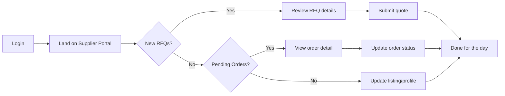

# Supplier Portal - Complete User Flow

## 1. Discovery & Entry

```mermaid
flowchart TD
    Start[User visits fractionalforge.app] --> Marketing[Marketing Homepage]
    Marketing --> Network[Scrolls to THE NETWORK section]
    Network --> Supplier[Sees Marketplace Suppliers card]
    Supplier --> Click[Clicks Start Selling button]
    Click --> JoinPage[/join/supplier page]
```

### Marketing Page Content

**"Marketplace Suppliers" Card:**
- Headline: "SELL YOUR PRODUCTS."
- Description: List products, services, or capacity. Receive qualified orders. Zero sales overhead.
- Button: **"Start Selling"** → `/join/supplier`

## 2. Signup & Onboarding

```mermaid
flowchart TD
    JoinPage[Join Supplier Page] --> Hook[Stage 1: The Hook]
    Hook --> ShowBenefits[Show benefits & value prop]
    ShowBenefits --> ClickCTA[User clicks Start Selling]
    ClickCTA --> Form[Stage 2: Signup Form]
    
    Form --> FillForm[Fill form:<br/>Name, Email, Password,<br/>Business Name, Business Type]
    FillForm --> Submit[Submit]
    Submit --> CreateAccount[Create auth user]
    CreateAccount --> SetAccountType[Set account_type = supplier]
    SetAccountType --> SetFoundry[foundry_id = centaur-suppliers]
    SetFoundry --> Success[/join/success]
    Success --> EmailVerify[Check email for verification]
    EmailVerify --> ClickLink[Click verification link]
    ClickLink --> Callback[/auth/callback]
    Callback --> CheckType{account_type?}
    CheckType -->|supplier| SupplierPortal[Redirect to /supplier-portal]
    CheckType -->|team_builder| Dashboard[Redirect to /today]
```

### Signup Form Fields

- Full Name (required)
- Email (required)
- Password (required, min 8 chars)
- Business Name (required)
- What do you sell? (optional)

### Onboarding Modal Steps (Supplier-Specific)

1. **Welcome, Supplier** - Introduction to portal
2. **Create Your Listing** - Guide to marketplace setup
3. **Get Discovered** - How RFQs and orders work
4. **Your Portal Awaits** - Dashboard overview

## 3. Supplier Portal Experience

### Dashboard (`/supplier-portal`)

```
┌─────────────────────────────────────────────────────────────────┐
│  WELCOME BACK, [NAME]!                         [Edit Listing]   │
│  Your Supplier Portal overview                                  │
├─────────────────────────────────────────────────────────────────┤
│                                                                 │
│  ┌──────────┐ ┌──────────┐ ┌──────────┐ ┌──────────┐          │
│  │ ACTIVE   │ │ NEW      │ │ THIS     │ │ RATING   │          │
│  │ ORDERS   │ │ RFQs     │ │ MONTH    │ │ 4.8★     │          │
│  │   12     │ │    5     │ │ $4,250   │ │ 23 rev   │          │
│  └──────────┘ └──────────┘ └──────────┘ └──────────┘          │
│                                                                 │
│  ┌──────────────────────┐ ┌──────────────────────┐            │
│  │ RECENT ORDERS        │ │ RFQ OPPORTUNITIES    │            │
│  │                      │ │                      │            │
│  │ • Order #1234        │ │ • "Need 50 units"    │            │
│  │   $450, Pending      │ │   Budget: $2,000     │            │
│  │   [View]             │ │   [Respond]          │            │
│  │                      │ │                      │            │
│  │ [View All →]         │ │ [View All →]         │            │
│  └──────────────────────┘ └──────────────────────┘            │
│                                                                 │
│  ┌──────────────────────────────────────────┐                  │
│  │ PROFILE COMPLETION                       │                  │
│  │ [████████████████░░░░] 85%               │                  │
│  │                                          │                  │
│  │ Missing: Add portfolio, Connect Stripe   │                  │
│  │ [Complete Setup →]                       │                  │
│  └──────────────────────────────────────────┘                  │
└─────────────────────────────────────────────────────────────────┘
```

### Navigation Sections

**Main:**
- Dashboard (home icon)
- My Listing (package icon)
- Orders (cart icon)
- RFQs (file icon)
- Analytics (chart icon)

**Browse:**
- Marketplace (store icon) - Suppliers can browse/buy

**Support:**
- Help (help icon)
- Settings (settings icon)

## 4. Daily Workflow

### Typical Supplier Day



### Key Actions

**Responding to RFQs:**
1. Dashboard shows "5 New RFQs"
2. Click "View All" → `/supplier-portal/rfqs`
3. See available RFQs with budget, deadline
4. Click "Respond" → Taken to RFQ detail page
5. Submit quote/proposal
6. Track status in "My Responses" tab

**Managing Orders:**
1. Dashboard shows "3 Pending Orders"
2. Click order → `/supplier-portal/orders/[id]`
3. See buyer info, order details, timeline
4. Update status: Accept → In Progress → Complete
5. Payment automatically released from escrow

**Updating Listing:**
1. Click "Edit Listing" from dashboard
2. Update title, description, category
3. Preview changes
4. Save → Listing updates in marketplace

## 5. What Suppliers DON'T See

To keep the experience focused, suppliers do NOT see:
- Task lists or task management UI
- Objectives and strategic planning features
- Team management and member invitations
- Timeline/Gantt chart views
- Guild or talent management
- Advisory forum
- Blueprints and knowledge mapping
- Admin panel (unless they have admin role separately)

## 6. Edge Cases Handled

### Existing Provider Portal Users
- Users with provider listings but no `account_type` → Continue using main platform
- Can be migrated to supplier account type later with a data script

### Suppliers Who Join a Team Later
- A supplier can be invited to a foundry as an Executive/Apprentice
- Their `member_role` changes, but `account_type` stays `supplier`
- They still land on Supplier Portal as their home base
- They can access team features when working within that foundry

### Team Builders Who Want to Sell
- Create a marketplace listing from `/marketplace`
- Their `account_type` stays `team_builder`
- They access provider features from within the main platform
- NOT routed to the simplified Supplier Portal

## Implementation Status

✅ Database schema migration  
✅ Intent selection in onboarding  
✅ Supplier onboarding modal  
✅ Supplier portal layout & sidebar  
✅ Dashboard with stats & widgets  
✅ All supplier pages (listing, orders, RFQs, analytics, settings)  
✅ Routing logic (middleware, login, auth callback)  
✅ Marketing page entry point  
✅ Join page supplier config  
✅ Signup action handling  

**Status:** Ready for testing and deployment
