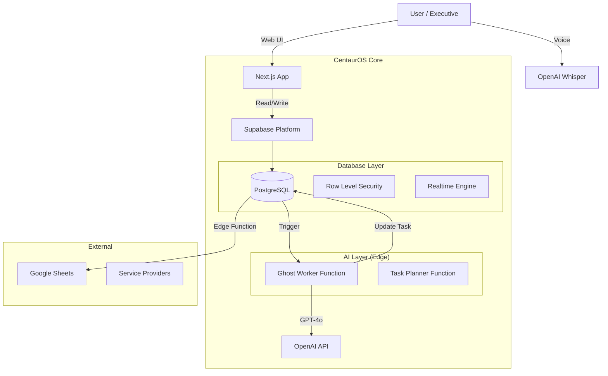

# System Architecture

## High-Level Overview

## Data Flow: "Ghost Apprentice"
1.  **Trigger**: User assigns task to "AI: Legal Agent".
2.  **Event**: Database `INSERT/UPDATE` fires `on_task_assigned_to_ai` trigger.
3.  **Execution**: Trigger calls `ghost-worker` Edge Function.
4.  **Processing**:
    - Function fetches Task Context + Objective.
    - Prompts GPT-4o with "Persona" (Legal Expert).
    - AI generates response/draft.
5.  **Handshake**:
    - Function updates Task Status -> `Amended_Pending_Approval`.
    - Function writes content to `amendment_notes`.
6.  **Review**:
    - Human User sees orange Badge on Task Card.
    - User clicks "Verify" or "Reject".

## Security Model
- **RLS**: All tables enabled. Users can only see data for their `foundry_id`.
- **Edge Functions**: Service Role Key required for invocation.
- **Client**: Anon Key restricted to public rows or authorized user rows.
