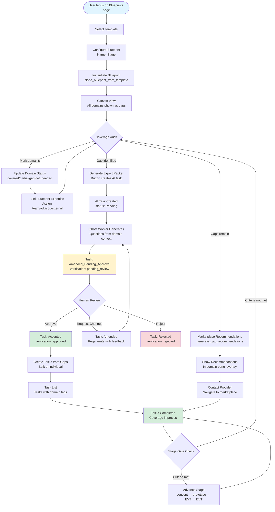
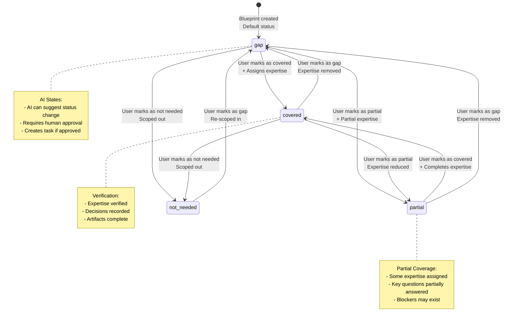

# UX Specification: Manufacturing Blueprint

> **Step 2 Output** | Created: 2026-02-01 | Status: Complete  
> **Version:** 1.0 | **Author:** Agent Step-2

---

## Table of Contents
1. [Executive Summary](#1-executive-summary)
2. [Primary Screens](#2-primary-screens)
3. [Canvas Interaction Model](#3-canvas-interaction-model)
4. [Coverage Audit UX](#4-coverage-audit-ux)
5. [Expert Packet Generation](#5-expert-packet-generation)
6. [Task Creation from Gaps](#6-task-creation-from-gaps)
7. [Marketplace Overlay](#7-marketplace-overlay)
8. [Accessibility](#8-accessibility)
9. [User Flow Diagrams](#9-user-flow-diagrams)
10. [Domain State Machine](#10-domain-state-machine)
11. [Edge Cases](#11-edge-cases)
12. [Implementation Checklist](#12-implementation-checklist)

---

## 1. Executive Summary

The Manufacturing Blueprint UX provides a **visual knowledge map** that helps hardware founders identify expertise gaps, generate expert-ready questions, and create actionable tasks. The interface centers on an interactive mind-map canvas showing the hierarchical domain tree, with side panels for detailed domain information and gap management.

### 1.1 Design Principles

1. **Visual First**: The mind-map canvas is the primary interface—users see coverage status at a glance
2. **Progressive Disclosure**: Details available on-demand via side panels; main canvas stays uncluttered
3. **Action-Oriented**: Every gap has clear next steps (expert packet, marketplace, tasks)
4. **Stage-Aware**: Content and interactions adapt to `project_stage` (concept → prototype → EVT → DVT → production → launched)
5. **Accessible**: Full keyboard navigation, screen reader support, WCAG 2.1 AA compliance

### 1.2 Key User Flows

- **Template → Coverage → Expert Packet → Tasks → Marketplace**: End-to-end journey from blueprint creation to expert engagement
- **Domain State Transitions**: Coverage status changes (covered/partial/gap/not_needed) with AI-assisted suggestions

---

## 2. Primary Screens

### 2.1 Blueprint List View

**Route:** `/blueprints`

**Purpose:** Overview of all blueprints in the foundry

**Layout:**
```
┌─────────────────────────────────────────────────────────────────┐
│ [Page Header: Orange Accent Bar]                                │
│ Blueprints                                                       │
│ Manage your product knowledge maps                              │
│ [+ Create Blueprint]                                            │
├─────────────────────────────────────────────────────────────────┤
│                                                                  │
│ ┌──────────────┐  ┌──────────────┐  ┌──────────────┐          │
│ │ RoboArm v1   │  │ Smart Hub    │  │ Wearable     │          │
│ │ Prototype    │  │ EVT          │  │ Concept      │          │
│ │ ████░░ 75%   │  │ ██████ 92%   │  │ ██░░░░ 35%   │          │
│ │ 3 gaps       │  │ 1 gap        │  │ 12 gaps      │          │
│ └──────────────┘  └──────────────┘  └──────────────┘          │
│                                                                  │
└─────────────────────────────────────────────────────────────────┘
```

**Components:**
- `BlueprintCard`: Shows name, stage, coverage score, gap count
- Filter/Search: By stage, coverage score, name
- Empty State: "Create your first blueprint from a template"

**Interactions:**
- Click card → Navigate to blueprint detail
- Click "+ Create Blueprint" → Template selection modal

### 2.2 Canvas View (Mind-Map)

**Route:** `/blueprints/[id]` (default tab)

**Purpose:** Interactive visualization of `knowledge_domains` hierarchy

**Layout:**
```
┌─────────────────────────────────────────────────────────────────┐
│ [Page Header: Orange Accent Bar]                                │
│ RoboArm v1 • Prototype                                           │
│ [Stage Selector] [View: Tree/List] [Filter] [Search]            │
├─────────────────────────────────────────────────────────────────┤
│                                                                  │
│  ┌──────────────────────────────────────────────────────────┐  │
│  │ [Canvas Controls: Pan/Zoom/Fit]                          │  │
│  │                                                           │  │
│  │        ┌──────────────┐                                  │  │
│  │        │ Electronics  │                                  │  │
│  │        │ ████░░ 60%   │                                  │  │
│  │        └──────┬───────┘                                  │  │
│  │               │                                           │  │
│  │    ┌──────────┼──────────┐                               │  │
│  │    │          │          │                               │  │
│  │ ┌──▼──┐   ┌──▼──┐   ┌──▼──┐                            │  │
│  │ │ PCB │   │ RF  │   │Power│                            │  │
│  │ │ ✓   │   │ ⚠   │   │ ✗   │                            │  │
│  │ └─────┘   └─────┘   └─────┘                            │  │
│  │                                                           │  │
│  └──────────────────────────────────────────────────────────┘  │
│                                                                  │
│ [Coverage Score: 75%] [Gap Dashboard] [Expert Packet Queue]     │
└─────────────────────────────────────────────────────────────────┘
```

**Components:**
- `DomainTreeCanvas`: Interactive mind-map using React Flow or similar
- `CanvasControls`: Pan, zoom, fit-to-view, reset
- `DomainNode`: Visual node with status badge, expand/collapse
- `BreadcrumbBar`: Shows path to selected domain
- `StatusLegend`: Color legend for coverage statuses

**Node Visual States:**
- **Covered** (`status: 'covered'`): `<StatusBadge status="success">`, checkmark icon
- **Partial** (`status: 'partial'`): `<StatusBadge status="warning">`, warning icon
- **Gap** (`status: 'gap'`): `<StatusBadge status="error">`, X icon
- **Not Needed** (`status: 'not_needed'`): `<StatusBadge status="info">`, minus icon
- **Critical** (`is_critical: true`): Thicker border, warning indicator

**Node Size/Color:**
- Node size: Based on `criticality` (critical = larger)
- Node color: Based on `status` (semantic tokens: `status-success`, `status-warning`, `status-error`)
- Edge color: Inherits from parent node status (muted)

### 2.3 Domain Detail Panel

**Component:** `DomainDetailPanel` (Sheet component, right side)

**Purpose:** Detailed view and editing for a single domain

**Layout:**
```
┌─────────────────────────────────────────────────────────────┐
│ [Sheet: Right Side, 480px width]                            │
│                                                              │
│ ┌────────────────────────────────────────────────────────┐ │
│ │ FCC Certification                    [Close]            │ │
│ │ Regulatory & Compliance • Critical                      │ │
│ │ Status: [Gap ▼]                                         │ │
│ └────────────────────────────────────────────────────────┘ │
│                                                              │
│ Description                                                  │
│ ────────────                                                 │
│ Wireless devices require FCC Part 15B certification...      │
│                                                              │
│ Key Questions                                                │
│ ────────────                                                 │
│ • What RF output power does your WiFi module use?           │
│ • Will you use internal or external antenna?                │
│                                                              │
│ Coverage                                                     │
│ ────────────                                                 │
│ [Assign Expertise] [Mark as Covered]                       │
│                                                              │
│ Blockers                                                     │
│ ────────────                                                 │
│ [+ Add Blocker]                                              │
│                                                              │
│ Decisions                                                    │
│ ────────────                                                 │
│ [+ Add Decision]                                             │
│                                                              │
│ Actions                                                      │
│ ────────────                                                 │
│ [Generate Expert Packet] [Create Task] [View RFQ]            │
│                                                              │
└─────────────────────────────────────────────────────────────┘
```

**Sections:**
1. **Header**: Domain name, category, criticality badge, status selector
2. **Description**: Domain description from `knowledge_domains.description`
3. **Key Questions**: List of `key_questions` (filtered by stage if configured)
4. **Coverage**: Expertise assignments, status controls
5. **Blockers**: List of blockers with severity indicators
6. **Decisions**: List of decisions/assumptions (from `blueprint_domain_coverage.decisions`)
7. **Actions**: Expert packet, task creation, RFQ links

**Interactions:**
- Status dropdown: Change `blueprint_domain_coverage.status`
- "Assign Expertise": Opens expertise assignment dialog
- "Generate Expert Packet": Creates task with `metadata.artifact_type = 'expert_packet'`
- "Create Task": Opens task creation dialog with domain pre-filled

### 2.4 Gap Dashboard

**Route:** `/blueprints/[id]?tab=gaps`

**Purpose:** Focused view of all gaps with prioritization

**Layout:**
```
┌─────────────────────────────────────────────────────────────────┐
│ Gap Dashboard                                                    │
│ Showing 8 gaps (3 critical)                                     │
├─────────────────────────────────────────────────────────────────┤
│                                                                  │
│ ┌──────────────────────────────────────────────────────────┐  │
│ │ 🔴 Critical Gaps                                          │  │
│ │ ┌──────────────────────────────────────────────────────┐ │  │
│ │ │ FCC Certification                                    │ │  │
│ │ │ Regulatory • Blocking EVT stage                      │ │  │
│ │ │ [Generate Expert Packet] [Find Marketplace Expert]   │ │  │
│ │ └──────────────────────────────────────────────────────┘ │  │
│ │ ┌──────────────────────────────────────────────────────┐ │  │
│ │ │ Battery Thermal Management                           │ │  │
│ │ │ Power Systems • 2 blockers                          │ │  │
│ │ │ [Generate Expert Packet] [Create Task]               │ │  │
│ │ └──────────────────────────────────────────────────────┘ │  │
│ └──────────────────────────────────────────────────────────┘  │
│                                                                  │
│ ┌──────────────────────────────────────────────────────────┐  │
│ │ ⚠️ Other Gaps                                             │  │
│ │ [List of non-critical gaps]                              │  │
│ └──────────────────────────────────────────────────────────┘  │
│                                                                  │
└─────────────────────────────────────────────────────────────────┘
```

**Components:**
- `GapCard`: Shows domain, category, blockers, actions
- Filter: By criticality, category, blockers
- Bulk Actions: "Create Tasks for All Gaps", "Generate Expert Packets"

**Interactions:**
- Click gap → Opens `DomainDetailPanel`
- Bulk actions → Confirmation dialog → Creates multiple tasks

---

## 3. Canvas Interaction Model

### 3.1 Pan & Zoom

**Controls:**
- **Pan**: Click + drag on canvas background
- **Zoom**: Mouse wheel (or pinch on touch)
- **Fit to View**: Button centers and scales to show all nodes
- **Reset**: Button returns to default zoom/pan

**Constraints:**
- Min zoom: 0.25x (25%)
- Max zoom: 2x (200%)
- Pan boundaries: Prevent panning beyond content bounds

**Implementation:**
```tsx
import { ReactFlow, Controls, Background, useReactFlow } from 'reactflow'

export function DomainTreeCanvas({ domains }: { domains: Domain[] }) {
  const { fitView, zoomTo, getViewport } = useReactFlow()
  
  const handleFitView = () => {
    fitView({ padding: 0.2, duration: 300 })
  }
  
  return (
    <ReactFlow
      nodes={buildNodes(domains)}
      edges={buildEdges(domains)}
      onMove={(event, viewport) => {
        // Track viewport for breadcrumbs
      }}
      minZoom={0.25}
      maxZoom={2}
    >
      <Controls />
      <Background />
    </ReactFlow>
  )
}
```

### 3.2 Expand/Collapse Nodes

**Behavior:**
- Click node → Expands/collapses children
- Double-click → Opens `DomainDetailPanel`
- Expand animation: 200ms ease-out
- Collapsed nodes show count badge: "3 children"

**State Management:**
```tsx
const [expandedNodes, setExpandedNodes] = useState<Set<string>>(new Set())

const toggleNode = (nodeId: string) => {
  setExpandedNodes(prev => {
    const next = new Set(prev)
    if (next.has(nodeId)) {
      next.delete(nodeId)
    } else {
      next.add(nodeId)
    }
    return next
  })
}
```

**Visual Indicators:**
- Expanded: ChevronDown icon
- Collapsed: ChevronRight icon
- Children count badge on collapsed nodes

### 3.3 Search

**Component:** Search input in header

**Functionality:**
- Real-time filtering as user types
- Highlights matching nodes
- Shows match count: "5 domains found"
- Clears filter on "X" click

**Search Scope:**
- Domain name
- Domain description
- Key questions (if expanded)

**Implementation:**
```tsx
const [searchQuery, setSearchQuery] = useState('')

const filteredDomains = useMemo(() => {
  if (!searchQuery) return domains
  
  const query = searchQuery.toLowerCase()
  return domains.filter(domain => 
    domain.name.toLowerCase().includes(query) ||
    domain.description?.toLowerCase().includes(query) ||
    domain.key_questions?.some(q => q.toLowerCase().includes(query))
  )
}, [domains, searchQuery])
```

### 3.4 Breadcrumbs

**Component:** Breadcrumb bar above canvas

**Purpose:** Show path to selected domain

**Layout:**
```
Electronics > Power Systems > Battery Management
```

**Behavior:**
- Updates when domain node clicked
- Click breadcrumb → Navigate to that domain (pan/zoom to node)
- Last item is current domain (non-clickable)

**Implementation:**
```tsx
const buildBreadcrumbs = (domain: Domain, allDomains: Domain[]): Domain[] => {
  const path: Domain[] = []
  let current: Domain | null = domain
  
  while (current) {
    path.unshift(current)
    current = current.parent_id 
      ? allDomains.find(d => d.id === current.parent_id) || null
      : null
  }
  
  return path
}
```

---

## 4. Coverage Audit UX

### 4.1 Setting Domain Status

**Location:** `DomainDetailPanel` header

**Component:** Status dropdown

**Options:**
- `covered` → `<StatusBadge status="success">Covered</StatusBadge>`
- `partial` → `<StatusBadge status="warning">Partial</StatusBadge>`
- `gap` → `<StatusBadge status="error">Gap</StatusBadge>`
- `not_needed` → `<StatusBadge status="info">Not Needed</StatusBadge>`

**Interaction:**
```tsx
<Select
  value={coverage.status}
  onValueChange={async (newStatus) => {
    await updateDomainCoverage(domainId, { status: newStatus })
    // Optimistic update
    setCoverage(prev => ({ ...prev, status: newStatus }))
    // Recalculate coverage score
    await recalculateCoverageScore(blueprintId)
  }}
>
  <SelectTrigger>
    <StatusBadge status={coverage.status} />
  </SelectTrigger>
  <SelectContent>
    <SelectItem value="covered">Covered</SelectItem>
    <SelectItem value="partial">Partial</SelectItem>
    <SelectItem value="gap">Gap</SelectItem>
    <SelectItem value="not_needed">Not Needed</SelectItem>
  </SelectContent>
</Select>
```

**Real-time Updates:**
- Coverage score recalculates immediately
- Canvas node updates color/badge
- Gap dashboard updates if status changes to/from gap

### 4.2 Linking Blueprint Expertise

**Location:** `DomainDetailPanel` → "Coverage" section

**Component:** Expertise list + "Assign Expertise" button

**Expertise Types:**
- `team` → Team member (from `profiles`)
- `advisor` → Advisor (external contact)
- `marketplace` → Marketplace provider
- `external` → External consultant
- `ai_agent` → AI agent (for AI-generated content)

**Assignment Dialog:**
```tsx
<Dialog>
  <DialogContent size="md">
    <DialogHeader>
      <DialogTitle>Assign Expertise</DialogTitle>
    </DialogHeader>
    <Tabs defaultValue="team">
      <TabsList>
        <TabsTrigger value="team">Team Member</TabsTrigger>
        <TabsTrigger value="advisor">Advisor</TabsTrigger>
        <TabsTrigger value="marketplace">Marketplace</TabsTrigger>
        <TabsTrigger value="external">External</TabsTrigger>
      </TabsList>
      <TabsContent value="team">
        <Select>
          {/* Team member list */}
        </Select>
        <Select>
          <SelectItem value="expert">Expert</SelectItem>
          <SelectItem value="competent">Competent</SelectItem>
          <SelectItem value="learning">Learning</SelectItem>
        </Select>
      </TabsContent>
      {/* Other tabs */}
    </Tabs>
    <DialogFooter>
      <Button variant="secondary" onClick={onCancel}>Cancel</Button>
      <Button onClick={handleAssign}>Assign</Button>
    </DialogFooter>
  </DialogContent>
</Dialog>
```

**Expertise Display:**
```tsx
{expertise.map(exp => (
  <div key={exp.id} className="flex items-center gap-2">
    <UserAvatar name={exp.profile?.full_name} role={exp.profile?.role} />
    <div>
      <p className="text-sm font-medium">{exp.profile?.full_name}</p>
      <p className="text-xs text-muted-foreground">
        {exp.expertise_level} • {exp.verification_status}
      </p>
    </div>
    <Button variant="ghost" size="icon" onClick={() => removeExpertise(exp.id)}>
      <X className="h-4 w-4" />
    </Button>
  </div>
))}
```

### 4.3 Coverage Score Display

**Location:** Blueprint header, gap dashboard

**Component:** `CoverageScore`

**Visual:**
```
Coverage: ████████░░ 75%
```

**Calculation:**
- Numerator: Domains with `status: 'covered'` or `'partial'` (weighted: covered = 1.0, partial = 0.5)
- Denominator: Total domains (excluding `'not_needed'`)
- Formula: `(covered_count * 1.0 + partial_count * 0.5) / total_domains * 100`

**Real-time Updates:**
- Updates immediately on status change
- Smooth animation (200ms transition)

---

## 5. Expert Packet Generation

### 5.1 Generate Expert Packet Button

**Location:** `DomainDetailPanel` → "Actions" section

**Button:**
```tsx
<Button
  onClick={handleGenerateExpertPacket}
  disabled={coverage.status === 'covered'}
  variant="default"
>
  <Sparkles className="h-4 w-4 mr-2" />
  Generate Expert Packet
</Button>
```

**Pre-conditions:**
- Domain status must be `'gap'` or `'partial'`
- Button disabled if `status: 'covered'`

**Action Flow:**
1. User clicks button
2. Loading state: "Generating expert packet..."
3. Server action: `generateExpertPacket({ blueprint_id, domain_id })`
4. Task created with:
   - `title`: "Expert Packet: {domain_name}"
   - `status`: `'Pending'`
   - `assignee_id`: AI_Agent profile
   - `metadata.artifact_type`: `'expert_packet'`
   - `metadata.blueprint_id`: blueprint_id
   - `metadata.domain_id`: domain_id
5. Ghost Worker triggered (async)
6. Task status → `'Amended_Pending_Approval'` when AI completes
7. User notified: "Expert packet ready for review"
8. Navigate to task detail page

### 5.2 Expert Packet Task Detail

**Route:** `/tasks/[id]`

**Purpose:** Review and approve AI-generated expert packet

**Layout:**
```
┌─────────────────────────────────────────────────────────────────┐
│ Expert Packet: FCC Certification                                │
│ Status: Amended_Pending_Approval                                │
│ Assigned to: AI Agent                                           │
├─────────────────────────────────────────────────────────────────┤
│                                                                  │
│ [Provenance Badge: AI Suggested • 78% Confidence]               │
│                                                                  │
│ Context                                                          │
│ ────────                                                         │
│ Project: RoboArm v1 (Prototype stage)                           │
│ Domain: FCC Certification                                       │
│                                                                  │
│ Generated Questions                                              │
│ ───────────────────                                              │
│                                                                  │
│ 1. What is the RF output power of your WiFi module?             │
│    Why it matters: FCC Part 15.247 limits EIRP to 1W...        │
│    Artifacts to request:                                        │
│    • WiFi module datasheet                                      │
│    • Preliminary EMC scan results                              │
│    Red flags: Module vendor cannot provide FCC grant...         │
│                                                                  │
│ 2. Will you use internal or external antenna?                   │
│    [Similar structure]                                          │
│                                                                  │
│ [Edit] [Add Question] [Remove Question]                         │
│                                                                  │
│ [Review Actions Panel]                                           │
│ [Approve] [Request Changes] [Reject]                            │
│                                                                  │
└─────────────────────────────────────────────────────────────────┘
```

**Review Actions:**
- **Approve**: Task status → `'Accepted'`, verification status → `'approved'`
- **Request Changes**: Task status → `'Amended'`, amendment instructions saved
- **Reject**: Task status → `'Rejected'`, verification status → `'rejected'`

**Editing:**
- User can edit questions inline
- Changes tracked in `amendment_notes`
- On approval, edited content becomes canonical

---

## 6. Task Creation from Gaps

### 6.1 Create Task Button

**Location:** `DomainDetailPanel` → "Actions" section, Gap Dashboard → Gap card

**Button:**
```tsx
<Button
  onClick={handleCreateTask}
  variant="secondary"
>
  <Plus className="h-4 w-4 mr-2" />
  Create Task
</Button>
```

**Dialog:**
```tsx
<Dialog>
  <DialogContent size="md">
    <DialogHeader>
      <DialogTitle>Create Task from Gap</DialogTitle>
    </DialogHeader>
    <form onSubmit={handleSubmit}>
      <div className="space-y-4">
        <div className="space-y-2">
          <Label htmlFor="task-title" className="text-sm font-medium">
            Task Title
            <span className="text-destructive ml-1" aria-label="required">*</span>
          </Label>
          <Input
            id="task-title"
            name="title"
            defaultValue={`Address ${domain.name} gap`}
            required
            aria-required={true}
            aria-invalid={errors.title ? true : false}
            aria-describedby={errors.title ? "task-title-error" : undefined}
            className={cn(errors.title && "border-destructive")}
          />
          {errors.title && (
            <p id="task-title-error" role="alert" className="text-sm text-destructive">
              {errors.title}
            </p>
          )}
        </div>
        <div className="space-y-2">
          <Label htmlFor="task-description" className="text-sm font-medium">
            Description
            <span className="text-destructive ml-1" aria-label="required">*</span>
          </Label>
          <Textarea
            id="task-description"
            name="description"
            defaultValue={domain.description}
            required
            aria-required={true}
            aria-invalid={errors.description ? true : false}
            aria-describedby={errors.description ? "task-description-error" : undefined}
            className={cn(errors.description && "border-destructive")}
          />
          {errors.description && (
            <p id="task-description-error" role="alert" className="text-sm text-destructive">
              {errors.description}
            </p>
          )}
        </div>
        <div className="space-y-2">
          <Label className="text-sm font-medium">Domain Tags</Label>
          <div className="flex gap-2">
            <Badge variant="secondary">{domain.name}</Badge>
            <Badge variant="secondary">{domain.category}</Badge>
          </div>
        </div>
        <div className="space-y-2">
          <Label htmlFor="task-priority" className="text-sm font-medium">Priority</Label>
          <Select 
            id="task-priority"
            name="priority"
            defaultValue={domain.is_critical ? 'high' : 'medium'}
          >
            <SelectItem value="high">High</SelectItem>
            <SelectItem value="medium">Medium</SelectItem>
            <SelectItem value="low">Low</SelectItem>
          </Select>
        </div>
      </div>
      <DialogFooter>
        <Button variant="secondary" onClick={onCancel}>Cancel</Button>
        <Button type="submit">Create Task</Button>
      </DialogFooter>
    </form>
  </DialogContent>
</Dialog>
```

**Note:** On form validation failure, focus should move to the first error field using:
```tsx
const firstErrorId = Object.keys(errors)[0]
requestAnimationFrame(() => {
  document.getElementById(firstErrorId)?.focus()
})
```

**Task Metadata:**
```typescript
{
  blueprint_id: blueprintId,
  domain_id: domainId,
  // No artifact_type (regular task, not AI artifact)
}
```

**Domain Tags:**
- Task includes domain name and category as tags
- Enables filtering tasks by domain in task list

### 6.2 Bulk Task Creation

**Location:** Gap Dashboard → Bulk Actions

**Button:**
```tsx
<Button
  onClick={handleBulkCreateTasks}
  variant="outline"
>
  <Plus className="h-4 w-4 mr-2" />
  Create Tasks for All Gaps
</Button>
```

**Confirmation Dialog:**
```tsx
<AlertDialog>
  <AlertDialogContent>
    <AlertDialogHeader>
      <AlertDialogTitle>Create Tasks for 8 Gaps?</AlertDialogTitle>
      <AlertDialogDescription>
        This will create 8 tasks, one for each gap domain. You can edit them after creation.
      </AlertDialogDescription>
    </AlertDialogHeader>
    <div className="space-y-2 max-h-48 overflow-y-auto">
      {gaps.map(gap => (
        <div key={gap.id} className="flex items-center gap-2">
          <Checkbox checked={selectedGaps.has(gap.id)} />
          <span>{gap.name}</span>
        </div>
      ))}
    </div>
    <AlertDialogFooter>
      <AlertDialogCancel>Cancel</AlertDialogCancel>
      <AlertDialogAction onClick={handleConfirm}>
        Create {selectedGaps.size} Tasks
      </AlertDialogAction>
    </AlertDialogFooter>
  </AlertDialogContent>
</AlertDialog>
```

**Server Action:**
- Calls `createTasksFromGaps({ blueprint_id, domain_ids, task_type: 'coverage_assessment' })`
- Returns `{ success, tasks_created, task_ids, errors }`
- Shows toast with results

---

## 7. Marketplace Overlay

### 7.1 Marketplace Recommendations Display

**Location:** `DomainDetailPanel` → "Actions" section (when gap exists)

**Component:** Marketplace recommendations card

**Layout:**
```
┌─────────────────────────────────────────────────────────────┐
│ Marketplace Recommendations                                 │
│ ─────────────────────────────────────────────────────────── │
│                                                              │
│ Found 3 providers for FCC Certification                     │
│                                                              │
│ ┌────────────────────────────────────────────────────────┐ │
│ │ RF Compliance Experts                                  │ │
│ │ ⭐⭐⭐⭐⭐ Verified Partner                              │ │
│ │ Match: 92% • Based on your gap in Regulatory           │ │
│ │ [View Profile] [Contact]                               │ │
│ └────────────────────────────────────────────────────────┘ │
│                                                              │
│ ┌────────────────────────────────────────────────────────┐ │
│ │ EMC Testing Labs                                       │ │
│ │ ⭐⭐⭐⭐ Approved                                        │ │
│ │ Match: 78% • Based on your gap in Regulatory           │ │
│ │ [View Profile] [Contact]                               │ │
│ └────────────────────────────────────────────────────────┘ │
│                                                              │
│ [View All Recommendations] [Dismiss]                       │
│                                                              │
└─────────────────────────────────────────────────────────────┘
```

**Gating Rules:**
- Only shown when `domain.status === 'gap'` or `'partial'`
- Requires `recommendation.match_score >= 60`
- Requires `provider.tier === 'verified_partner'` or `'approved'`
- Hidden if `recommendation.is_dismissed === true`

**CTA Variants:**
- **Prominent**: Early stages (concept, prototype, evt), high confidence
- **Subtle**: Late stages (dvt, production), with warning: "Late-stage engagement may have limited impact"

### 7.2 Marketplace Integration

**Navigation:**
- "View Profile" → `/marketplace/[provider_id]`
- "Contact" → Opens contact dialog or creates RFQ
- "View All Recommendations" → `/marketplace?source=blueprint&blueprint_id=X&domain_id=Y`

**Recommendation Source:**
- `marketplace_recommendations.source_type = 'blueprint_gap'`
- `marketplace_recommendations.source_id = blueprint_domain_coverage.id`

---

## 8. Accessibility

### 8.1 Keyboard Navigation

**Canvas Navigation:**
- **Tab**: Move focus between nodes (breadcrumb → canvas → controls)
- **Arrow Keys**: Navigate between sibling nodes (when node focused)
- **Enter**: Expand/collapse node or open detail panel
- **Escape**: Close detail panel, clear search
- **Home**: Focus first node
- **End**: Focus last node

**Detail Panel Navigation:**
- **Tab**: Move through form fields, buttons
- **Enter**: Submit form, activate button
- **Escape**: Close panel

**Implementation:**
```tsx
const handleKeyDown = (e: React.KeyboardEvent) => {
  switch (e.key) {
    case 'ArrowRight':
      e.preventDefault()
      focusNextSibling()
      break
    case 'ArrowLeft':
      e.preventDefault()
      focusPreviousSibling()
      break
    case 'Enter':
      e.preventDefault()
      if (focusedNode) {
        openDetailPanel(focusedNode)
      }
      break
    case 'Escape':
      e.preventDefault()
      closeDetailPanel()
      break
  }
}
```

### 8.2 Focus Management

**Focus Indicators:**
- All interactive elements have visible focus rings
- Focus ring color: `ring-accent` (International Orange)
- Focus ring width: 2px

**Focus Trapping:**
- Detail panel traps focus when open
- Focus returns to trigger element on close
- Canvas maintains focus state during pan/zoom

**Focus Announcements:**
- Screen reader announces: "Domain {name}, status {status}, {criticality} criticality"
- Status changes announced: "Domain {name} status changed to {new_status}"
- Task creation announced: "Task created: {title}"

### 8.3 Screen Reader Support

**ARIA Labels:**
```tsx
<button
  aria-label={`${domain.name}, ${domain.status} status, ${domain.criticality} criticality`}
  aria-expanded={isExpanded}
  aria-controls={`domain-${domain.id}-children`}
>
  {domain.name}
</button>
```

**Live Regions:**
```tsx
<div aria-live="polite" aria-atomic="true" className="sr-only">
  {announcement}
</div>
```

**Status Badges:**
- Use `StatusBadge` component with `aria-label`
- Example: `aria-label="Status: Gap, Critical domain"`

### 8.4 Color Contrast

**Requirements:**
- All text meets WCAG 2.1 AA (4.5:1 for normal text, 3:1 for large text)
- Status badges use semantic tokens (automatically compliant)
- Canvas nodes have sufficient contrast against background

**Testing:**
- Use browser DevTools contrast checker
- Test with colorblind simulation tools
- Ensure status is communicated via icon + text, not color alone

### 8.5 Touch Targets

**Minimum Size:**
- All interactive elements: `min-h-[44px] min-w-[44px]` (iOS HIG standard)
- Canvas nodes: Minimum 48x48px touch target
- Buttons: Use `size="lg"` on mobile, `size="default"` on desktop

---

## 9. User Flow Diagrams

### 9.1 End-to-End User Flow



### 9.2 Domain State Machine



---

## 10. Domain State Machine

### 10.1 State Transitions

**States:**
- `covered`: Domain has sufficient expertise coverage
- `partial`: Domain has partial coverage (some gaps remain)
- `gap`: Domain has no coverage (critical blocker)
- `not_needed`: Domain explicitly scoped out for this product

**Transition Rules:**
- **Any → `covered`**: User assigns expertise + marks as covered
- **Any → `partial`**: User assigns partial expertise or marks explicitly
- **Any → `gap`**: User removes expertise or marks explicitly
- **Any → `not_needed`**: User explicitly scopes out domain

**AI-Assisted Transitions:**
- AI can suggest status changes (creates task with `artifact_type: 'domain_suggestion'`)
- Human must approve AI suggestions
- AI suggestions include confidence score and rationale

### 10.2 State Persistence

**Storage:**
- `blueprint_domain_coverage.status` (enum: `coverage_status`)
- Updated via `updateBlueprintDomainCoverage` server action
- Changes logged to `blueprint_history`

**Optimistic Updates:**
- UI updates immediately on status change
- Server action runs in background
- Rollback on error with toast notification

---

## 11. Edge Cases

### EC-01: Domain Without Coverage Record

**Scenario:** User clicks domain that has no `blueprint_domain_coverage` record yet.

**Handling:**
- Auto-create coverage record with `status: 'gap'` (default)
- Show toast: "Coverage record created"
- Proceed with detail panel

**Implementation:**
```tsx
const getDomainCoverage = async (blueprintId: string, domainId: string) => {
  let coverage = await fetchCoverage(blueprintId, domainId)
  
  if (!coverage) {
    // Auto-create default coverage
    coverage = await createDefaultCoverage(blueprintId, domainId)
  }
  
  return coverage
}
```

### EC-02: Very Large Domain Tree (200+ Nodes)

**Scenario:** Template has 200+ domains, canvas becomes slow.

**Handling:**
- Virtual scrolling: Only render visible nodes
- Lazy loading: Load children on expand
- Progressive rendering: Render top-level first, children on demand
- Performance warning: "Large tree detected. Consider filtering."

**Implementation:**
```tsx
const VirtualizedTree = ({ domains }: { domains: Domain[] }) => {
  const [expanded, setExpanded] = useState<Set<string>>(new Set(['root']))
  const visibleDomains = useMemo(() => {
    return filterVisibleDomains(domains, expanded)
  }, [domains, expanded])
  
  return (
    <VirtualList
      items={visibleDomains}
      renderItem={domain => <DomainNode domain={domain} />}
      itemHeight={60}
    />
  )
}
```

### EC-03: Concurrent Status Updates

**Scenario:** Two users update the same domain status simultaneously.

**Handling:**
- Optimistic locking: Check `updated_at` timestamp
- Last-write-wins with conflict toast
- Show both users' changes in history

**Implementation:**
```tsx
const updateStatus = async (domainId: string, newStatus: string) => {
  const current = await getCoverage(domainId)
  
  const { error } = await supabase
    .from('blueprint_domain_coverage')
    .update({ status: newStatus, updated_at: new Date() })
    .eq('id', domainId)
    .eq('updated_at', current.updated_at) // Optimistic lock
    
  if (error?.code === 'PGRST116') {
    toast.error('Domain was updated by another user. Please refresh.')
    return
  }
}
```

### EC-04: Expert Packet Generation Fails

**Scenario:** Ghost Worker fails to generate expert packet (API error, timeout).

**Handling:**
- Task remains in `Pending` status
- System comment added: "AI generation failed: {error}"
- Retry button shown
- User can manually create task instead

**Implementation:**
```tsx
try {
  await runBlueprintAIWorker(taskId, 'expert_packet', context)
} catch (error) {
  await addSystemComment(taskId, {
    action: 'ai_generation_failed',
    error_message: error.message,
    retry_available: true
  })
  // Task stays in Pending
}
```

### EC-05: Domain Deleted While Panel Open

**Scenario:** User has domain detail panel open, another user deletes the domain.

**Handling:**
- Poll for domain existence (every 5s) or use real-time subscription
- Show warning banner: "This domain was deleted"
- Disable edit controls
- Allow close panel

**Implementation:**
```tsx
useEffect(() => {
  const subscription = supabase
    .channel(`domain-${domainId}`)
    .on('postgres_changes', {
      event: 'DELETE',
      schema: 'public',
      table: 'knowledge_domains',
      filter: `id=eq.${domainId}`
    }, () => {
      setDomainDeleted(true)
    })
    .subscribe()
    
  return () => subscription.unsubscribe()
}, [domainId])
```

### EC-06: Blueprint Stage Changes During Expert Packet Review

**Scenario:** User changes blueprint stage while expert packet is pending review.

**Handling:**
- Task preserves original stage context
- Warning banner: "Blueprint stage changed to {new_stage} after packet generation"
- User can regenerate packet with new stage context
- Original packet remains for historical reference

**Implementation:**
```tsx
const TaskDetailView = ({ task }: { task: Task }) => {
  const currentStage = blueprint.project_stage
  const packetStage = task.metadata?.provenance?.ai_context?.source_context?.project_stage
  
  const stageChanged = currentStage !== packetStage
  
  return (
    <>
      {stageChanged && (
        <Alert variant="warning">
          Blueprint stage changed to {currentStage} after this packet was generated.
          Consider regenerating with updated stage context.
        </Alert>
      )}
      {/* Task content */}
    </>
  )
}
```

### EC-07: Marketplace Recommendations Expire

**Scenario:** User views recommendations that have `expires_at` in the past.

**Handling:**
- Filter out expired recommendations automatically
- Show message: "Some recommendations have expired. Refresh to see new ones."
- "Refresh Recommendations" button calls `generate_gap_recommendations()` with `force_refresh: true`

**Implementation:**
```tsx
const validRecommendations = recommendations.filter(rec => 
  !rec.is_dismissed && 
  new Date(rec.expires_at) > new Date()
)

if (validRecommendations.length < recommendations.length) {
  showExpiredWarning()
}
```

### EC-08: User Dismisses Recommendation Then Re-opens Gap

**Scenario:** User dismisses marketplace recommendation, then later marks domain as gap again.

**Handling:**
- Dismissed recommendations stay dismissed (don't auto-reappear)
- User can manually refresh recommendations
- New gaps generate new recommendations (different `source_id`)

**Implementation:**
```tsx
// Recommendations are dismissed per recommendation, not per domain
// New gap → new recommendation → new source_id
// Old dismissed recommendation stays dismissed
```

### EC-09: Canvas Pan/Zoom Loses State on Navigation

**Scenario:** User pans/zooms canvas, navigates away, returns—canvas resets.

**Handling:**
- Persist viewport state in URL query params or localStorage
- Restore on mount: `?viewport=x:100,y:200,zoom:1.5`
- Or use sessionStorage for temporary state

**Implementation:**
```tsx
const saveViewport = (viewport: Viewport) => {
  const params = new URLSearchParams({
    x: viewport.x.toString(),
    y: viewport.y.toString(),
    zoom: viewport.zoom.toString()
  })
  router.replace(`/blueprints/${id}?${params}`)
}

const restoreViewport = () => {
  const params = new URLSearchParams(window.location.search)
  if (params.has('x')) {
    return {
      x: parseFloat(params.get('x')!),
      y: parseFloat(params.get('y')!),
      zoom: parseFloat(params.get('zoom')!)
    }
  }
  return null
}
```

### EC-10: Search Returns No Results

**Scenario:** User searches for domain that doesn't exist.

**Handling:**
- Show empty state: "No domains found matching '{query}'"
- "Clear search" button
- Suggest: "Try a different search term" or "Check spelling"

**Implementation:**
```tsx
{filteredDomains.length === 0 && searchQuery && (
  <EmptyState
    title={`No domains found matching "${searchQuery}"`}
    description="Try a different search term or clear the filter"
    action={
      <Button onClick={() => setSearchQuery('')}>
        Clear Search
      </Button>
    }
  />
)}
```

### EC-11: Bulk Task Creation Partially Fails

**Scenario:** User creates tasks for 10 gaps, 3 fail (permissions, validation).

**Handling:**
- Show success toast: "7 tasks created successfully"
- Show error details: "3 tasks failed: {reasons}"
- Allow retry for failed domains
- Created tasks are still created (partial success)

**Implementation:**
```tsx
const result = await createTasksFromGaps({ blueprint_id, domain_ids })

if (result.success) {
  toast.success(`${result.tasks_created} tasks created`)
} else {
  toast.warning(`${result.tasks_created} tasks created, ${result.errors?.length} failed`)
  if (result.errors) {
    // Show error details in expandable section
  }
}
```

### EC-12: Domain Has 50+ Decisions

**Scenario:** Domain detail panel becomes very long with many decisions.

**Handling:**
- Paginate decisions: Show 10 per page
- Collapsible sections: "Show all decisions (50)"
- Search/filter decisions by type, status, date
- Virtual scrolling for long lists

**Implementation:**
```tsx
const [decisionsPage, setDecisionsPage] = useState(1)
const decisionsPerPage = 10

const paginatedDecisions = decisions.slice(
  (decisionsPage - 1) * decisionsPerPage,
  decisionsPage * decisionsPerPage
)

return (
  <div>
    {paginatedDecisions.map(decision => (
      <DecisionCard key={decision.id} decision={decision} />
    ))}
    {decisions.length > decisionsPerPage && (
      <Pagination
        currentPage={decisionsPage}
        totalPages={Math.ceil(decisions.length / decisionsPerPage)}
        onPageChange={setDecisionsPage}
      />
    )}
  </div>
)
```

---

## 12. Implementation Checklist

### 12.1 Canvas Components

- [ ] Implement `DomainTreeCanvas` with React Flow or similar
- [ ] Add pan/zoom controls with constraints
- [ ] Implement expand/collapse with animation
- [ ] Add breadcrumb navigation
- [ ] Implement search with highlighting
- [ ] Add status legend component
- [ ] Test with 200+ node trees

### 12.2 Domain Detail Panel

- [ ] Create `DomainDetailPanel` Sheet component
- [ ] Implement status dropdown with real-time updates
- [ ] Add expertise assignment dialog
- [ ] Implement blocker management
- [ ] Add decision recording UI
- [ ] Add action buttons (expert packet, tasks, RFQ)
- [ ] Test with long content (50+ decisions)

### 12.3 Coverage Audit

- [ ] Implement coverage score calculation
- [ ] Add real-time score updates
- [ ] Create gap dashboard view
- [ ] Implement bulk actions (create tasks, generate packets)
- [ ] Add filter by status, criticality, category
- [ ] Test concurrent updates

### 12.4 Expert Packet Flow

- [ ] Implement "Generate Expert Packet" button
- [ ] Create expert packet task detail view
- [ ] Add review actions (approve, reject, amend)
- [ ] Implement editing of AI-generated questions
- [ ] Add provenance badges and confidence indicators
- [ ] Test AI generation failure handling

### 12.5 Task Creation

- [ ] Implement "Create Task" dialog
- [ ] Add domain tags to tasks
- [ ] Implement bulk task creation
- [ ] Add confirmation dialogs
- [ ] Test partial failure scenarios

### 12.6 Marketplace Integration

- [ ] Implement recommendation display in domain panel
- [ ] Add marketplace CTA gating logic
- [ ] Create recommendation card component
- [ ] Implement dismiss functionality
- [ ] Add navigation to marketplace
- [ ] Test recommendation expiration

### 12.7 Accessibility

- [ ] Implement keyboard navigation for canvas
- [ ] Add ARIA labels to all interactive elements
- [ ] Test with screen reader (NVDA/JAWS)
- [ ] Ensure color contrast compliance
- [ ] Add focus management for modals/panels
- [ ] Test touch targets on mobile

### 12.8 Performance

- [ ] Implement virtual scrolling for large trees
- [ ] Add lazy loading for domain children
- [ ] Optimize canvas rendering (React.memo, useMemo)
- [ ] Test with 200+ domains
- [ ] Add loading states for async operations

### 12.9 Error Handling

- [ ] Handle domain deletion while panel open
- [ ] Handle concurrent status updates
- [ ] Handle AI generation failures
- [ ] Handle partial bulk operation failures
- [ ] Add user-friendly error messages

### 12.10 Testing

- [ ] E2E test: Template → Coverage → Expert Packet → Tasks
- [ ] E2E test: Domain state transitions
- [ ] E2E test: Marketplace recommendation flow
- [ ] Unit test: Coverage score calculation
- [ ] Unit test: Marketplace CTA gating logic
- [ ] Accessibility audit (WCAG 2.1 AA)

---

## Changes Made

| File | Action |
|------|--------|
| `docs/blueprint/02-ux-spec.md` | Created — Comprehensive UX specification with primary screens, canvas interaction, coverage audit, expert packets, tasks, marketplace overlay, accessibility, user flows, state machine, and 12 edge cases |
| `docs/blueprint/INDEX.md` | Updated — Marked 02-ux-spec.md as complete |
| `docs/blueprint/ORCHESTRATION.md` | Updated — Marked Step 2 complete |
