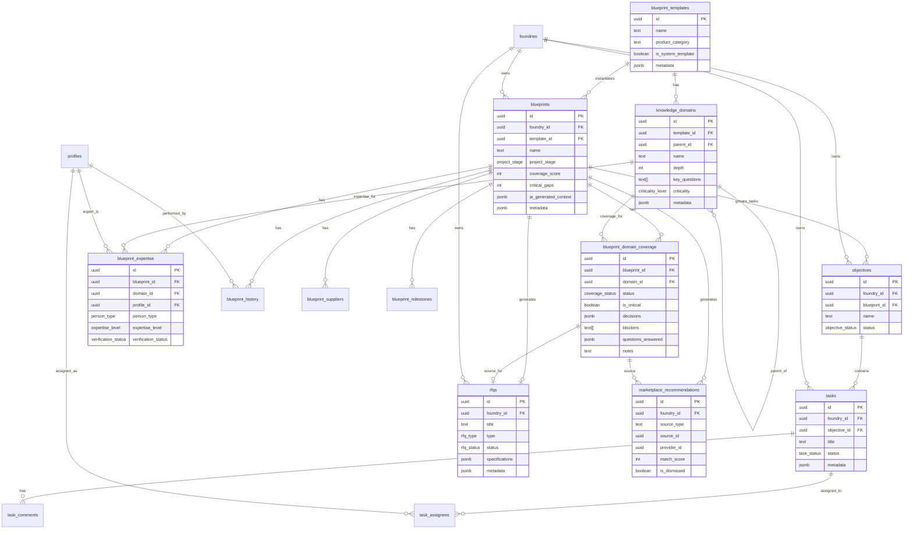

# Data Model & API Design

> **Step 3 Output** | Created: 2026-02-01 | Status: Complete  
> **Version:** 1.0 | **Author:** Agent Step-3

---

## Table of Contents
1. [Executive Summary](#1-executive-summary)
2. [Current-State Schema Mapping](#2-current-state-schema-mapping)
3. [Proposed Schema Changes](#3-proposed-schema-changes)
4. [API Surface](#4-api-surface)
5. [Permissions Model](#5-permissions-model)
6. [Versioning & Audit](#6-versioning--audit)
7. [Entity Relationship Diagram](#7-entity-relationship-diagram)
8. [Analytics Events](#8-analytics-events)
9. [Implementation Checklist](#9-implementation-checklist)

---

## 1. Executive Summary

The Manufacturing Blueprint data model leverages **existing CentaurOS infrastructure** wherever possible, adding only minimal schema extensions for blueprint-task integration and AI artifact management.

### 1.1 Design Principles

1. **Prefer Existing Tables**: Use `tasks`, `objectives`, `rfqs` for actionable items rather than creating parallel structures
2. **JSONB for Flexibility**: Store extensible metadata in JSONB columns (`tasks.metadata`, `blueprint_domain_coverage.decisions`)
3. **Foundry Isolation**: All tables include `foundry_id` with RLS policies
4. **Audit Everything**: Use `blueprint_history` and `task_comments` with `is_system_log` for provenance
5. **Type Safety**: Mirror TypeScript types in API contracts

### 1.2 Schema Changes Summary

| Change | Type | Priority | Rationale |
|--------|------|----------|-----------|
| `tasks.metadata` JSONB | ADD COLUMN | Critical | Blueprint/domain linking, artifact storage |
| `objectives.blueprint_id` | ADD COLUMN | Critical | Blueprint-objective grouping |
| GIN index on `tasks.metadata` | ADD INDEX | High | Query performance for JSONB |

---

## 2. Current-State Schema Mapping

### 2.1 PRD Feature → Table Mapping

| PRD Feature | Primary Table(s) | Existing | Notes |
|-------------|------------------|----------|-------|
| **FR-001: Create blueprint from template** | `blueprints`, `blueprint_domain_coverage` | ✅ | Use `clone_blueprint_from_template()` |
| **FR-010-015: Mind-map/domain tree** | `knowledge_domains`, `blueprint_domain_coverage` | ✅ | Hierarchical tree via `parent_id` |
| **FR-020-025: Coverage audit** | `blueprint_domain_coverage` | ✅ | Status/blockers/notes exist |
| **FR-030-036: Expert packet generation** | `tasks` | ⚠️ Extend | Needs `metadata` column for artifact |
| **FR-040-044: Decision recording** | `blueprint_domain_coverage.decisions` | ✅ | JSONB array exists |
| **FR-050-054: Risk heatmap** | Computed | ✅ | No storage needed—ephemeral |
| **FR-060-065: OptionSets** | New table (v1) | ❌ Defer | Not MVP |
| **FR-070-075: RFQ starter pack** | `rfqs`, `rfq_responses` | ✅ | Use `createNewRFQ()` |
| **FR-080-085: Marketplace overlay** | `marketplace_recommendations` | ✅ | Use `generate_gap_recommendations()` |

### 2.2 Core Blueprint Tables (Existing)

```sql
-- Blueprint Templates (system-level)
CREATE TABLE blueprint_templates (
  id UUID PRIMARY KEY,
  name TEXT NOT NULL,
  description TEXT,
  product_category TEXT NOT NULL,
  icon TEXT,
  is_system_template BOOLEAN DEFAULT true,
  metadata JSONB DEFAULT '{}',
  estimated_domains INTEGER,
  fork_count INTEGER DEFAULT 0,
  created_at TIMESTAMPTZ DEFAULT NOW(),
  updated_at TIMESTAMPTZ DEFAULT NOW()
);

-- Knowledge Domains (template structure)
CREATE TABLE knowledge_domains (
  id UUID PRIMARY KEY,
  template_id UUID REFERENCES blueprint_templates(id),
  parent_id UUID REFERENCES knowledge_domains(id),
  name TEXT NOT NULL,
  description TEXT,
  depth INTEGER DEFAULT 0,
  key_questions TEXT[],
  criticality criticality_level DEFAULT 'important',
  metadata JSONB DEFAULT '{}',
  display_order INTEGER DEFAULT 0,
  created_at TIMESTAMPTZ DEFAULT NOW(),
  updated_at TIMESTAMPTZ DEFAULT NOW()
);

-- Blueprints (instance per foundry)
CREATE TABLE blueprints (
  id UUID PRIMARY KEY,
  foundry_id UUID NOT NULL REFERENCES foundries(id),
  template_id UUID REFERENCES blueprint_templates(id),
  name TEXT NOT NULL,
  description TEXT,
  project_stage project_stage DEFAULT 'concept',
  coverage_score INTEGER DEFAULT 0,
  critical_gaps INTEGER DEFAULT 0,
  ai_generated_context JSONB DEFAULT '{}',
  metadata JSONB DEFAULT '{}',
  created_at TIMESTAMPTZ DEFAULT NOW(),
  updated_at TIMESTAMPTZ DEFAULT NOW()
);

-- Blueprint Domain Coverage (status per domain per blueprint)
CREATE TABLE blueprint_domain_coverage (
  id UUID PRIMARY KEY,
  blueprint_id UUID NOT NULL REFERENCES blueprints(id),
  domain_id UUID NOT NULL REFERENCES knowledge_domains(id),
  status coverage_status DEFAULT 'gap',
  is_critical BOOLEAN DEFAULT false,
  decisions JSONB DEFAULT '[]',
  blockers TEXT[],
  questions_answered JSONB DEFAULT '[]',
  questions_open JSONB DEFAULT '[]',
  notes TEXT,
  foundry_id UUID NOT NULL REFERENCES foundries(id),
  created_at TIMESTAMPTZ DEFAULT NOW(),
  updated_at TIMESTAMPTZ DEFAULT NOW(),
  UNIQUE(blueprint_id, domain_id)
);

-- Blueprint Expertise (who covers what)
CREATE TABLE blueprint_expertise (
  id UUID PRIMARY KEY,
  blueprint_id UUID NOT NULL REFERENCES blueprints(id),
  domain_id UUID NOT NULL REFERENCES knowledge_domains(id),
  profile_id UUID REFERENCES profiles(id),
  external_contact JSONB,
  person_type person_type NOT NULL,
  expertise_level expertise_level DEFAULT 'competent',
  verification_status verification_status DEFAULT 'claimed',
  foundry_id UUID NOT NULL REFERENCES foundries(id),
  created_at TIMESTAMPTZ DEFAULT NOW(),
  updated_at TIMESTAMPTZ DEFAULT NOW()
);

-- Blueprint History (audit log)
CREATE TABLE blueprint_history (
  id UUID PRIMARY KEY,
  blueprint_id UUID NOT NULL REFERENCES blueprints(id),
  user_id UUID REFERENCES profiles(id),
  action TEXT NOT NULL,
  details JSONB DEFAULT '{}',
  foundry_id UUID NOT NULL REFERENCES foundries(id),
  created_at TIMESTAMPTZ DEFAULT NOW()
);

-- Blueprint Suppliers (tracked per blueprint)
CREATE TABLE blueprint_suppliers (
  id UUID PRIMARY KEY,
  blueprint_id UUID NOT NULL REFERENCES blueprints(id),
  supplier_id UUID REFERENCES suppliers(id),
  domain_id UUID REFERENCES knowledge_domains(id),
  status TEXT,
  notes TEXT,
  foundry_id UUID NOT NULL REFERENCES foundries(id),
  created_at TIMESTAMPTZ DEFAULT NOW(),
  updated_at TIMESTAMPTZ DEFAULT NOW()
);

-- Blueprint Milestones (stage gates)
CREATE TABLE blueprint_milestones (
  id UUID PRIMARY KEY,
  blueprint_id UUID NOT NULL REFERENCES blueprints(id),
  name TEXT NOT NULL,
  description TEXT,
  target_date TIMESTAMPTZ,
  completed_at TIMESTAMPTZ,
  required_domain_ids UUID[],
  foundry_id UUID NOT NULL REFERENCES foundries(id),
  created_at TIMESTAMPTZ DEFAULT NOW(),
  updated_at TIMESTAMPTZ DEFAULT NOW()
);
```

### 2.3 Task System Tables (Existing)

```sql
-- Tasks (core task table)
CREATE TABLE tasks (
  id UUID PRIMARY KEY,
  foundry_id UUID NOT NULL REFERENCES foundries(id),
  objective_id UUID REFERENCES objectives(id),
  parent_task_id UUID REFERENCES tasks(id),
  title TEXT NOT NULL,
  description TEXT,
  status task_status DEFAULT 'Pending',
  priority priority_level DEFAULT 'medium',
  due_date TIMESTAMPTZ,
  completed_at TIMESTAMPTZ,
  amendment_notes TEXT,
  -- metadata JSONB DEFAULT '{}', -- TO BE ADDED
  created_at TIMESTAMPTZ DEFAULT NOW(),
  updated_at TIMESTAMPTZ DEFAULT NOW()
);

-- Objectives (grouping for tasks)
CREATE TABLE objectives (
  id UUID PRIMARY KEY,
  foundry_id UUID NOT NULL REFERENCES foundries(id),
  name TEXT NOT NULL,
  description TEXT,
  status objective_status DEFAULT 'active',
  start_date DATE,
  due_date DATE,
  -- blueprint_id UUID REFERENCES blueprints(id), -- TO BE ADDED
  created_at TIMESTAMPTZ DEFAULT NOW(),
  updated_at TIMESTAMPTZ DEFAULT NOW()
);

-- Task Comments (including system logs)
CREATE TABLE task_comments (
  id UUID PRIMARY KEY,
  task_id UUID NOT NULL REFERENCES tasks(id),
  user_id UUID REFERENCES profiles(id),
  content TEXT NOT NULL,
  is_system_log BOOLEAN DEFAULT false,
  created_at TIMESTAMPTZ DEFAULT NOW()
);
```

### 2.4 Marketplace & RFQ Tables (Existing)

```sql
-- RFQs
CREATE TABLE rfqs (
  id UUID PRIMARY KEY,
  foundry_id UUID NOT NULL REFERENCES foundries(id),
  title TEXT NOT NULL,
  description TEXT,
  type rfq_type DEFAULT 'custom',
  status rfq_status DEFAULT 'draft',
  specifications JSONB DEFAULT '{}',
  category TEXT,
  quantity INTEGER,
  deadline TIMESTAMPTZ,
  metadata JSONB DEFAULT '{}',
  created_at TIMESTAMPTZ DEFAULT NOW(),
  updated_at TIMESTAMPTZ DEFAULT NOW()
);

-- Marketplace Recommendations
CREATE TABLE marketplace_recommendations (
  id UUID PRIMARY KEY,
  foundry_id UUID NOT NULL REFERENCES foundries(id),
  source_type TEXT NOT NULL,
  source_id UUID,
  provider_id UUID,
  category TEXT,
  match_score INTEGER,
  recommendation_reason TEXT,
  is_dismissed BOOLEAN DEFAULT false,
  expires_at TIMESTAMPTZ,
  created_at TIMESTAMPTZ DEFAULT NOW()
);
```

---

## 3. Proposed Schema Changes

### 3.1 Migration 1: `tasks.metadata` JSONB (Critical)

**Purpose:** Store blueprint linkage, artifact type, and AI provenance metadata.

```sql
-- Migration: 20260201000001_add_tasks_metadata.sql
-- Add metadata JSONB column to tasks table for blueprint integration

DO $$
BEGIN
  -- Add column if not exists
  IF NOT EXISTS (
    SELECT 1 FROM information_schema.columns 
    WHERE table_name = 'tasks' AND column_name = 'metadata'
  ) THEN
    ALTER TABLE tasks ADD COLUMN metadata JSONB DEFAULT '{}';
    COMMENT ON COLUMN tasks.metadata IS 'Extensible metadata: blueprint_id, domain_id, artifact_type, provenance';
  END IF;
END $$;

-- Create indexes for common query patterns
CREATE INDEX IF NOT EXISTS idx_tasks_metadata_blueprint 
  ON tasks ((metadata->>'blueprint_id'));

CREATE INDEX IF NOT EXISTS idx_tasks_metadata_domain 
  ON tasks ((metadata->>'domain_id'));

CREATE INDEX IF NOT EXISTS idx_tasks_metadata_artifact 
  ON tasks ((metadata->>'artifact_type'));

-- GIN index for complex JSONB queries
CREATE INDEX IF NOT EXISTS idx_tasks_metadata_gin 
  ON tasks USING GIN (metadata);

-- Index for verification status queries (from Step 13)
CREATE INDEX IF NOT EXISTS idx_tasks_metadata_verification 
  ON tasks ((metadata->'provenance'->'verification'->>'status'));
```

**TypeScript Schema:**

```typescript
// src/types/task-metadata.ts
export interface TaskMetadata {
  // Blueprint linkage
  blueprint_id?: string;
  domain_id?: string;
  artifact_type?: ArtifactType;
  
  // AI provenance (from Step 13)
  provenance?: ProvenanceMetadata;
  
  // Artifact-specific data
  artifact_data?: ArtifactData;
}

export type ArtifactType = 
  | 'expert_packet' 
  | 'rfq_pack' 
  | 'decision_proposal' 
  | 'domain_suggestion';

export interface ArtifactData {
  // For expert_packet
  questions?: ExpertPacketQuestion[];
  target_expertise?: string[];
  suggested_providers?: string[];
  
  // For rfq_pack
  rfq_draft_id?: string;
  specifications_snapshot?: RFQSpecifications;
  
  // For decision_proposal
  proposed_decisions?: DecisionProposal[];
  
  // For domain_suggestion
  proposed_domains?: ProposedDomain[];
}

export interface ExpertPacketQuestion {
  question: string;
  why_it_matters: string;
  artifacts_to_request: string[];
  red_flags: string[];
  stage_context: string;
}
```

### 3.2 Migration 2: `objectives.blueprint_id` (Critical)

**Purpose:** Link objectives to blueprints for task grouping.

```sql
-- Migration: 20260201000002_add_objectives_blueprint_id.sql
-- Add blueprint_id to objectives for blueprint-task grouping

DO $$
BEGIN
  IF NOT EXISTS (
    SELECT 1 FROM information_schema.columns 
    WHERE table_name = 'objectives' AND column_name = 'blueprint_id'
  ) THEN
    ALTER TABLE objectives 
      ADD COLUMN blueprint_id UUID REFERENCES blueprints(id) ON DELETE SET NULL;
    
    COMMENT ON COLUMN objectives.blueprint_id IS 'Links objective to a blueprint for task grouping';
  END IF;
END $$;

-- Create index for blueprint lookups
CREATE INDEX IF NOT EXISTS idx_objectives_blueprint 
  ON objectives(blueprint_id);
```

### 3.3 Alternative: `blueprint_artifacts` Table (Deferred)

**Status:** Only create if `tasks.metadata` proves insufficient for complex queries.

```sql
-- Migration: 20260201000003_create_blueprint_artifacts.sql
-- OPTIONAL: Create dedicated artifacts table if tasks.metadata is insufficient
-- DO NOT CREATE unless needed for performance/query complexity reasons

CREATE TABLE IF NOT EXISTS blueprint_artifacts (
  id UUID PRIMARY KEY DEFAULT gen_random_uuid(),
  foundry_id UUID NOT NULL REFERENCES foundries(id) ON DELETE CASCADE,
  blueprint_id UUID NOT NULL REFERENCES blueprints(id) ON DELETE CASCADE,
  domain_id UUID REFERENCES knowledge_domains(id) ON DELETE SET NULL,
  
  -- Artifact type and content
  artifact_type TEXT NOT NULL CHECK (artifact_type IN (
    'expert_packet', 'rfq_pack', 'decision_proposal', 'domain_suggestion', 'risk_assessment'
  )),
  content JSONB NOT NULL DEFAULT '{}',
  
  -- Provenance (from Step 13)
  provenance JSONB NOT NULL DEFAULT '{}',
  
  -- Linkage to task (if actionable)
  task_id UUID REFERENCES tasks(id) ON DELETE SET NULL,
  
  -- Metadata
  created_at TIMESTAMPTZ NOT NULL DEFAULT NOW(),
  updated_at TIMESTAMPTZ NOT NULL DEFAULT NOW(),
  created_by UUID REFERENCES profiles(id),
  
  CONSTRAINT valid_provenance CHECK (
    provenance ? 'provenance_type' AND
    provenance->>'provenance_type' IN ('template_derived', 'user_entered', 'ai_suggested')
  )
);

-- RLS policies
ALTER TABLE blueprint_artifacts ENABLE ROW LEVEL SECURITY;

CREATE POLICY "Users can view own foundry artifacts"
  ON blueprint_artifacts FOR SELECT
  USING (foundry_id = get_my_foundry_id());

CREATE POLICY "Users can create artifacts in own foundry"
  ON blueprint_artifacts FOR INSERT
  WITH CHECK (foundry_id = get_my_foundry_id());

CREATE POLICY "Users can update own foundry artifacts"
  ON blueprint_artifacts FOR UPDATE
  USING (foundry_id = get_my_foundry_id());

-- Indexes
CREATE INDEX IF NOT EXISTS idx_artifacts_blueprint ON blueprint_artifacts(blueprint_id);
CREATE INDEX IF NOT EXISTS idx_artifacts_domain ON blueprint_artifacts(domain_id);
CREATE INDEX IF NOT EXISTS idx_artifacts_type ON blueprint_artifacts(artifact_type);
CREATE INDEX IF NOT EXISTS idx_artifacts_task ON blueprint_artifacts(task_id);
```

**Recommendation:** Start with `tasks.metadata` for MVP. Migrate to `blueprint_artifacts` only if:
- Query patterns require complex filtering on artifact data
- Task table performance degrades
- Artifact lifecycle diverges from task lifecycle

---

## 4. API Surface

### 4.1 API Design Principles

1. **Server Actions** for mutations (type-safe, RLS-enforced)
2. **Supabase RPC** for complex reads and database functions
3. **React Query** for client-side caching
4. **Consistent error handling** with typed responses

### 4.2 Instantiate Blueprint from Template

**Existing Function:** `clone_blueprint_from_template()`

```sql
-- Already exists in 20260131300000_blueprints.sql
-- Signature:
CREATE OR REPLACE FUNCTION clone_blueprint_from_template(
  p_template_id UUID,
  p_name TEXT,
  p_description TEXT DEFAULT NULL,
  p_foundry_id UUID DEFAULT NULL
)
RETURNS UUID
```

**Server Action Wrapper:**

```typescript
// src/actions/blueprints/instantiate-blueprint.ts
'use server';

import { createClient } from '@/lib/supabase/server';
import { revalidatePath } from 'next/cache';
import { z } from 'zod';

const InstantiateBlueprintSchema = z.object({
  template_id: z.string().uuid(),
  name: z.string().min(1).max(255),
  description: z.string().optional(),
  project_stage: z.enum(['concept', 'prototype', 'evt', 'dvt', 'production', 'launched']).default('concept')
});

export type InstantiateBlueprintInput = z.infer<typeof InstantiateBlueprintSchema>;

export interface InstantiateBlueprintResponse {
  success: boolean;
  blueprint_id?: string;
  error?: string;
}

export async function instantiateBlueprintFromTemplate(
  input: InstantiateBlueprintInput
): Promise<InstantiateBlueprintResponse> {
  const supabase = await createClient();
  
  // Validate input
  const parsed = InstantiateBlueprintSchema.safeParse(input);
  if (!parsed.success) {
    return { success: false, error: parsed.error.message };
  }
  
  const { template_id, name, description, project_stage } = parsed.data;
  
  // Call existing RPC function
  const { data, error } = await supabase.rpc('clone_blueprint_from_template', {
    p_template_id: template_id,
    p_name: name,
    p_description: description
  });
  
  if (error) {
    console.error('Blueprint instantiation failed:', error);
    return { success: false, error: error.message };
  }
  
  const blueprintId = data as string;
  
  // Update project_stage if not default
  if (project_stage !== 'concept') {
    await supabase
      .from('blueprints')
      .update({ project_stage })
      .eq('id', blueprintId);
  }
  
  // Log to blueprint_history
  await supabase.from('blueprint_history').insert({
    blueprint_id: blueprintId,
    action: 'blueprint_created',
    details: {
      template_id,
      project_stage,
      source: 'template'
    }
  });
  
  revalidatePath('/blueprints');
  revalidatePath(`/blueprints/${blueprintId}`);
  
  return { success: true, blueprint_id: blueprintId };
}
```

**Request/Response Schema:**

```json
// Request
{
  "template_id": "uuid",
  "name": "string (1-255 chars)",
  "description": "string | null",
  "project_stage": "'concept' | 'prototype' | 'evt' | 'dvt' | 'production' | 'launched'"
}

// Response (success)
{
  "success": true,
  "blueprint_id": "uuid"
}

// Response (error)
{
  "success": false,
  "error": "string"
}
```

### 4.3 Update Blueprint Domain Coverage

**Server Action:**

```typescript
// src/actions/blueprints/update-coverage.ts
'use server';

import { createClient } from '@/lib/supabase/server';
import { revalidatePath } from 'next/cache';
import { z } from 'zod';

const UpdateCoverageSchema = z.object({
  blueprint_id: z.string().uuid(),
  domain_id: z.string().uuid(),
  status: z.enum(['covered', 'partial', 'gap', 'not_needed']).optional(),
  is_critical: z.boolean().optional(),
  blockers: z.array(z.string()).optional(),
  notes: z.string().optional(),
  questions_answered: z.array(z.object({
    question_id: z.string(),
    answer: z.string(),
    answered_at: z.string().datetime(),
    answered_by: z.string().uuid()
  })).optional()
});

export type UpdateCoverageInput = z.infer<typeof UpdateCoverageSchema>;

export interface UpdateCoverageResponse {
  success: boolean;
  coverage_id?: string;
  new_coverage_score?: number;
  error?: string;
}

export async function updateBlueprintDomainCoverage(
  input: UpdateCoverageInput
): Promise<UpdateCoverageResponse> {
  const supabase = await createClient();
  
  const parsed = UpdateCoverageSchema.safeParse(input);
  if (!parsed.success) {
    return { success: false, error: parsed.error.message };
  }
  
  const { blueprint_id, domain_id, ...updates } = parsed.data;
  
  // Get current user for audit
  const { data: { user } } = await supabase.auth.getUser();
  if (!user) {
    return { success: false, error: 'Unauthorized' };
  }
  
  // Get existing coverage
  const { data: existing } = await supabase
    .from('blueprint_domain_coverage')
    .select('id, status')
    .eq('blueprint_id', blueprint_id)
    .eq('domain_id', domain_id)
    .single();
  
  const oldStatus = existing?.status;
  
  // Upsert coverage
  const { data, error } = await supabase
    .from('blueprint_domain_coverage')
    .upsert({
      blueprint_id,
      domain_id,
      ...updates,
      updated_at: new Date().toISOString()
    }, {
      onConflict: 'blueprint_id,domain_id'
    })
    .select('id')
    .single();
  
  if (error) {
    console.error('Coverage update failed:', error);
    return { success: false, error: error.message };
  }
  
  // Recalculate coverage score
  const { data: metrics } = await supabase.rpc('calculate_blueprint_coverage', {
    p_blueprint_id: blueprint_id
  });
  
  // Update cached metrics on blueprint
  await supabase.rpc('update_blueprint_metrics', {
    p_blueprint_id: blueprint_id
  });
  
  // Log status change to history
  if (updates.status && updates.status !== oldStatus) {
    await supabase.from('blueprint_history').insert({
      blueprint_id,
      user_id: user.id,
      action: 'domain_status_changed',
      details: {
        domain_id,
        old_status: oldStatus,
        new_status: updates.status
      }
    });
  }
  
  revalidatePath(`/blueprints/${blueprint_id}`);
  
  return {
    success: true,
    coverage_id: data.id,
    new_coverage_score: metrics?.coverage_score
  };
}
```

**Request/Response Schema:**

```json
// Request
{
  "blueprint_id": "uuid",
  "domain_id": "uuid",
  "status": "'covered' | 'partial' | 'gap' | 'not_needed' | undefined",
  "is_critical": "boolean | undefined",
  "blockers": "string[] | undefined",
  "notes": "string | undefined",
  "questions_answered": "[{ question_id, answer, answered_at, answered_by }] | undefined"
}

// Response (success)
{
  "success": true,
  "coverage_id": "uuid",
  "new_coverage_score": 75
}

// Response (error)
{
  "success": false,
  "error": "string"
}
```

### 4.4 Generate Expert Packet (Create Task for AI Agent)

**Server Action:**

```typescript
// src/actions/blueprints/generate-expert-packet.ts
'use server';

import { createClient } from '@/lib/supabase/server';
import { revalidatePath } from 'next/cache';
import { z } from 'zod';
import { runBlueprintAIWorker } from '@/lib/ai-worker';

const GenerateExpertPacketSchema = z.object({
  blueprint_id: z.string().uuid(),
  domain_id: z.string().uuid(),
  additional_context: z.string().optional()
});

export type GenerateExpertPacketInput = z.infer<typeof GenerateExpertPacketSchema>;

export interface GenerateExpertPacketResponse {
  success: boolean;
  task_id?: string;
  objective_id?: string;
  error?: string;
}

export async function generateExpertPacket(
  input: GenerateExpertPacketInput
): Promise<GenerateExpertPacketResponse> {
  const supabase = await createClient();
  
  const parsed = GenerateExpertPacketSchema.safeParse(input);
  if (!parsed.success) {
    return { success: false, error: parsed.error.message };
  }
  
  const { blueprint_id, domain_id, additional_context } = parsed.data;
  
  // Get current user
  const { data: { user } } = await supabase.auth.getUser();
  if (!user) {
    return { success: false, error: 'Unauthorized' };
  }
  
  // Get blueprint and domain details
  const { data: blueprint } = await supabase
    .from('blueprints')
    .select('id, name, project_stage, ai_generated_context, foundry_id')
    .eq('id', blueprint_id)
    .single();
  
  if (!blueprint) {
    return { success: false, error: 'Blueprint not found' };
  }
  
  const { data: domain } = await supabase
    .from('knowledge_domains')
    .select('id, name, description, key_questions, criticality, metadata')
    .eq('id', domain_id)
    .single();
  
  if (!domain) {
    return { success: false, error: 'Domain not found' };
  }
  
  // Get or create objective for blueprint tasks
  let objectiveId: string;
  const { data: existingObjective } = await supabase
    .from('objectives')
    .select('id')
    .eq('blueprint_id', blueprint_id)
    .single();
  
  if (existingObjective) {
    objectiveId = existingObjective.id;
  } else {
    const { data: newObjective, error: objError } = await supabase
      .from('objectives')
      .insert({
        name: `${blueprint.name} Expert Engagement`,
        description: `Expert packets and tasks for ${blueprint.name} blueprint`,
        blueprint_id,
        foundry_id: blueprint.foundry_id
      })
      .select('id')
      .single();
    
    if (objError) {
      return { success: false, error: 'Failed to create objective' };
    }
    objectiveId = newObjective.id;
  }
  
  // Get AI Agent profile for this foundry
  const { data: aiAgent } = await supabase
    .from('profiles')
    .select('id')
    .eq('foundry_id', blueprint.foundry_id)
    .eq('role', 'AI_Agent')
    .single();
  
  // Create task with blueprint metadata
  const taskMetadata: TaskMetadata = {
    blueprint_id,
    domain_id,
    artifact_type: 'expert_packet',
    provenance: {
      provenance_type: 'ai_suggested',
      created_at: new Date().toISOString(),
      created_by: aiAgent?.id || user.id,
      ai_context: {
        confidence: 0, // Will be calculated by AI worker
        confidence_factors: [],
        rationale: '',
        assumptions: [],
        model_metadata: {
          model_id: '',
          temperature: 0.3,
          prompt_version: 'expert_packet_v1.0',
          tokens_used: 0,
          generation_timestamp: new Date().toISOString()
        },
        source_context: {
          blueprint_id,
          domain_id,
          project_stage: blueprint.project_stage,
          product_description: blueprint.ai_generated_context?.product_description,
          referenced_decisions: []
        }
      },
      verification: {
        status: 'draft'
      }
    }
  };
  
  const { data: task, error: taskError } = await supabase
    .from('tasks')
    .insert({
      title: `Expert Packet: ${domain.name}`,
      description: `Generate expert engagement questions for ${domain.name} domain at ${blueprint.project_stage} stage.\n\nDomain: ${domain.description}\n\nKey Questions to Address:\n${domain.key_questions?.map((q: string) => `- ${q}`).join('\n') || 'None specified'}`,
      objective_id: objectiveId,
      foundry_id: blueprint.foundry_id,
      status: 'Pending',
      priority: domain.criticality === 'critical' ? 'high' : 'medium',
      metadata: taskMetadata
    })
    .select('id')
    .single();
  
  if (taskError) {
    console.error('Task creation failed:', taskError);
    return { success: false, error: taskError.message };
  }
  
  // Assign to AI Agent if available
  if (aiAgent) {
    await supabase.from('task_assignees').insert({
      task_id: task.id,
      profile_id: aiAgent.id
    });
    
    // Trigger Ghost Worker (async, don't await)
    runBlueprintAIWorker(task.id, 'expert_packet', {
      blueprint,
      domain,
      additional_context
    }).catch(console.error);
  }
  
  // Log to blueprint history
  await supabase.from('blueprint_history').insert({
    blueprint_id,
    user_id: user.id,
    action: 'expert_packet_requested',
    details: {
      domain_id,
      domain_name: domain.name,
      task_id: task.id
    }
  });
  
  revalidatePath(`/blueprints/${blueprint_id}`);
  revalidatePath('/tasks');
  
  return {
    success: true,
    task_id: task.id,
    objective_id: objectiveId
  };
}
```

**Request/Response Schema:**

```json
// Request
{
  "blueprint_id": "uuid",
  "domain_id": "uuid",
  "additional_context": "string | undefined"
}

// Response (success)
{
  "success": true,
  "task_id": "uuid",
  "objective_id": "uuid"
}

// Response (error)
{
  "success": false,
  "error": "string"
}
```

### 4.5 Create Tasks from Gaps

**Server Action:**

```typescript
// src/actions/blueprints/create-gap-tasks.ts
'use server';

import { createClient } from '@/lib/supabase/server';
import { revalidatePath } from 'next/cache';
import { z } from 'zod';

const CreateGapTasksSchema = z.object({
  blueprint_id: z.string().uuid(),
  domain_ids: z.array(z.string().uuid()).min(1),
  task_type: z.enum(['expert_packet', 'coverage_assessment', 'rfq_preparation']).default('expert_packet')
});

export type CreateGapTasksInput = z.infer<typeof CreateGapTasksSchema>;

export interface CreateGapTasksResponse {
  success: boolean;
  tasks_created: number;
  task_ids: string[];
  errors?: string[];
}

export async function createTasksFromGaps(
  input: CreateGapTasksInput
): Promise<CreateGapTasksResponse> {
  const supabase = await createClient();
  
  const parsed = CreateGapTasksSchema.safeParse(input);
  if (!parsed.success) {
    return { success: false, tasks_created: 0, task_ids: [], errors: [parsed.error.message] };
  }
  
  const { blueprint_id, domain_ids, task_type } = parsed.data;
  
  // Get current user and verify permissions
  const { data: { user } } = await supabase.auth.getUser();
  if (!user) {
    return { success: false, tasks_created: 0, task_ids: [], errors: ['Unauthorized'] };
  }
  
  const { data: profile } = await supabase
    .from('profiles')
    .select('role, foundry_id')
    .eq('id', user.id)
    .single();
  
  // Only Founder, Executive can bulk create gap tasks
  if (!['Founder', 'Executive'].includes(profile?.role || '')) {
    return { success: false, tasks_created: 0, task_ids: [], errors: ['Insufficient permissions'] };
  }
  
  // Get blueprint
  const { data: blueprint } = await supabase
    .from('blueprints')
    .select('id, name, project_stage, foundry_id')
    .eq('id', blueprint_id)
    .single();
  
  if (!blueprint) {
    return { success: false, tasks_created: 0, task_ids: [], errors: ['Blueprint not found'] };
  }
  
  // Get domains with gap status
  const { data: domains } = await supabase
    .from('knowledge_domains')
    .select('id, name, description, criticality')
    .in('id', domain_ids);
  
  const { data: coverages } = await supabase
    .from('blueprint_domain_coverage')
    .select('domain_id, status')
    .eq('blueprint_id', blueprint_id)
    .in('domain_id', domain_ids)
    .in('status', ['gap', 'partial']);
  
  const gapDomainIds = new Set(coverages?.map(c => c.domain_id) || []);
  const validDomains = domains?.filter(d => gapDomainIds.has(d.id)) || [];
  
  if (validDomains.length === 0) {
    return { success: false, tasks_created: 0, task_ids: [], errors: ['No gap domains found'] };
  }
  
  // Get or create objective
  let { data: objective } = await supabase
    .from('objectives')
    .select('id')
    .eq('blueprint_id', blueprint_id)
    .single();
  
  if (!objective) {
    const { data: newObj } = await supabase
      .from('objectives')
      .insert({
        name: `${blueprint.name} Expert Engagement`,
        blueprint_id,
        foundry_id: blueprint.foundry_id
      })
      .select('id')
      .single();
    objective = newObj;
  }
  
  const taskIds: string[] = [];
  const errors: string[] = [];
  
  // Create tasks for each gap domain
  for (const domain of validDomains) {
    const taskTitle = task_type === 'expert_packet' 
      ? `Expert Packet: ${domain.name}`
      : task_type === 'coverage_assessment'
      ? `Assess Coverage: ${domain.name}`
      : `Prepare RFQ: ${domain.name}`;
    
    const { data: task, error } = await supabase
      .from('tasks')
      .insert({
        title: taskTitle,
        description: `${task_type} for ${domain.name} domain.\n\n${domain.description || ''}`,
        objective_id: objective?.id,
        foundry_id: blueprint.foundry_id,
        status: 'Pending',
        priority: domain.criticality === 'critical' ? 'high' : 'medium',
        metadata: {
          blueprint_id,
          domain_id: domain.id,
          artifact_type: task_type === 'expert_packet' ? 'expert_packet' : null
        }
      })
      .select('id')
      .single();
    
    if (error) {
      errors.push(`Failed to create task for ${domain.name}: ${error.message}`);
    } else if (task) {
      taskIds.push(task.id);
    }
  }
  
  // Log bulk action
  await supabase.from('blueprint_history').insert({
    blueprint_id,
    user_id: user.id,
    action: 'bulk_tasks_created',
    details: {
      task_type,
      domains_count: validDomains.length,
      task_ids: taskIds
    }
  });
  
  revalidatePath(`/blueprints/${blueprint_id}`);
  revalidatePath('/tasks');
  
  return {
    success: errors.length === 0,
    tasks_created: taskIds.length,
    task_ids: taskIds,
    errors: errors.length > 0 ? errors : undefined
  };
}
```

**Request/Response Schema:**

```json
// Request
{
  "blueprint_id": "uuid",
  "domain_ids": ["uuid", "uuid", ...],
  "task_type": "'expert_packet' | 'coverage_assessment' | 'rfq_preparation'"
}

// Response (success)
{
  "success": true,
  "tasks_created": 5,
  "task_ids": ["uuid", "uuid", ...]
}

// Response (partial failure)
{
  "success": false,
  "tasks_created": 3,
  "task_ids": ["uuid", "uuid", "uuid"],
  "errors": ["Failed to create task for Domain X: reason"]
}
```

### 4.6 Generate Marketplace Recommendations from Gaps

**Existing Function:** `generate_gap_recommendations()`

**Server Action Wrapper:**

```typescript
// src/actions/blueprints/generate-recommendations.ts
'use server';

import { createClient } from '@/lib/supabase/server';
import { revalidatePath } from 'next/cache';
import { z } from 'zod';

const GenerateRecommendationsSchema = z.object({
  blueprint_id: z.string().uuid().optional(),
  force_refresh: z.boolean().default(false)
});

export type GenerateRecommendationsInput = z.infer<typeof GenerateRecommendationsSchema>;

export interface GenerateRecommendationsResponse {
  success: boolean;
  recommendations_count: number;
  error?: string;
}

export async function generateMarketplaceRecommendations(
  input: GenerateRecommendationsInput
): Promise<GenerateRecommendationsResponse> {
  const supabase = await createClient();
  
  const parsed = GenerateRecommendationsSchema.safeParse(input);
  if (!parsed.success) {
    return { success: false, recommendations_count: 0, error: parsed.error.message };
  }
  
  const { blueprint_id, force_refresh } = parsed.data;
  
  // Get user's foundry
  const { data: { user } } = await supabase.auth.getUser();
  if (!user) {
    return { success: false, recommendations_count: 0, error: 'Unauthorized' };
  }
  
  const { data: profile } = await supabase
    .from('profiles')
    .select('foundry_id')
    .eq('id', user.id)
    .single();
  
  if (!profile?.foundry_id) {
    return { success: false, recommendations_count: 0, error: 'No foundry found' };
  }
  
  // If force_refresh, clear existing non-dismissed recommendations
  if (force_refresh) {
    await supabase
      .from('marketplace_recommendations')
      .delete()
      .eq('foundry_id', profile.foundry_id)
      .eq('is_dismissed', false)
      .lt('expires_at', new Date().toISOString());
  }
  
  // Call existing RPC function
  const { data, error } = await supabase.rpc('generate_gap_recommendations', {
    p_foundry_id: profile.foundry_id
  });
  
  if (error) {
    console.error('Recommendation generation failed:', error);
    return { success: false, recommendations_count: 0, error: error.message };
  }
  
  // If blueprint_id provided, also link recommendations to specific domains
  if (blueprint_id) {
    const { data: gaps } = await supabase
      .from('blueprint_domain_coverage')
      .select('id, domain_id')
      .eq('blueprint_id', blueprint_id)
      .in('status', ['gap', 'partial']);
    
    // Update recommendations with source linkage
    for (const gap of gaps || []) {
      await supabase
        .from('marketplace_recommendations')
        .update({
          source_type: 'blueprint_gap',
          source_id: gap.id
        })
        .eq('foundry_id', profile.foundry_id)
        .is('source_id', null);
    }
  }
  
  // Count recommendations
  const { count } = await supabase
    .from('marketplace_recommendations')
    .select('id', { count: 'exact' })
    .eq('foundry_id', profile.foundry_id)
    .eq('is_dismissed', false)
    .gte('expires_at', new Date().toISOString());
  
  revalidatePath('/marketplace');
  if (blueprint_id) {
    revalidatePath(`/blueprints/${blueprint_id}`);
  }
  
  return {
    success: true,
    recommendations_count: count || 0
  };
}
```

### 4.7 Create RFQ from Blueprint Domain

**Server Action:**

```typescript
// src/actions/blueprints/create-rfq-from-domain.ts
'use server';

import { createClient } from '@/lib/supabase/server';
import { revalidatePath } from 'next/cache';
import { z } from 'zod';

const CreateRFQFromDomainSchema = z.object({
  blueprint_id: z.string().uuid(),
  domain_id: z.string().uuid(),
  rfq_type: z.enum(['commodity', 'custom', 'service']).default('custom'),
  title: z.string().optional(),
  quantity: z.number().int().positive().optional(),
  deadline: z.string().datetime().optional()
});

export type CreateRFQFromDomainInput = z.infer<typeof CreateRFQFromDomainSchema>;

export interface CreateRFQFromDomainResponse {
  success: boolean;
  rfq_id?: string;
  warnings?: string[];
  error?: string;
}

export async function createRFQFromBlueprintDomain(
  input: CreateRFQFromDomainInput
): Promise<CreateRFQFromDomainResponse> {
  const supabase = await createClient();
  
  const parsed = CreateRFQFromDomainSchema.safeParse(input);
  if (!parsed.success) {
    return { success: false, error: parsed.error.message };
  }
  
  const { blueprint_id, domain_id, rfq_type, title, quantity, deadline } = parsed.data;
  
  // Get current user and verify permissions
  const { data: { user } } = await supabase.auth.getUser();
  if (!user) {
    return { success: false, error: 'Unauthorized' };
  }
  
  const { data: profile } = await supabase
    .from('profiles')
    .select('role, foundry_id')
    .eq('id', user.id)
    .single();
  
  // Only Founder, Executive can create RFQs from blueprints
  if (!['Founder', 'Executive'].includes(profile?.role || '')) {
    return { success: false, error: 'Insufficient permissions to create RFQ' };
  }
  
  // Get blueprint and domain details
  const { data: blueprint } = await supabase
    .from('blueprints')
    .select('id, name, project_stage, foundry_id, ai_generated_context')
    .eq('id', blueprint_id)
    .single();
  
  if (!blueprint) {
    return { success: false, error: 'Blueprint not found' };
  }
  
  const { data: domain } = await supabase
    .from('knowledge_domains')
    .select('id, name, description, key_questions')
    .eq('id', domain_id)
    .single();
  
  if (!domain) {
    return { success: false, error: 'Domain not found' };
  }
  
  // Get domain coverage with decisions
  const { data: coverage } = await supabase
    .from('blueprint_domain_coverage')
    .select('status, decisions, notes, is_critical')
    .eq('blueprint_id', blueprint_id)
    .eq('domain_id', domain_id)
    .single();
  
  // Check RFQ generation rules (from Step 13)
  const warnings: string[] = [];
  
  if (coverage?.status === 'covered') {
    return { success: false, error: 'Cannot create RFQ for covered domain' };
  }
  
  if (blueprint.project_stage === 'concept') {
    warnings.push('Early stage - consider this exploratory');
  }
  
  if (['dvt', 'production', 'launched'].includes(blueprint.project_stage)) {
    warnings.push('Late stage - ensure production-ready specifications');
  }
  
  if (coverage?.is_critical) {
    warnings.push('Critical domain - mandatory review checklist');
  }
  
  // Build specifications from domain context
  const specifications = {
    description: `${domain.description || ''}\n\nRelated to ${blueprint.name} (${blueprint.project_stage} stage)`,
    custom_fields: {
      blueprint_id,
      domain_id,
      project_stage: blueprint.project_stage,
      key_questions: domain.key_questions || [],
      decisions: (coverage?.decisions || [])
        .filter((d: any) => d.status === 'approved')
        .map((d: any) => ({
          decision: d.decision,
          rationale: d.rationale
        }))
    }
  };
  
  // Create RFQ
  const { data: rfq, error: rfqError } = await supabase
    .from('rfqs')
    .insert({
      foundry_id: blueprint.foundry_id,
      title: title || `RFQ: ${domain.name}`,
      description: `Request for Quote for ${domain.name} expertise/services.\n\nProject: ${blueprint.name}\nStage: ${blueprint.project_stage}`,
      type: rfq_type,
      status: 'draft',
      specifications,
      category: domain.name,
      quantity: quantity || null,
      deadline: deadline || null,
      metadata: {
        blueprint_id,
        domain_id,
        source: 'blueprint_domain'
      }
    })
    .select('id')
    .single();
  
  if (rfqError) {
    console.error('RFQ creation failed:', rfqError);
    return { success: false, error: rfqError.message };
  }
  
  // Log to blueprint history
  await supabase.from('blueprint_history').insert({
    blueprint_id,
    user_id: user.id,
    action: 'rfq_created_from_domain',
    details: {
      domain_id,
      domain_name: domain.name,
      rfq_id: rfq.id,
      rfq_type
    }
  });
  
  revalidatePath(`/blueprints/${blueprint_id}`);
  revalidatePath('/rfq');
  
  return {
    success: true,
    rfq_id: rfq.id,
    warnings: warnings.length > 0 ? warnings : undefined
  };
}
```

**Request/Response Schema:**

```json
// Request
{
  "blueprint_id": "uuid",
  "domain_id": "uuid",
  "rfq_type": "'commodity' | 'custom' | 'service'",
  "title": "string | undefined",
  "quantity": "number | undefined",
  "deadline": "ISO8601 datetime | undefined"
}

// Response (success)
{
  "success": true,
  "rfq_id": "uuid",
  "warnings": ["Late stage - ensure production-ready specifications"]
}

// Response (error)
{
  "success": false,
  "error": "Cannot create RFQ for covered domain"
}
```

### 4.8 Add Decision to Domain

**Server Action:**

```typescript
// src/actions/blueprints/add-decision.ts
'use server';

import { createClient } from '@/lib/supabase/server';
import { revalidatePath } from 'next/cache';
import { z } from 'zod';

const AddDecisionSchema = z.object({
  blueprint_id: z.string().uuid(),
  domain_id: z.string().uuid(),
  decision: z.object({
    type: z.enum(['decision', 'assumption', 'constraint']),
    decision: z.string().min(1),
    rationale: z.string().optional(),
    status: z.enum(['proposed', 'approved', 'superseded']).default('proposed'),
    supersedes: z.string().uuid().optional(),
    linked_domains: z.array(z.string().uuid()).optional()
  })
});

export type AddDecisionInput = z.infer<typeof AddDecisionSchema>;

export interface AddDecisionResponse {
  success: boolean;
  decision_id?: string;
  error?: string;
}

export async function addDecisionToDomain(
  input: AddDecisionInput
): Promise<AddDecisionResponse> {
  const supabase = await createClient();
  
  const parsed = AddDecisionSchema.safeParse(input);
  if (!parsed.success) {
    return { success: false, error: parsed.error.message };
  }
  
  const { blueprint_id, domain_id, decision } = parsed.data;
  
  // Get current user
  const { data: { user } } = await supabase.auth.getUser();
  if (!user) {
    return { success: false, error: 'Unauthorized' };
  }
  
  // Get existing coverage
  const { data: coverage, error: coverageError } = await supabase
    .from('blueprint_domain_coverage')
    .select('id, decisions')
    .eq('blueprint_id', blueprint_id)
    .eq('domain_id', domain_id)
    .single();
  
  if (coverageError || !coverage) {
    return { success: false, error: 'Domain coverage not found' };
  }
  
  // Generate decision ID
  const decisionId = crypto.randomUUID();
  
  // Build full decision object with provenance
  const fullDecision = {
    id: decisionId,
    ...decision,
    made_at: new Date().toISOString(),
    made_by: user.id,
    provenance: {
      provenance_type: 'user_entered',
      created_at: new Date().toISOString(),
      created_by: user.id,
      verification: {
        status: decision.status === 'approved' ? 'approved' : 'pending_review',
        verified_by: decision.status === 'approved' ? user.id : null,
        verified_at: decision.status === 'approved' ? new Date().toISOString() : null
      }
    }
  };
  
  // Append to existing decisions
  const existingDecisions = coverage.decisions || [];
  
  // If superseding, mark old decision
  if (decision.supersedes) {
    const oldDecisionIndex = existingDecisions.findIndex(
      (d: any) => d.id === decision.supersedes
    );
    if (oldDecisionIndex >= 0) {
      existingDecisions[oldDecisionIndex].status = 'superseded';
      existingDecisions[oldDecisionIndex].superseded_by = decisionId;
      existingDecisions[oldDecisionIndex].superseded_at = new Date().toISOString();
    }
  }
  
  const updatedDecisions = [...existingDecisions, fullDecision];
  
  // Update coverage
  const { error: updateError } = await supabase
    .from('blueprint_domain_coverage')
    .update({
      decisions: updatedDecisions,
      updated_at: new Date().toISOString()
    })
    .eq('id', coverage.id);
  
  if (updateError) {
    console.error('Decision add failed:', updateError);
    return { success: false, error: updateError.message };
  }
  
  // Log to blueprint history
  await supabase.from('blueprint_history').insert({
    blueprint_id,
    user_id: user.id,
    action: 'decision_added',
    details: {
      domain_id,
      decision_id: decisionId,
      decision_type: decision.type,
      supersedes: decision.supersedes
    }
  });
  
  revalidatePath(`/blueprints/${blueprint_id}`);
  
  return {
    success: true,
    decision_id: decisionId
  };
}
```

### 4.9 Evaluate Stage Gate

**Database Function:**

```sql
-- Function to evaluate stage gate criteria
CREATE OR REPLACE FUNCTION evaluate_stage_gate(
  p_blueprint_id UUID,
  p_target_stage project_stage
)
RETURNS JSONB
LANGUAGE plpgsql
SECURITY DEFINER
AS $$
DECLARE
  v_result JSONB;
  v_current_stage project_stage;
  v_critical_gaps INTEGER;
  v_high_blockers INTEGER;
  v_foundry_id UUID;
BEGIN
  -- Verify access
  SELECT foundry_id, project_stage 
  INTO v_foundry_id, v_current_stage
  FROM blueprints
  WHERE id = p_blueprint_id AND foundry_id = get_my_foundry_id();
  
  IF v_foundry_id IS NULL THEN
    RETURN jsonb_build_object('error', 'Blueprint not found or access denied');
  END IF;
  
  -- Count critical domain gaps
  SELECT COUNT(*) INTO v_critical_gaps
  FROM blueprint_domain_coverage bdc
  JOIN knowledge_domains kd ON bdc.domain_id = kd.id
  WHERE bdc.blueprint_id = p_blueprint_id
    AND bdc.status = 'gap'
    AND kd.criticality = 'critical';
  
  -- Count domains with blockers
  SELECT COUNT(*) INTO v_high_blockers
  FROM blueprint_domain_coverage
  WHERE blueprint_id = p_blueprint_id
    AND array_length(blockers, 1) > 0;
  
  v_result := jsonb_build_object(
    'current_stage', v_current_stage,
    'target_stage', p_target_stage,
    'can_advance', (v_critical_gaps = 0),
    'critical_gaps', v_critical_gaps,
    'domains_with_blockers', v_high_blockers,
    'criteria', jsonb_build_array(
      jsonb_build_object('name', 'No critical domain gaps', 'met', v_critical_gaps = 0),
      jsonb_build_object('name', 'No blocking issues', 'met', v_high_blockers = 0)
    )
  );
  
  RETURN v_result;
END;
$$;
```

**Server Action Wrapper:**

```typescript
// src/actions/blueprints/evaluate-stage-gate.ts
'use server';

import { createClient } from '@/lib/supabase/server';

export interface StageGateEvaluation {
  current_stage: string;
  target_stage: string;
  can_advance: boolean;
  critical_gaps: number;
  domains_with_blockers: number;
  criteria: Array<{
    name: string;
    met: boolean;
  }>;
}

export async function evaluateStageGate(
  blueprintId: string,
  targetStage: string
): Promise<StageGateEvaluation | null> {
  const supabase = await createClient();
  
  const { data, error } = await supabase.rpc('evaluate_stage_gate', {
    p_blueprint_id: blueprintId,
    p_target_stage: targetStage
  });
  
  if (error || data?.error) {
    console.error('Stage gate evaluation failed:', error || data?.error);
    return null;
  }
  
  return data as StageGateEvaluation;
}
```

---

## 5. Permissions Model

### 5.1 Role-Based Access Control

| Action | Founder | Executive | Apprentice | AI_Agent |
|--------|---------|-----------|------------|----------|
| **Create blueprint from template** | ✅ | ✅ | ❌ | ❌ |
| **View blueprint** | ✅ | ✅ | ✅ (own foundry) | ✅ (own foundry) |
| **Update coverage status** | ✅ | ✅ | ✅ | ❌ |
| **Add/edit decisions** | ✅ | ✅ | ✅ | ✅ (suggestions only) |
| **Approve decisions** | ✅ | ✅ | ❌ | ❌ |
| **Generate expert packet** | ✅ | ✅ | ✅ | ❌ |
| **Approve AI output** | ✅ | ✅ | ✅ | ❌ |
| **Create RFQ from domain** | ✅ | ✅ | ❌ | ❌ |
| **Bulk create gap tasks** | ✅ | ✅ | ❌ | ❌ |
| **Advance stage** | ✅ | ✅ | ❌ | ❌ |
| **Delete blueprint** | ✅ | ✅ | ❌ | ❌ |
| **View marketplace recommendations** | ✅ | ✅ | ✅ | ✅ |
| **Dismiss recommendations** | ✅ | ✅ | ✅ | ❌ |
| **Write to tasks.metadata** | ✅ | ✅ | ✅ | ✅ |
| **Update verification status** | ✅ | ✅ | ✅ | ❌ |

### 5.2 Permission Check Functions

```typescript
// src/lib/permissions/blueprint-permissions.ts

export type BlueprintAction = 
  | 'create' 
  | 'view' 
  | 'update_coverage' 
  | 'add_decision'
  | 'approve_decision'
  | 'generate_expert_packet'
  | 'approve_ai_output'
  | 'create_rfq'
  | 'bulk_create_tasks'
  | 'advance_stage'
  | 'delete';

const ROLE_PERMISSIONS: Record<string, Set<BlueprintAction>> = {
  Founder: new Set([
    'create', 'view', 'update_coverage', 'add_decision', 'approve_decision',
    'generate_expert_packet', 'approve_ai_output', 'create_rfq',
    'bulk_create_tasks', 'advance_stage', 'delete'
  ]),
  Executive: new Set([
    'create', 'view', 'update_coverage', 'add_decision', 'approve_decision',
    'generate_expert_packet', 'approve_ai_output', 'create_rfq',
    'bulk_create_tasks', 'advance_stage', 'delete'
  ]),
  Apprentice: new Set([
    'view', 'update_coverage', 'add_decision',
    'generate_expert_packet', 'approve_ai_output'
  ]),
  AI_Agent: new Set([
    'view', 'add_decision' // suggestions only, requires human approval
  ])
};

export function canPerformBlueprintAction(
  role: string,
  action: BlueprintAction
): boolean {
  return ROLE_PERMISSIONS[role]?.has(action) ?? false;
}

export function getBlueprintPermissions(role: string): BlueprintAction[] {
  return Array.from(ROLE_PERMISSIONS[role] ?? []);
}
```

### 5.3 RLS Policy Summary

All blueprint tables use these RLS patterns:

```sql
-- Standard foundry isolation policy
CREATE POLICY "Users can view own foundry data"
  ON [table_name] FOR SELECT
  USING (foundry_id = get_my_foundry_id() AND is_active_user());

CREATE POLICY "Users can insert to own foundry"
  ON [table_name] FOR INSERT
  WITH CHECK (foundry_id = get_my_foundry_id() AND is_active_user());

CREATE POLICY "Users can update own foundry data"
  ON [table_name] FOR UPDATE
  USING (foundry_id = get_my_foundry_id() AND is_active_user());

CREATE POLICY "Users can delete own foundry data"
  ON [table_name] FOR DELETE
  USING (foundry_id = get_my_foundry_id() AND is_active_user());
```

---

## 6. Versioning & Audit

### 6.1 Blueprint History Table

**Existing Table:** `blueprint_history`

**Action Types:**

| Action | Trigger | Details Schema |
|--------|---------|----------------|
| `blueprint_created` | `instantiateBlueprintFromTemplate` | `{ template_id, project_stage, source }` |
| `domain_status_changed` | `updateBlueprintDomainCoverage` | `{ domain_id, old_status, new_status }` |
| `decision_added` | `addDecisionToDomain` | `{ domain_id, decision_id, decision_type }` |
| `decision_superseded` | `addDecisionToDomain` | `{ domain_id, old_decision_id, new_decision_id }` |
| `expert_packet_requested` | `generateExpertPacket` | `{ domain_id, domain_name, task_id }` |
| `rfq_created_from_domain` | `createRFQFromBlueprintDomain` | `{ domain_id, rfq_id, rfq_type }` |
| `bulk_tasks_created` | `createTasksFromGaps` | `{ task_type, domains_count, task_ids }` |
| `stage_advanced` | Stage change | `{ old_stage, new_stage, criteria_met, overrides }` |
| `stage_regressed` | Stage change | `{ old_stage, new_stage, reason }` |
| `expertise_added` | Add expertise | `{ domain_id, person_type, profile_id }` |
| `milestone_completed` | Milestone update | `{ milestone_id, milestone_name }` |

### 6.2 Task Comments for Action Logging

**Pattern:** Use `task_comments` with `is_system_log: true` for AI verification workflow logging.

```typescript
// System log comment structure
interface SystemLogComment {
  action: 
    | 'ai_generation_started'
    | 'ai_generation_completed'
    | 'ai_generation_failed'
    | 'verification_approved'
    | 'verification_rejected'
    | 'verification_amended';
  
  // AI generation details
  artifact_type?: ArtifactType;
  model_id?: string;
  confidence?: number;
  
  // Verification details
  verification_status?: VerificationStatus;
  reviewer_id?: string;
  review_notes?: string;
  amendments_made?: boolean;
  rejection_reason?: string;
  
  // Error details
  error_type?: string;
  error_message?: string;
  retry_available?: boolean;
  
  // Timestamps
  timestamp: string;
}
```

### 6.3 Audit Query Patterns

```typescript
// Get blueprint change history
async function getBlueprintHistory(blueprintId: string) {
  const supabase = await createClient();
  
  const { data } = await supabase
    .from('blueprint_history')
    .select(`
      id,
      action,
      details,
      created_at,
      user:profiles(id, full_name, avatar_url)
    `)
    .eq('blueprint_id', blueprintId)
    .order('created_at', { ascending: false })
    .limit(50);
  
  return data;
}

// Get AI verification history for a task
async function getTaskVerificationHistory(taskId: string) {
  const supabase = await createClient();
  
  const { data } = await supabase
    .from('task_comments')
    .select(`
      id,
      content,
      created_at,
      user:profiles(id, full_name)
    `)
    .eq('task_id', taskId)
    .eq('is_system_log', true)
    .order('created_at', { ascending: true });
  
  return data?.map(comment => ({
    ...comment,
    parsed_content: JSON.parse(comment.content)
  }));
}
```

---

## 7. Entity Relationship Diagram



---

## 8. Analytics Events

### 8.1 Event Definitions

| Event ID | Event Name | Properties | Trigger |
|----------|------------|------------|---------|
| **AR-001** | `blueprint_created` | `blueprint_id`, `template_id`, `project_type`, `project_stage` | `instantiateBlueprintFromTemplate` |
| **AR-002** | `coverage_audit_completed` | `blueprint_id`, `domains_audited`, `gaps_found`, `critical_gaps` | After batch coverage updates |
| **AR-003** | `domain_status_changed` | `blueprint_id`, `domain_id`, `old_status`, `new_status`, `changed_by` | `updateBlueprintDomainCoverage` |
| **AR-004** | `expert_packet_generated` | `blueprint_id`, `domain_id`, `task_id`, `question_count` | AI worker completion |
| **AR-005** | `expert_packet_approved` | `task_id`, `edits_made`, `approval_time_seconds` | Verification approval |
| **AR-006** | `decision_recorded` | `blueprint_id`, `domain_id`, `decision_type` | `addDecisionToDomain` |
| **AR-007** | `rfq_generated_from_blueprint` | `blueprint_id`, `domain_id`, `rfq_id` | `createRFQFromBlueprintDomain` |
| **AR-008** | `marketplace_recommendation_clicked` | `recommendation_id`, `category`, `source_type` | User clicks CTA |
| **AR-009** | `stage_advanced` | `blueprint_id`, `old_stage`, `new_stage`, `gaps_at_advance` | Stage change |
| **AR-010** | `gap_tasks_bulk_created` | `blueprint_id`, `task_count`, `task_type` | `createTasksFromGaps` |
| **AR-011** | `ai_verification_rejected` | `task_id`, `artifact_type`, `rejection_reason` | Verification rejection |
| **AR-012** | `ai_verification_amended` | `task_id`, `artifact_type`, `amendment_instructions` | Verification amendment |

### 8.2 Analytics Implementation

```typescript
// src/lib/analytics/blueprint-events.ts
import { track } from '@/lib/analytics';

export const BlueprintAnalytics = {
  blueprintCreated: (props: {
    blueprint_id: string;
    template_id: string;
    project_type: string;
    project_stage: string;
  }) => track('blueprint_created', props),
  
  coverageAuditCompleted: (props: {
    blueprint_id: string;
    domains_audited: number;
    gaps_found: number;
    critical_gaps: number;
  }) => track('coverage_audit_completed', props),
  
  domainStatusChanged: (props: {
    blueprint_id: string;
    domain_id: string;
    old_status: string;
    new_status: string;
    changed_by: string;
  }) => track('domain_status_changed', props),
  
  expertPacketGenerated: (props: {
    blueprint_id: string;
    domain_id: string;
    task_id: string;
    question_count: number;
  }) => track('expert_packet_generated', props),
  
  expertPacketApproved: (props: {
    task_id: string;
    edits_made: boolean;
    approval_time_seconds: number;
  }) => track('expert_packet_approved', props),
  
  decisionRecorded: (props: {
    blueprint_id: string;
    domain_id: string;
    decision_type: 'decision' | 'assumption' | 'constraint';
  }) => track('decision_recorded', props),
  
  rfqGeneratedFromBlueprint: (props: {
    blueprint_id: string;
    domain_id: string;
    rfq_id: string;
  }) => track('rfq_generated_from_blueprint', props),
  
  marketplaceRecommendationClicked: (props: {
    recommendation_id: string;
    category: string;
    source_type: string;
  }) => track('marketplace_recommendation_clicked', props),
  
  stageAdvanced: (props: {
    blueprint_id: string;
    old_stage: string;
    new_stage: string;
    gaps_at_advance: number;
  }) => track('stage_advanced', props),
  
  gapTasksBulkCreated: (props: {
    blueprint_id: string;
    task_count: number;
    task_type: string;
  }) => track('gap_tasks_bulk_created', props)
};
```

---

## 9. Implementation Checklist

### 9.1 Database Migrations

- [ ] Create migration `20260201000001_add_tasks_metadata.sql`
- [ ] Create migration `20260201000002_add_objectives_blueprint_id.sql`
- [ ] Add indexes for `tasks.metadata` JSONB queries
- [ ] Test migrations with RLS enabled
- [ ] Verify backward compatibility with existing data

### 9.2 Server Actions

- [ ] Implement `instantiateBlueprintFromTemplate`
- [ ] Implement `updateBlueprintDomainCoverage`
- [ ] Implement `generateExpertPacket`
- [ ] Implement `createTasksFromGaps`
- [ ] Implement `generateMarketplaceRecommendations`
- [ ] Implement `createRFQFromBlueprintDomain`
- [ ] Implement `addDecisionToDomain`
- [ ] Implement `evaluateStageGate`

### 9.3 Database Functions

- [ ] Create `evaluate_stage_gate()` RPC function
- [ ] Test all existing functions with new schema

### 9.4 TypeScript Types

- [ ] Add `TaskMetadata` type to `src/types/task-metadata.ts`
- [ ] Extend `Objective` type with `blueprint_id`
- [ ] Add API response types
- [ ] Add analytics event types

### 9.5 Testing

- [ ] Unit test all server actions
- [ ] Test RLS policies with different roles
- [ ] Test permission checks
- [ ] E2E test blueprint creation flow
- [ ] E2E test expert packet generation flow
- [ ] E2E test RFQ creation from domain
- [ ] Load test JSONB queries

---

## Changes Made

| File | Action |
|------|--------|
| `docs/blueprint/03-data-api.md` | Created — Data model and API design specification |
| `docs/blueprint/INDEX.md` | Updated — Marked Step 3 complete; added to changes log |
| `docs/blueprint/ORCHESTRATION.md` | Updated — Marked Step 3 complete; updated Wave 3 status |
