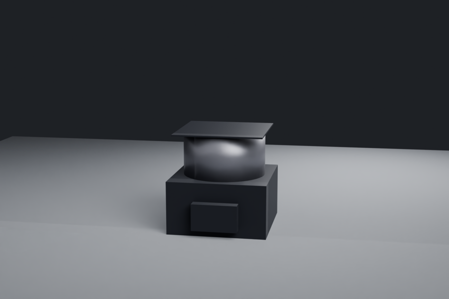

# Organoid-in-Space Machine Set — Visual Deck

*Composer-generated forms for all 8 machines, rendered through the ForgeOS composer→Blender path (`COMPOSER=1`). Every form is function-derived (contract signals → medium → connected geometry) — none is a hand-authored family. Rendered 2026-07-19 during the autonomous session. Full-res in `out/organoid-set/` + `out/m2-organoid-cassette/`; committed copies in `renders/`.*

> **What this proves:** the composer takes brand-new archetypes it has never seen (an organoid cassette, a CubeLab carrier, a perfusion bioreactor) and produces coherent, connected, *recognisable* hardware forms — not generic boxes. This is the convergent-evolution claim, demonstrated end-to-end (signals → form → render), for the full Yuri organoid product line.

## Contact sheet

*(top→bottom, left→right: M2 cassette, M1 RPM-appliance, M3 smart cassette, M4 imager, M5 carrier, M6 bioreactor, M7 centrifuge, M8 return cassette)*

---

## The blades (razor-and-blade consumables) — `sealed_cartridge`

### M2 — Universal organoid cassette

A flat ANSI/SLAS laminate card: 24 scaffold-free culture wells in a **4×6 grid** (SBS-24), a fluidic manifold row of ports along the front edge, a glass detection window, and a keyed dock rail. The recurring-revenue core. **Quality: good** — reads as a real multi-well cassette.

### M3 — Smart assay cassette

The M2 form, taller (44 mm) for the on-floor MEA + optical sensing. **Quality: good** as a plate; *note:* the MEA electrode detail is not yet rendered as distinct geometry (the cassette form ignores `electrode_count` — a future fidelity item).

### M8 — Sample-return / fixation cassette

The M2 card with fixative/stabiliser reservoirs, capsule-compatible. **Quality: good.**

## The razor (ground host) — `rotation`

### M1 — Organoid RPM-appliance

A base + a cylindrical rotor bowl + a lid — the centrifuge/RPM silhouette (fixed this session; it was a featureless cube before SIGHT). The ground flagship that docks the cassette. **Quality: good** as a rotary host; *composite-host note:* incubation/perfusion/imaging are docked subsystems, not yet co-composed into the one enclosure.

## The orbital core — `culture_fluid`

### M6 — Autonomous perfusion bioreactor

An electronics base with a culture vial protruding on top + optical sensors + cap — the CubeLab-4U sealed perfusion unit. **Quality: good** — reads as a bioreactor with a culture vessel.

## The data reader — `light` / `image_plane`

### M4 — In-host live-cell imager

A body + an optical head module reading the cassette window. **Quality: acceptable** — reads as an imager base + head; would benefit from a visible objective/lens.

## The credibility control — `rotation`

### M7 — In-orbit 1g reference centrifuge

Same rotary silhouette as M1, middeck-locker envelope — the paired-1g control. **Quality: good.**

## The carrier (fit-anywhere payload) — `structural_carrier`

### M5 — CubeLab organoid carrier

A 9U (100×100×900 mm) rear frame with **6 payload bays as a visible vertical stack** (fixed this session; it was a solid bar before SIGHT). Holds the cassettes/bioreactors. **Quality: acceptable** — the bay stack reads; dark due to the tall thin object under the standard light rig.

---

## Honest quality summary

| Machine | Composer medium | Render quality |
|---|---|---|
| M2 / M3 / M8 cassettes | sealed_cartridge | **good** (real multi-well plate) |
| M1 / M7 rotary (RPM, centrifuge) | rotation | **good** (centrifuge silhouette) |
| M6 bioreactor | culture_fluid | **good** (vial on body) |
| M4 imager | light | acceptable (base + head) |
| M5 carrier | structural_carrier | acceptable (visible bay stack) |

**Two SIGHT-driven fixes landed this session** (commit 9681cad05): rotation was a cube → now a centrifuge; carrier was a solid bar → now a visible bay stack. **Remaining fidelity items** (not blocking, future polish): MEA geometry on the smart cassette; a visible objective on the imager; and the *composite-host* capability so M1/M6 co-compose their several media (rotation + incubation + imaging) into one enclosure rather than a dominant medium + docked subsystems. These are the honest gaps — recognisable is progress, not gold.

*Forms: `lead-product-composer-forms.json` + `out/*/form-proof.json`. Design: `00-SYNTHESIS-AND-DESIGN.md`, `01-LEAD-PRODUCT-DESIGN-PACK.md`.*
